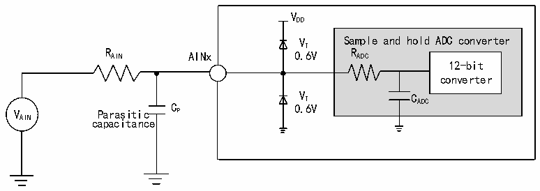
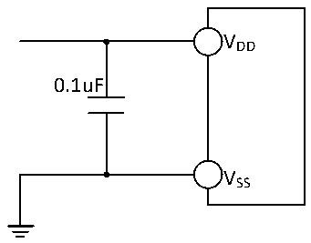

<!-- source-page: 34 -->

[← p.33](0033.md) · [index](../README.md) · [PDF p.34](https://ch32-riscv-ug.github.io/CH32V006/datasheet_en/CH32V004DS0.PDF#page=34) · [p.35 →](0035.md)

<!-- header: CH32V004 Datasheet https://wch-ic.com -->

Figure 3-10 ADC typical connection diagram  
 <!-- rendered from the PDF; verify at https://ch32-riscv-ug.github.io/CH32V006/datasheet_en/CH32V004DS0.PDF#page=34 -->

🖼 Text parsed from the figure above

VDD  
VT Sample and hold ADC converter  
R AIN AINx 0.6V R ADC  
12-bit  
converter  
V Parasitic C P 0 V . T 6V C ADC  
AIN capacitance  

Figure 3-11 Analog power supply and decoupling circuit reference  
 <!-- rendered from the PDF; verify at https://ch32-riscv-ug.github.io/CH32V006/datasheet_en/CH32V004DS0.PDF#page=34 -->

🖼 Text parsed from the figure above

VDD  
0.1uF  
VSS  

<!-- image: p34-draw-image-00001 bbox=[518.88, 784.08, 538.32, 794.28] -->
<!-- footer: V1.9 32 -->
