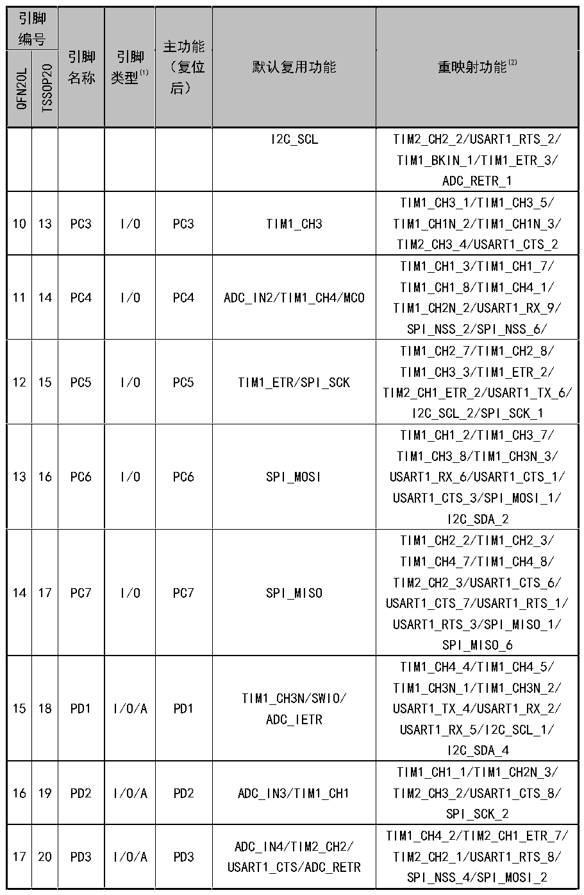

<!-- source-page: 13 -->

[← p.12](0012.md) · [index](../README.md) · [PDF p.13](https://ch32-riscv-ug.github.io/CH32V006/datasheet_zh/CH32V004DS0.PDF#page=13) · [p.14 →](0014.md)

<!-- header: CH32V004数据手册 https://wch.cn -->

 <!-- p13-cluster-01 uncaptioned graphics, rendered from the PDF; verify at https://ch32-riscv-ug.github.io/CH32V006/datasheet_zh/CH32V004DS0.PDF#page=13 -->

🖼 Text parsed from the figure above

> ⬆ **Table continued** — rendered in full at [page 12](0012.md). <!-- p13-table-001 -->

注1：表格缩写解释：  
I = TTL/CMOS电平斯密特输入；O = CMOS电平三态输出；  
A = 模拟信号输入或输出；P = 电源。  
<!-- image: p13-draw-image-00001 bbox=[507.72, 779.28, 527.16, 789.6] -->
<!-- footer: V1.9 11 -->
