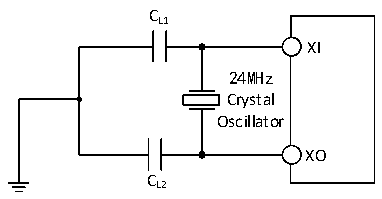

<!-- source-page: 21 -->

[← p.20](0020.md) · [index](../README.md) · [PDF p.21](https://ch32-riscv-ug.github.io/CH32V006/datasheet_zh/CH32V004DS0.PDF#page=21) · [p.22 →](0022.md)

<!-- header: CH32V004数据手册 https://wch.cn -->

图3-4 外接24M晶体典型电路  
 <!-- rendered from the PDF; verify at https://ch32-riscv-ug.github.io/CH32V006/datasheet_zh/CH32V004DS0.PDF#page=21 -->

🖼 Text parsed from the figure above

CL1  
XI  
24MHz  
Crystal  
Oscillator  
XO  
CL2  

### 3.3.6 内部时钟源特性

<!-- p21-table-001 (table-3-11@1) -->
<table><caption>表3-11 内部高速(HSI)RC振荡器特性</caption><tr><th>符号</th><th>参数</th><th>条件</th><th>最小值</th><th>典型值</th><th>最大值</th><th>单位</th></tr><tr><td rowspan="2" style="text-align:left">FHSI</td><td rowspan="2">频率(校准后)</td><td>HSI_LP = 0</td><td></td><td>24</td><td></td><td>MHz</td></tr><tr><td>HSI_LP = 1</td><td>30</td><td>42</td><td>58</td><td>KHz</td></tr><tr><td style="text-align:left">DuCy HSI</td><td>占空比(Duty cycle)</td><td></td><td>45</td><td>50</td><td>55</td><td>%</td></tr><tr><td style="text-align:left">ACCHSI</td><td>HSI振荡器的精度（校准后）</td><td style="text-align:left">HSI_LP = 0， T = -10℃～70℃ A</td><td>-2.2</td><td></td><td>2.2</td><td>%</td></tr><tr><td style="text-align:left">t (1) SU(HSI)</td><td>HSI振荡器启动稳定时间</td><td></td><td></td><td>3</td><td>8</td><td>us</td></tr><tr><td rowspan="2" style="text-align:left">IDD(HSI)</td><td rowspan="2">HSI振荡器功耗</td><td>HSI_LP = 0</td><td></td><td>200</td><td></td><td rowspan="2">uA</td></tr><tr><td>HSI_LP = 1</td><td></td><td>8.5</td><td></td></tr></table>

注：1.寄存器RCC_CTLR HSION置1，等待HSIRDY置1。  

<!-- p21-table-002 (table-3-12@1) -->
<table><caption>表3-12 内部低速(LSI)RC振荡器特性</caption><tr><th>符号</th><th>参数</th><th>条件</th><th>最小值</th><th>典型值</th><th>最大值</th><th>单位</th></tr><tr><td style="text-align:left">FLSI</td><td>频率</td><td></td><td>90</td><td>128</td><td>172</td><td>KHz</td></tr><tr><td style="text-align:left">DuCy LSI</td><td>占空比(Duty cycle)</td><td></td><td>45</td><td>50</td><td>55</td><td>%</td></tr><tr><td style="text-align:left">t (1) SU(LSI)</td><td>LSI振荡器启动稳定时间</td><td></td><td></td><td>30</td><td>100</td><td>us</td></tr><tr><td style="text-align:left">I (1) DD(LSI)</td><td>LSI振荡器功耗</td><td></td><td></td><td>550</td><td></td><td>nA</td></tr></table>

注：1.寄存器RCC_CTLR LSION置1，等待LSIRDY置1。  

### 3.3.7 从低功耗模式唤醒的时间

<!-- p21-table-003 (table-3-13@1) -->
<table><caption>表3-13 低功耗模式唤醒的时间</caption><tr><th>符号</th><th>参数</th><th>条件</th><th>典型值</th><th>单位</th></tr><tr><td style="text-align:left">t WUSLEEP</td><td>从睡眠模式唤醒</td><td>使用HSI RC时钟唤醒</td><td>1</td><td>us</td></tr><tr><td style="text-align:left">t WUSTDBY</td><td>从待机模式唤醒</td><td>LDO稳定时间+使用HSI RC时钟唤醒</td><td>10</td><td>us</td></tr></table>

注：以上为实测参数。  

### 3.3.8 存储器特性

<!-- p21-table-004 (table-3-14@1) -->
<table><caption>表3-14 闪存存储器特性</caption><tr><th>符号</th><th>参数</th><th>条件</th><th>最小值</th><th>典型值</th><th>最大值</th><th>单位</th></tr><tr><td style="text-align:left">t prog_page</td><td>页（256字节）编程时间</td><td></td><td></td><td>1.5</td><td>2.0</td><td>ms</td></tr><tr><td style="text-align:left">t erase_page</td><td>页（256字节）擦除时间</td><td></td><td></td><td>2.5</td><td>3.1</td><td>ms</td></tr><tr><td style="text-align:left">t erase_sec</td><td>扇区（1K字节）擦除时间</td><td></td><td></td><td>2.7</td><td>3.3</td><td>ms</td></tr></table>

<!-- image: p21-draw-image-00001 bbox=[507.72, 786.36, 527.16, 796.68] -->
<!-- footer: V1.9 19 -->
