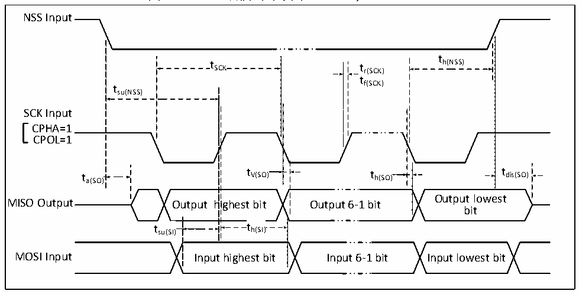

<!-- source-page: 26 -->

[← p.25](0025.md) · [index](../README.md) · [PDF p.26](https://ch32-riscv-ug.github.io/CH32V006/datasheet_zh/CH32V004DS0.PDF#page=26) · [p.27 →](0027.md)

<!-- header: CH32V004数据手册 https://wch.cn -->

图3-8-2 SPI从模式时序图（CPHA=0，CPOL=1）  
 <!-- rendered from the PDF; verify at https://ch32-riscv-ug.github.io/CH32V006/datasheet_zh/CH32V004DS0.PDF#page=26 -->

🖼 Text parsed from the figure above

NSS Input  
tSCKt th(NSS)  
r(SCK)  
tf(SCK)  
tsu(NSS)  
SCK Input  
CPHA=0  
CPOL=1  
t t  
a(SO) V(SO) t  
h(SO)  
tdis(SO)  
utput highest bit  t h(SI)  t h(SI)  )  th(SI)  
MISO Output Output highest bit Output 6-1 bit Output lowest bit  
tsu(SI) th(SI)  
MOSI Input Input highest bit Input 6-1 bit Input lowest bit  

图3-9-1 SPI从模式时序图（CPHA=1，CPOL=0）  
 <!-- rendered from the PDF; verify at https://ch32-riscv-ug.github.io/CH32V006/datasheet_zh/CH32V004DS0.PDF#page=26 -->

🖼 Text parsed from the figure above

NSS Input  
t  
t SCK t r(SCK) h(NSS)  
t  
SCK Input tsu(NSS) f(SCK)  
CPHA=1  
CPOL=0  
t h(SI)  th(SI)  
tsu(SI) th(SI)  
MOSI Input Input highest bit Input 6-1 bit Input lowest bit  

图3-9-2 SPI从模式时序图（CPHA=1，CPOL=1）  
 <!-- rendered from the PDF; verify at https://ch32-riscv-ug.github.io/CH32V006/datasheet_zh/CH32V004DS0.PDF#page=26 -->

🖼 Text parsed from the figure above

NSS Input  
t  
t SCK t r(SCK) h(NSS)  
tf(SCK)  
tsu(NSS)  
SCK Input  
CPHA=1  
CPOL=1  
t a(SO) t V(SO) t h(SO) t dis(SO)  
Output lowest  
MISO Output Output highest bit Output 6-1 bit  
bit  
t su(SI)  
t h(SI)  th(SI)  
MOSI Input Input highest bit Input 6-1 bit Input lowest bit  

<!-- image: p26-draw-image-00001 bbox=[507.72, 786.36, 527.16, 796.68] -->
<!-- footer: V1.9 24 -->
