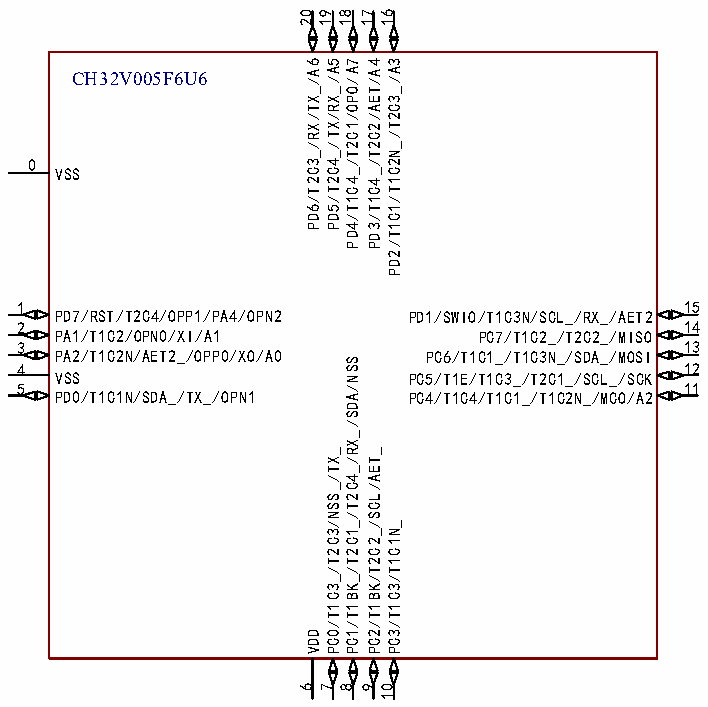

<!-- source-page: 17 -->

[← p.16](0016.md) · [index](../README.md) · [PDF p.17](https://ch32-riscv-ug.github.io/CH32V006/datasheet_en/CH32V006DS0.PDF#page=17) · [p.18 →](0018.md)

<!-- header: CH32V006/005 Datasheet https://wch-ic.com -->

### 2.1.2 CH32V005 Pinouts

CH32V005E6R6  
1 24  
PD1/SWIO/T1C3N/SCL_/RX_/AET2 PB3/SWCK/U2RX  
2 23  
PC0/T2C1_/T1/T2/TX_/MOSI_ PB1/T1C3_/T2/SCK_  
3 22  
PC1/T2C2_/T1/T2/RX_/SDA PB0/T1C2_/NSS_  
4 21  
PC2/T1/T2/SCL/AET_ PA3/T1C1_/T2/U2RX_  
5 20  
VSS PD0/T1C1N/SDA_/TX_/OPN1  
6 19  
VDD PA2/T1C2N/AET2_/OPP0/A0  
7 18  
PC5/T1E/T1C3_/T2C1_/RST PA0/T1C1N_/T2  
8 17  
PC4/T1/MCO/A2 PA1/OPN0/A1/PA6/U2TX_  
9 16  
PD2/T1C1/T1C2N_/T2C3_/A3 PA5/U2RX_/OPO1  
10 15  
PD3/T1C4_/T2C2/AET/A4 PA4/U2TX_/OPN2  
11  
14  
PD4/T1C4_/T2C1/OPO0/A7 PD7/T2C4/OPP1  
12 13  
PD5/T2C4_/TX/RX_/A5 PD6/T2/RX/TX_/A6  

 <!-- p17-cluster-01 uncaptioned graphics, rendered from the PDF; verify at https://ch32-riscv-ug.github.io/CH32V006/datasheet_en/CH32V006DS0.PDF#page=17 -->

🖼 Text parsed from the figure above

20 19  
18 17 16  
PD6/T2C3_/RX/TX_/A6  
PD5/T2C4_/TX/RX_/A5  
PD4/T1C4_/T2C1/OPO/A7  
PD3/T1C4_/T2C2/AET/A4  
PD2/T1C1/T1C2N_/T2C3_/A3  
CH32V005F6U6  
0  
VSS  
15  
1  
PD7/RST/T2C4/OPP1/PA4/OPN2 PD1/SWIO/T1C3N/SCL_/RX_/AET2  
2 14  
PA1/T1C2/OPN0/XI/A1 PC7/T1C2_/T2C2_/MISO  
3 13  
PA2/T1C2N/AET2_/OPP0/XO/A0 PC6/T1C1_/T1C3N_/SDA_/MOSI  
PC1/T1BK_/T2C1_/T2C4_/RX_/SDA/NSS  
4 12  
VSS PC5/T1E/T1C3_/T2C1_/SCL_/SCK  
11  
5  
PD0/T1C1N/SDA_/TX_/OPN1 PC4/T1C4/T1C1_/T1C2N_/MCO/A2  
PC0/T1C3_/T2C3/NSS_/TX_  
PC2/T1BK/T2C2_/SCL/AET_  
PC3/T1C3/T1C1N_  
VDD  
6  
7  
8  
9  
10  

<!-- image: p17-draw-image-00001 bbox=[518.88, 778.44, 538.32, 788.64] -->
<!-- footer: V2.0 15 -->
