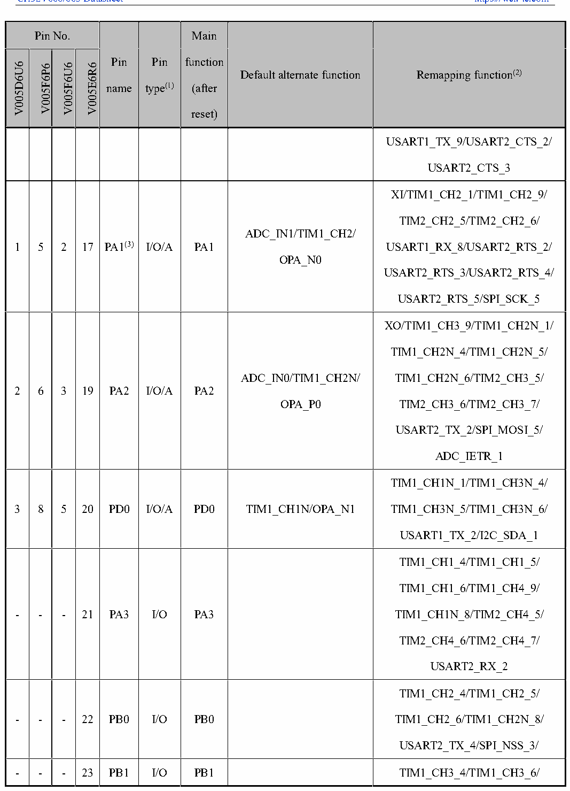

<!-- source-page: 28 -->

[← p.27](0027.md) · [index](../README.md) · [PDF p.28](https://ch32-riscv-ug.github.io/CH32V006/datasheet_en/CH32V006DS0.PDF#page=28) · [p.29 →](0029.md)

<!-- header: CH32V006/005 Datasheet https://wch-ic.com -->

 <!-- p28-cluster-01 uncaptioned graphics, rendered from the PDF; verify at https://ch32-riscv-ug.github.io/CH32V006/datasheet_en/CH32V006DS0.PDF#page=28 -->

🖼 Text parsed from the figure above

> ⬆ **Table continued** — rendered in full at [page 27](0027.md). <!-- p28-table-001 -->

<!-- image: p28-draw-image-00001 bbox=[518.88, 778.44, 538.32, 788.64] -->
<!-- footer: V2.0 26 -->
