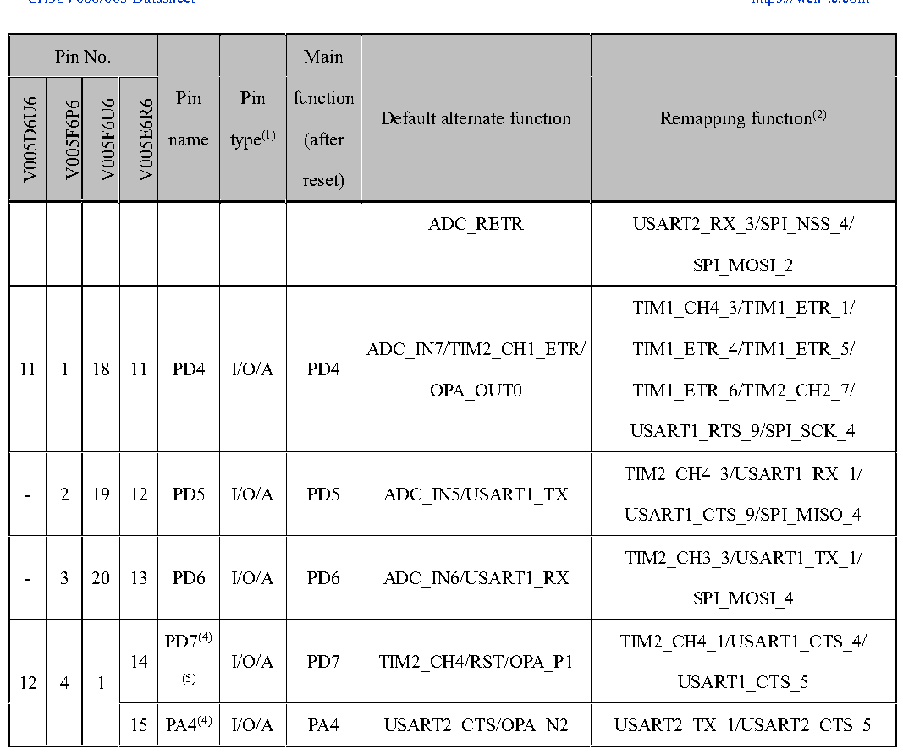

<!-- source-page: 31 -->

[← p.30](0030.md) · [index](../README.md) · [PDF p.31](https://ch32-riscv-ug.github.io/CH32V006/datasheet_en/CH32V006DS0.PDF#page=31) · [p.32 →](0032.md)

<!-- header: CH32V006/005 Datasheet https://wch-ic.com -->

 <!-- p31-cluster-01 uncaptioned graphics, rendered from the PDF; verify at https://ch32-riscv-ug.github.io/CH32V006/datasheet_en/CH32V006DS0.PDF#page=31 -->

🖼 Text parsed from the figure above

> ⬆ **Table continued** — rendered in full at [page 27](0027.md). <!-- p31-table-001 -->

<em>Note 1: Explanation of table abbreviations:</em>  
<em>I = TTL/CMOS level Schmitt input; O = CMOS level tri-state output.</em>  
<em>A = Analog signal input or output; P = Power supply.</em>  
<em>Note 2: The underlined value of the remapping function indicates the configuration value of the corresponding bit</em>  
<em>in the AFIO register. For example: TIM1_BKIN_4 indicates that the corresponding bit configuration of the</em>  
<em>AFIO register is 100b.</em>  
<em>Note 3: For CH32V006E8R and CH32V005E6R6 chips, the PA1 and PA6 pins are short-connected and sealed</em>  
<em>inside the chip, which forbids the two I/O to be configured as the output function.</em>  
<em>Note 4: For CH32V006F8U7, CH32V006F8P7, CH32V006D8U7, CH32V005F6U6, CH32V005F6P6 and</em>  
<em>CH32V005D6U6 chips, the PA4 and PD7 pins are short-jointed and sealed inside the chip, and it is forbidden that</em>  
<em>both of the two IMAGO are configured as output functions.</em>  
<em>Note 5: For CH32V006K8U7 chip, PA7 is the reset pin; for CH32V006E8R and CH32V005E6R6 chips, PC5 is</em>  
<em>the reset pin; for the rest of CH32V006 and CH32V005 chips, PD7 is the reset pin.</em>  
<!-- image: p31-draw-image-00001 bbox=[518.88, 778.44, 538.32, 788.64] -->
<!-- footer: V2.0 29 -->
