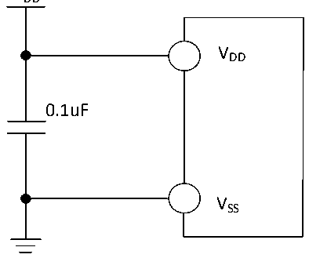

<!-- source-page: 35 -->

[← p.34](0034.md) · [index](../README.md) · [PDF p.35](https://ch32-riscv-ug.github.io/CH32V006/datasheet_en/CH32V006DS0.PDF#page=35) · [p.36 →](0036.md)

<!-- header: CH32V006/005 Datasheet https://wch-ic.com -->

# Chapter 3 Electrical Characteristics

## 3.1 Test Condition

Unless otherwise specified and marked, all voltages are based on VSS.  
All minimum and maximum values will be guaranteed under the worst ambient temperature, supply voltage and  
clock frequency. Typical values are based on room temperature 25℃ and VDD=3.3V or 5V for design guidance.  
Data obtained through comprehensive evaluation, design simulation or process characteristics will not be tested  
on the production line. On the basis of comprehensive evaluation, the minimum and maximum values are obtained  
through sample testing. Unless the special instructions are measured, the characteristic parameters are guaranteed  
by comprehensive evaluation or design.  
Power supply scheme:  

Figure 3-1 Typical circuit for conventional power supply  
 <!-- rendered from the PDF; verify at https://ch32-riscv-ug.github.io/CH32V006/datasheet_en/CH32V006DS0.PDF#page=35 -->

VDD  

🖼 Text parsed from the figure above

VDD  
0.1uF  
VSS  

## 3.2 Absolute Maximum Ratings

Stresses at or above the absolute maximum ratings listed in the table below may cause permanent damage to the  
device.  

<!-- p35-table-001 (table-3-1@1) pages 35-36 -->
<table><caption>Table 3-1 Absolute maximum ratings</caption><tr><th>Symbol</th><th colspan="2">Description</th><th>Min.</th><th>Max.</th><th>Unit</th></tr><tr><td rowspan="2" style="text-align:left">TA</td><td rowspan="2" style="text-align:left">Ambient temperature during operation</td><td style="text-align:left">Chips with a model number ending in 6</td><td>-40</td><td>85</td><td>℃</td></tr><tr><td style="text-align:left">Chips with a model number ending in 7</td><td>-40</td><td>105</td><td>℃</td></tr><tr><td style="text-align:left">TS</td><td colspan="2">Ambient temperature during storage</td><td>-40</td><td>125</td><td>℃</td></tr><tr><td style="text-align:left">V -V DD SS</td><td colspan="2" style="text-align:left">External main supply voltage (V ) DD</td><td>-0.3</td><td>5.5</td><td>V</td></tr><tr><td style="text-align:left">VIN</td><td colspan="2">Input voltage on the I/O pin</td><td style="text-align:left">V -0.3SS</td><td style="text-align:left">V +0.3DD</td><td>V</td></tr><tr><td style="text-align:left">|△V | DD_x</td><td colspan="2" style="text-align:left">Variations between different main power supply pins</td><td></td><td>50</td><td>mV</td></tr><tr><td style="text-align:left">|△V | SS_x</td><td colspan="2">Variations between different ground pins</td><td></td><td>50</td><td>mV</td></tr><tr><td style="text-align:left">VESD(HBM)</td><td colspan="2" style="text-align:left">Electrostatic discharge voltage (HBM) of ordinary I/O pin</td><td colspan="2">4K</td><td>V</td></tr><tr><td style="text-align:left">IVDD</td><td colspan="2" style="text-align:left">Total current of all V main power pins DD</td><td></td><td>100</td><td>mA</td></tr><tr><td style="text-align:left">IVSS</td><td colspan="2" style="text-align:left">Total current of all V common ground pins SS</td><td></td><td>200</td><td>mA</td></tr><tr><td rowspan="2" style="text-align:left">IIO</td><td colspan="2">Sink current on any I/O and control pin</td><td></td><td>30</td><td rowspan="5">mA</td></tr><tr><td colspan="2" style="text-align:left">Output current on any I/O and control pin</td><td></td><td>-30</td></tr><tr><td rowspan="2" style="text-align:left">IINJ(PIN)</td><td colspan="2">XI pin of HSE</td><td></td><td>+/-4</td></tr><tr><td colspan="2">Injected current on other pins</td><td></td><td>+/-4</td></tr><tr><td style="text-align:left">∑IINJ(PIN)</td><td colspan="2" style="text-align:left">Total injected current on all I/Os and control pins</td><td></td><td>+/-20</td></tr></table>

<!-- image: p35-draw-image-00001 bbox=[518.88, 784.08, 538.32, 794.28] -->
<!-- footer: V2.0 33 -->
