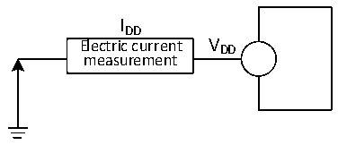

<!-- source-page: 38 -->

[← p.37](0037.md) · [index](../README.md) · [PDF p.38](https://ch32-riscv-ug.github.io/CH32V006/datasheet_en/CH32V006DS0.PDF#page=38) · [p.39 →](0039.md)

<!-- header: CH32V006/005 Datasheet https://wch-ic.com -->

Figure 3-2 Current consumption measurement  
 <!-- rendered from the PDF; verify at https://ch32-riscv-ug.github.io/CH32V006/datasheet_en/CH32V006DS0.PDF#page=38 -->

🖼 Text parsed from the figure above

IDD  
Electric current V DD  
measurement  

The microcontroller is in the following conditions:  
In the case of room temperature VDD= 3.3V or 5V, during the test: all I/O ports are configured with pull-down  
input, HSI = 24MHz (calibrated), and the bit LDO_MODE = 10 of register PWR_CTLR. Enable or disable the  
power consumption of all peripheral clocks.  

<!-- p38-table-001 (table-3-6@1) -->
<table><caption>Table 3-6 Typical current consumption in Run mode, data processing code runs from the internal Flash</caption><tr><th rowspan="3">Symbol</th><th rowspan="3">Parameter</th><th colspan="3">Condition</th><th colspan="2">Typ.</th><th rowspan="3">Unit</th></tr><tr><td rowspan="2">HSI/HSE</td><td rowspan="2">HSI_LP</td><td rowspan="2" style="text-align:left">FHCLK</td><td rowspan="2" style="text-align:left">All peripherals enabled</td><td>All peripherals</td></tr><tr><td>disabled</td></tr><tr><td rowspan="11" style="text-align:left">I (1) DD</td><td rowspan="11" style="text-align:left">Supply current in Run mode</td><td rowspan="5" style="text-align:left">Runs on the high-speed external clock (HSE) (HSE_SI = 00, HSE_LP = 1)</td><td rowspan="5">X</td><td style="text-align:left">F = 48MHz HCLK</td><td>4.4</td><td>3.5</td><td rowspan="11">mA</td></tr><tr><td style="text-align:left">F = 24MHz HCLK</td><td>3.3</td><td>2.8</td></tr><tr><td style="text-align:left">F = 16MHz HCLK</td><td>2.8</td><td>2.5</td></tr><tr><td style="text-align:left">F = 8MHz HCLK</td><td>2.5</td><td>2.4</td></tr><tr><td style="text-align:left">F = 750KHz HCLK</td><td>1.7</td><td>1.7</td></tr><tr><td rowspan="6" style="text-align:left">Runs on the high-speed internal RC oscillator (HSI)</td><td rowspan="5">0</td><td style="text-align:left">F = 48MHz HCLK</td><td>3.7</td><td>2.8</td></tr><tr><td style="text-align:left">F = 24MHz HCLK</td><td>2.5</td><td>2.0</td></tr><tr><td style="text-align:left">F = 16MHz HCLK</td><td>2.1</td><td>1.7</td></tr><tr><td style="text-align:left">F = 8MHz HCLK</td><td>1.8</td><td>1.6</td></tr><tr><td style="text-align:left">F = 750KHz HCLK</td><td>0.9</td><td>0.9</td></tr><tr><td>1</td><td style="text-align:left">F = 40KHz HCLK</td><td>0.6</td><td>0.6</td></tr></table>

<em>Note: The above are measured parameters.</em>  

<!-- p38-table-002 (table-3-7@1) pages 38-39 -->
<table><caption>Table 3-7 Typical current consumption in Sleep mode, data processing code runs from internal Flash or SRAM</caption><tr><th rowspan="2">Symbol</th><th rowspan="2">Parameter</th><th colspan="3">Condition</th><th colspan="2">Typ.</th><th rowspan="2">Unit</th></tr><tr><td>HSI/HSE</td><td>HSI_LP</td><td style="text-align:left">FHCLK</td><td>All peripherals</td><td>All peripherals</td></tr><tr><td></td><td></td><td></td><td></td><td></td><td>enabled</td><td>disabled</td><td></td></tr><tr><td rowspan="11" style="text-align:left">I (1) DD</td><td rowspan="11" style="text-align:left">Supply current in Sleep mode (In this case, peripheral power supply and clock are maintained)</td><td rowspan="5" style="text-align:left">Runs on the high-speed external clock (HSE) (HSE_SI = 00, HSE_LP = 1)</td><td rowspan="5">X</td><td style="text-align:left">F = HCLK48MHz</td><td>3.0</td><td>2.1</td><td rowspan="11">mA</td></tr><tr><td style="text-align:left">F = HCLK24MHz</td><td>2.3</td><td>1.8</td></tr><tr><td style="text-align:left">F = HCLK16MHz</td><td>2.1</td><td>1.8</td></tr><tr><td style="text-align:left">F = 8MHz HCLK</td><td>1.8</td><td>1.7</td></tr><tr><td style="text-align:left">F = HCLK750KHz</td><td>1.6</td><td>1.6</td></tr><tr><td rowspan="6" style="text-align:left">Runs on the high-speed internal RC oscillator (HSI)</td><td rowspan="5">0</td><td style="text-align:left">F = HCLK48MHz</td><td>2.2</td><td>1.3</td></tr><tr><td style="text-align:left">F = HCLK24MHz</td><td>1.5</td><td>1.0</td></tr><tr><td style="text-align:left">F = HCLK16MHz</td><td>1.3</td><td>1.0</td></tr><tr><td style="text-align:left">F = 8MHz HCLK</td><td>1.1</td><td>0.9</td></tr><tr><td style="text-align:left">F = HCLK750KHz</td><td>0.9</td><td>0.9</td></tr><tr><td>1</td><td style="text-align:left">F = 40KHz HCLK</td><td>0.6</td><td>0.6</td></tr></table>

<!-- image: p38-draw-image-00001 bbox=[518.88, 784.08, 538.32, 794.28] -->
<!-- footer: V2.0 36 -->
