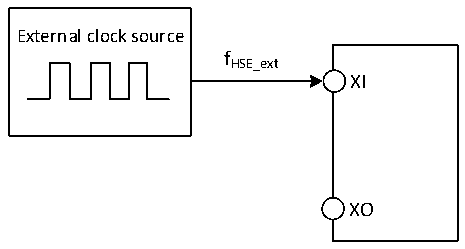

<!-- source-page: 40 -->

[← p.39](0039.md) · [index](../README.md) · [PDF p.40](https://ch32-riscv-ug.github.io/CH32V006/datasheet_en/CH32V006DS0.PDF#page=40) · [p.41 →](0041.md)

<!-- header: CH32V006/005 Datasheet https://wch-ic.com -->

> ⬆ **Table continued** — rendered in full at [page 39](0039.md). <!-- p40-table-001 -->

<em>Note: The above are measured parameters.</em>  

<!-- p40-table-002 (table-3-8-2@1) -->
<table><caption>Table 3-8-2 Typical current consumption in Standby mode (Only for CH32V005)</caption><tr><th rowspan="2">Symbol</th><th rowspan="2">Parameter</th><th colspan="3">Condition</th><th rowspan="2">Typ.</th><th rowspan="2">Unit</th></tr><tr><td>Independent watchdog</td><td>LSI</td><td style="text-align:left">VDD</td></tr><tr><td rowspan="6" style="text-align:left">IDD</td><td rowspan="6" style="text-align:left">Supply current in Standby mode</td><td rowspan="2">Enable</td><td rowspan="2">Enable</td><td>3.3V</td><td>18.1</td><td rowspan="6">uA</td></tr><tr><td>5V</td><td>19.1</td></tr><tr><td rowspan="2">Disable</td><td rowspan="2">Disable</td><td>3.3V</td><td>17.5</td></tr><tr><td>5V</td><td>18.5</td></tr><tr><td rowspan="2">Disable</td><td rowspan="2">Enable</td><td>3.3V</td><td>18.0</td></tr><tr><td>5V</td><td>19.0</td></tr></table>

### 3.3.5 External Clock Source Characteristics

<!-- p40-table-003 (table-3-9@1) -->
<table><caption>Table 3-9 From external high-speed clock</caption><tr><th>Symbol</th><th>Parameter</th><th>Condition</th><th>Min.</th><th>Typ.</th><th>Max.</th><th>Unit</th></tr><tr><td style="text-align:left">FHSE_ext</td><td>External clock frequency</td><td></td><td>3</td><td>24</td><td>32</td><td>MHz</td></tr><tr><td style="text-align:left">V (1) HSEH</td><td>XI input pin high level voltage</td><td></td><td style="text-align:left">0.8VDD</td><td></td><td style="text-align:left">VDD</td><td>V</td></tr><tr><td style="text-align:left">V (1) HSEL</td><td>XI input pin low-level voltage</td><td></td><td>0</td><td></td><td style="text-align:left">0.2VDD</td><td>V</td></tr><tr><td style="text-align:left">C in(HSE)</td><td>XI input capacitance</td><td></td><td></td><td>5</td><td></td><td>pF</td></tr><tr><td style="text-align:left">DuCy (HSE)</td><td>Duty cycle</td><td></td><td>40</td><td>50</td><td>60</td><td>%</td></tr><tr><td style="text-align:left">IL</td><td>XI input leakage current</td><td></td><td></td><td></td><td>±1</td><td>uA</td></tr></table>

<em>Note: 1. Failure to meet this condition may cause level recognition error.</em>  

Figure 3-3 External high-frequency clock source circuit  
 <!-- rendered from the PDF; verify at https://ch32-riscv-ug.github.io/CH32V006/datasheet_en/CH32V006DS0.PDF#page=40 -->

🖼 Text parsed from the figure above

External clock source  
fHSE_ext  
XI  
XO  

<!-- image: p40-draw-image-00001 bbox=[518.88, 784.08, 538.32, 794.28] -->
<!-- footer: V2.0 38 -->
