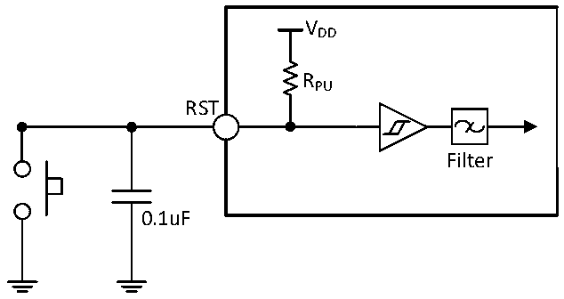

<!-- source-page: 44 -->

[← p.43](0043.md) · [index](../README.md) · [PDF p.44](https://ch32-riscv-ug.github.io/CH32V006/datasheet_en/CH32V006DS0.PDF#page=44) · [p.45 →](0045.md)

<!-- header: CH32V006/005 Datasheet https://wch-ic.com -->

> ⬆ **Table continued** — rendered in full at [page 43](0043.md). <!-- p44-table-001 -->

<em>Note: The sum of current must not exceed the absolute maximum rating given in Section 3.2 of the table if more</em>  
<em>than one I/O pin is driven at the same time in the above conditions. When multiple I/O pins are driven at the same</em>  
<em>time, the current on the power supply/ground wire point is very large, which will cause the voltage drop so that</em>  
<em>the voltage of the internal I/O cannot reach the power supply voltage in the meter, resulting in the drive current</em>  
<em>less than the nominal value.</em>  

<!-- p44-table-002 (table-3-18@1) -->
<table><caption>Table 3-18 Input/output AC characteristics</caption><tr><th>Symbol</th><th>Parameter</th><th>Condition</th><th>Min.</th><th>Max.</th><th>Unit</th></tr><tr><td style="text-align:left">F max(IO)out</td><td>Maximum frequency</td><td style="text-align:left">CL = 50pF, V = 2.7-5.5VDD</td><td></td><td>30</td><td>MHz</td></tr><tr><td style="text-align:left">t f(IO)out</td><td>Output high to low fall time</td><td style="text-align:left">CL = 50pF, V = 2.7-5.5VDD</td><td></td><td>10</td><td>ns</td></tr><tr><td style="text-align:left">t r(IO)out</td><td>Output low to high rise time</td><td style="text-align:left">CL = 50pF, V = 2.7-5.5VDD</td><td></td><td>10</td><td>ns</td></tr><tr><td style="text-align:left">t EXTIpw</td><td style="text-align:left">The EXTI controller detects the pulse width of the external signal</td><td></td><td>10</td><td></td><td>ns</td></tr></table>

<em>Note: Above parameters are guaranteed by design.</em>  

### 3.3.10 NRST Pin Characteristics

Circuit reference design and requirements:  

Figure 3-5 Typical circuit of external reset pin  
 <!-- rendered from the PDF; verify at https://ch32-riscv-ug.github.io/CH32V006/datasheet_en/CH32V006DS0.PDF#page=44 -->

🖼 Text parsed from the figure above

VDD  
RPU  
RST  
Filter  
0.1uF  

<em>Note: The capacitance in the figure is optional and can be used to filter out key jitter.</em>  
<!-- image: p44-draw-image-00001 bbox=[518.88, 784.08, 538.32, 794.28] -->
<!-- footer: V2.0 42 -->
