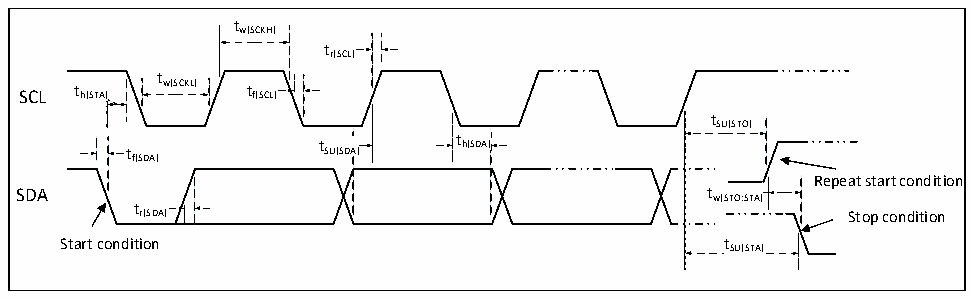

<!-- source-page: 46 -->

[← p.45](0045.md) · [index](../README.md) · [PDF p.46](https://ch32-riscv-ug.github.io/CH32V006/datasheet_en/CH32V006DS0.PDF#page=46) · [p.47 →](0047.md)

<!-- header: CH32V006/005 Datasheet https://wch-ic.com -->

### 3.3.12 I2C Interface Characteristics

Figure 3-6 I2C bus timing diagram  
 <!-- rendered from the PDF; verify at https://ch32-riscv-ug.github.io/CH32V006/datasheet_en/CH32V006DS0.PDF#page=46 -->

🖼 Text parsed from the figure above

tw(SCKH)  
tr(SCL)  
t  
SCL t h(STA) w(SCKL) t f(SCL)  
tSU(STO)  
t t SU(SDA) t h(SDA)  
th(SDA)  
f(SDA)  
Repeat start condition  
t  
r(SDA) Stop condition  
Start condition tSU(STA)  

<!-- p46-table-002 (table-3-21@1) -->
<table><caption>Table 3-21 I2C interface characteristics</caption><tr><th rowspan="2">Symbol</th><th rowspan="2">Parameter</th><th colspan="2">Standard I2C</th><th colspan="2">Fast I2C</th><th rowspan="2">Unit</th></tr><tr><td>Min.</td><td>Max.</td><td>Min.</td><td>Max.</td></tr><tr><td style="text-align:left">t w(SCKL)</td><td>SCL clock low-level time</td><td>4.7</td><td></td><td>1.2</td><td></td><td>us</td></tr><tr><td style="text-align:left">t w(SCKH)</td><td>SCL clock high-level time</td><td>4.0</td><td></td><td>0.6</td><td></td><td>us</td></tr><tr><td style="text-align:left">t SU(SDA)</td><td>SDA data setup time</td><td>250</td><td></td><td>100</td><td></td><td>ns</td></tr><tr><td style="text-align:left">t h(SDA)</td><td>SDA data hold time</td><td>0</td><td></td><td>0</td><td>900</td><td>ns</td></tr><tr><td style="text-align:left">t /t r(SDA) r(SCL)</td><td>SDA and SCL rise time</td><td></td><td>1000</td><td>20</td><td></td><td>ns</td></tr><tr><td style="text-align:left">t /t f(SDA) f(SCL)</td><td>SDA and SCL fall time</td><td></td><td>300</td><td></td><td></td><td>ns</td></tr><tr><td style="text-align:left">t h(STA)</td><td>Start condition hold time</td><td>4.0</td><td></td><td>0.6</td><td></td><td>us</td></tr><tr><td style="text-align:left">t SU(STA)</td><td>Repeated start condition setup time</td><td>4.7</td><td></td><td>0.6</td><td></td><td>us</td></tr><tr><td style="text-align:left">t SU(STO)</td><td>Stop condition setup time</td><td>4.0</td><td></td><td>0.6</td><td></td><td>us</td></tr><tr><td style="text-align:left">t w(STO:STA)</td><td style="text-align:left">Time from stop condition to start condition (bus free)</td><td>4.7</td><td></td><td>1.2</td><td></td><td>us</td></tr><tr><td style="text-align:left">C b</td><td>Capacitive load for each bus</td><td></td><td>400</td><td></td><td>400</td><td>pF</td></tr></table>

<!-- image: p46-draw-image-00001 bbox=[518.88, 784.08, 538.32, 794.28] -->
<!-- footer: V2.0 44 -->
