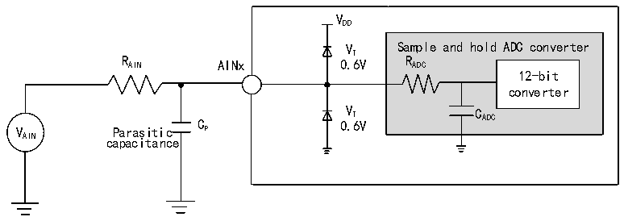

<!-- source-page: 52 -->

[← p.51](0051.md) · [index](../README.md) · [PDF p.52](https://ch32-riscv-ug.github.io/CH32V006/datasheet_en/CH32V006DS0.PDF#page=52) · [p.53 →](0053.md)

<!-- header: CH32V006/005 Datasheet https://wch-ic.com -->

> ⬆ **Table continued** — rendered in full at [page 51](0051.md). <!-- p52-table-001 -->

<!-- p52-table-002 (table-3-25@1) -->
<table><caption>Table 3-25 ADC error (fADC= 16MHz, ADC_LP = 1)</caption><tr><th>Symbol</th><th>Parameter</th><th>Condition</th><th>Typ.</th><th>Max.</th><th>Unit</th></tr><tr><td rowspan="2">ET</td><td rowspan="2">Total error</td><td style="text-align:left">0 ≤ V ＜ V /2 AIN DD</td><td>±3.5</td><td></td><td rowspan="6">LSB</td></tr><tr><td style="text-align:left">0 ≤ V ＜ V AIN DD</td><td>±6</td><td></td></tr><tr><td rowspan="2">ED</td><td rowspan="2">Differential nonlinear error</td><td style="text-align:left">0 ≤ V ＜ V /2 AIN DD</td><td>±3.5</td><td></td></tr><tr><td style="text-align:left">0 ≤ V ＜ V AIN DD</td><td>±6</td><td></td></tr><tr><td rowspan="2">EL</td><td rowspan="2">Differential nonlinear error</td><td style="text-align:left">0 ≤ V ＜ V /2 AIN DD</td><td>±2.5</td><td></td></tr><tr><td style="text-align:left">0 ≤ V ＜ V AIN DD</td><td>±5</td><td></td></tr></table>

<em>Note: Above parameters are guaranteed by design.</em>  
Cp represents the parasitic capacitance on the PCB and the pad (about 5pF), which may be related to the quality of  
the pad and PCB layout. A larger Cp value will reduce the conversion accuracy, the solution is to reduce the fADC  
value.  

Figure 3-10 ADC typical connection diagram  
 <!-- rendered from the PDF; verify at https://ch32-riscv-ug.github.io/CH32V006/datasheet_en/CH32V006DS0.PDF#page=52 -->

🖼 Text parsed from the figure above

VDD  
VT Sample and hold ADC converter  
R AIN AINx 0.6V R ADC  
12-bit  
converter  
V Parasitic C P 0 V . T 6V C ADC  
AIN capacitance  

<!-- image: p52-draw-image-00001 bbox=[518.88, 784.08, 538.32, 794.28] -->
<!-- footer: V2.0 50 -->
