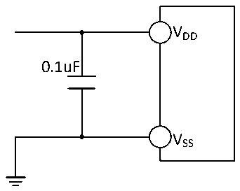

<!-- source-page: 53 -->

[← p.52](0052.md) · [index](../README.md) · [PDF p.53](https://ch32-riscv-ug.github.io/CH32V006/datasheet_en/CH32V006DS0.PDF#page=53) · [p.54 →](0054.md)

<!-- header: CH32V006/005 Datasheet https://wch-ic.com -->

Figure 3-11 Analog power supply and decoupling circuit reference  
 <!-- rendered from the PDF; verify at https://ch32-riscv-ug.github.io/CH32V006/datasheet_en/CH32V006DS0.PDF#page=53 -->

🖼 Text parsed from the figure above

VDD  
0.1uF  
VSS  

### 3.3.15 OPA characteristics

<!-- p53-table-001 (table-3-26-1@1) pages 53-54 -->
<table><caption>Table 3-26-1 OPA characteristics</caption><tr><th>Symbol</th><th>Parameter</th><th>Condition</th><th>Min.</th><th>Typ.</th><th>Max.</th><th>Unit</th></tr><tr><td style="text-align:left">VDD</td><td>Supply voltage</td><td style="text-align:left">No less than 2.5V is recommended</td><td>2.0</td><td>5</td><td>5.5</td><td>V</td></tr><tr><td style="text-align:left">VCMIR</td><td>Common mode input voltage</td><td></td><td>0</td><td></td><td style="text-align:left">VDD</td><td>V</td></tr><tr><td style="text-align:left">VIOFFSET</td><td>Input offset voltage</td><td></td><td></td><td>±3</td><td>±12</td><td>mV</td></tr><tr><td style="text-align:left">ILOAD</td><td>Drive current</td><td style="text-align:left">R = 4kΩLOAD</td><td></td><td></td><td>1.4</td><td>mA</td></tr><tr><td style="text-align:left">ILOAD_PGA</td><td>PGA mode drive current</td><td></td><td></td><td></td><td>500</td><td>uA</td></tr><tr><td style="text-align:left">IDDOPAMP</td><td>Current consumption</td><td>No load, static mode</td><td></td><td>420</td><td></td><td>uA</td></tr><tr><td>CMRR(1)</td><td style="text-align:left">Common mode rejection ratio</td><td>@1kHz</td><td></td><td>96</td><td></td><td>dB</td></tr><tr><td>PSRR(1)</td><td>Power supply rejection ratio</td><td>@1kHz</td><td></td><td>82</td><td></td><td>dB</td></tr><tr><td>Av(1)</td><td>Open loop gain</td><td style="text-align:left">C = 5pFLOAD</td><td></td><td>110</td><td></td><td>dB</td></tr><tr><td style="text-align:left">G (1) BW</td><td>Unit gain bandwidth</td><td style="text-align:left">C = 5pFLOAD</td><td></td><td>12</td><td></td><td>MHz</td></tr><tr><td style="text-align:left">P (1) M</td><td>Phase margin</td><td style="text-align:left">C = 5pFLOAD</td><td></td><td>75</td><td></td><td>°</td></tr><tr><td style="text-align:left">S (1) R</td><td>Slew rate limited</td><td style="text-align:left">C = 5pFLOAD</td><td></td><td>10</td><td></td><td>V/us</td></tr><tr><td style="text-align:left">t (1) WAKUP</td><td style="text-align:left">Setup time from shutdown to wake up, 0.1%</td><td style="text-align:left">Input V /2, DD C = 50pF, R = LOAD LOAD4kΩ</td><td></td><td></td><td>1</td><td>us</td></tr><tr><td style="text-align:left">RLOAD</td><td>Resistive load</td><td></td><td>4</td><td></td><td></td><td>kΩ</td></tr><tr><td style="text-align:left">CLOAD</td><td>Capacitive load</td><td></td><td></td><td></td><td>50</td><td>pF</td></tr><tr><td rowspan="2" style="text-align:left">V (2) OHSAT</td><td rowspan="2" style="text-align:left">High saturation output voltage</td><td style="text-align:left">R = 4kΩLOAD</td><td style="text-align:left">V -160DD</td><td></td><td></td><td rowspan="2">mV</td></tr><tr><td style="text-align:left">R = 20kΩLOAD</td><td style="text-align:left">V -35DD</td><td></td><td></td></tr><tr><td rowspan="2" style="text-align:left">V (2) OLSAT</td><td rowspan="2" style="text-align:left">Low saturation output voltage</td><td style="text-align:left">R = 4kΩLOAD</td><td></td><td></td><td>25</td><td rowspan="2">mV</td></tr><tr><td style="text-align:left">R = 20kΩLOAD</td><td></td><td></td><td>5</td></tr><tr><td rowspan="5" style="text-align:left">PGAGain(1)</td><td>PGADIF = 1 mode in phase</td><td>Gain = 4/8/16</td><td>-3</td><td></td><td>3</td><td>%</td></tr><tr><td rowspan="4">Internal in-phase PGA</td><td style="text-align:left">Gain = 4, V &lt; INP (V /3) DD</td><td>-1</td><td></td><td>1</td><td>%</td></tr><tr><td style="text-align:left">Gain = 8, V &lt; INP (V /7) DD</td><td>-1</td><td></td><td>1</td><td>%</td></tr><tr><td style="text-align:left">Gain = 16, V &lt; INP (V /15) DD</td><td>-1</td><td></td><td>1</td><td>%</td></tr><tr><td style="text-align:left">Gain = 32, V &lt; INP (V /31) DD</td><td>-1</td><td></td><td>1</td><td>%</td></tr><tr><td rowspan="2" style="text-align:left">VB</td><td rowspan="2" style="text-align:left">Output DC bias voltage in PGA mode</td><td>VBEN = 1, VBSEL = 0</td><td></td><td style="text-align:left">V /2DD</td><td></td><td>V</td></tr><tr><td>VBEN = 1, VBSEL = 1</td><td></td><td style="text-align:left">V /4DD</td><td></td><td>V</td></tr><tr><td>Delta R</td><td style="text-align:left">Absolute value change of resistance</td><td></td><td>-15</td><td></td><td>15</td><td>%</td></tr><tr><td rowspan="2">eN(1)</td><td rowspan="2">Equivalent input noise</td><td style="text-align:left">R = 4kΩ@1kHz LOAD</td><td></td><td>100</td><td></td><td rowspan="2" style="text-align:left">nV/ sqrt(Hz)</td></tr><tr><td style="text-align:left">R = 20kΩ@1KHz LOAD</td><td></td><td>60</td><td></td></tr></table>

<!-- image: p53-draw-image-00001 bbox=[518.88, 784.08, 538.32, 794.28] -->
<!-- footer: V2.0 51 -->
