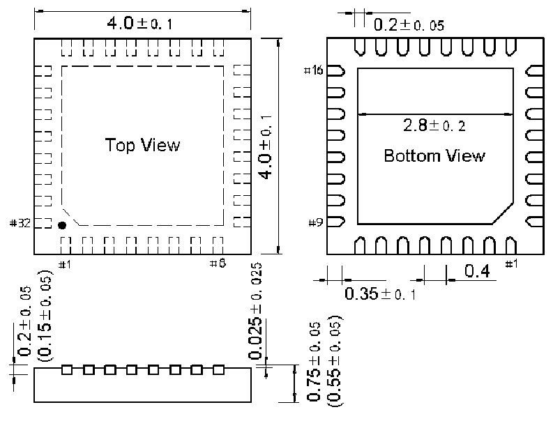

<!-- source-page: 57 -->

[← p.56](0056.md) · [index](../README.md) · [PDF p.57](https://ch32-riscv-ug.github.io/CH32V006/datasheet_en/CH32V006DS0.PDF#page=57) · [p.58 →](0058.md)

<!-- header: CH32V006/005 Datasheet https://wch-ic.com -->
<em>Note: All dimensions are in millimeters. The pin center spacing values are nominal values, with no error. Other</em>  
<em>than that, the dimensional error is not greater than the greater of ±0.2mm or 10%.</em>  

## 4.1 QFN32 Package

 <!-- p57-draw-image-00002 rendered from the PDF -->

<!-- image: p57-draw-image-00001 bbox=[518.88, 784.08, 538.32, 794.28] -->
<!-- footer: V2.0 55 -->
