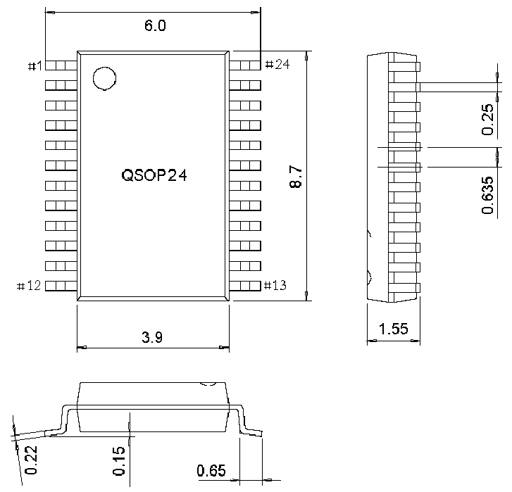
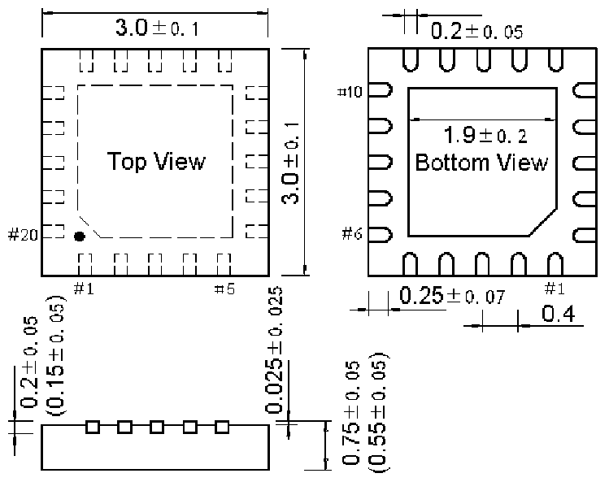

<!-- source-page: 58 -->

[← p.57](0057.md) · [index](../README.md) · [PDF p.58](https://ch32-riscv-ug.github.io/CH32V006/datasheet_en/CH32V006DS0.PDF#page=58) · [p.59 →](0059.md)

<!-- header: CH32V006/005 Datasheet https://wch-ic.com -->

## 4.2 QSOP24 Package

 <!-- p58-draw-image-00002 rendered from the PDF -->

## 4.3 QFN20 Package

 <!-- p58-draw-image-00003 rendered from the PDF -->

<!-- image: p58-draw-image-00001 bbox=[518.88, 784.08, 538.32, 794.28] -->
<!-- footer: V2.0 56 -->
