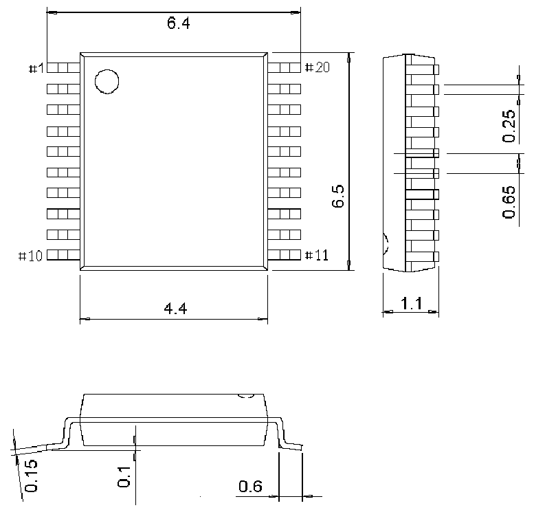

<!-- source-page: 59 -->

[← p.58](0058.md) · [index](../README.md) · [PDF p.59](https://ch32-riscv-ug.github.io/CH32V006/datasheet_en/CH32V006DS0.PDF#page=59) · [p.60 →](0060.md)

<!-- header: CH32V006/005 Datasheet https://wch-ic.com -->

## 4.4 TSSOP20 Package

 <!-- p59-draw-image-00002 rendered from the PDF -->

<!-- image: p59-draw-image-00001 bbox=[518.88, 784.08, 538.32, 794.28] -->
<!-- footer: V2.0 57 -->
