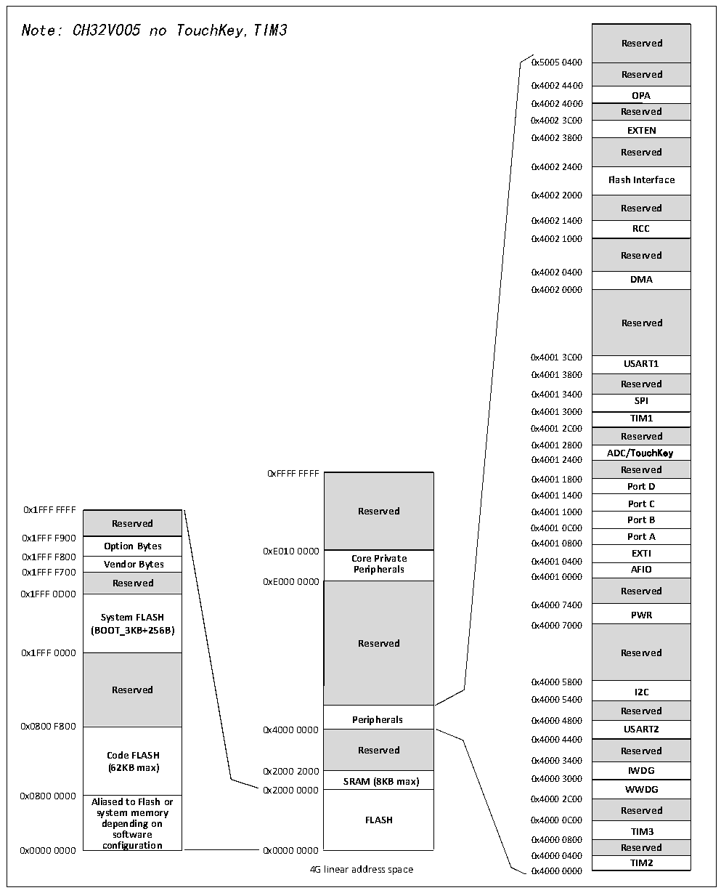

<!-- source-page: 4 -->

[← p.3](0003.md) · [index](../README.md) · [PDF p.4](https://ch32-riscv-ug.github.io/CH32V006/datasheet_zh/CH32V006DS0.PDF#page=4) · [p.5 →](0005.md)

<!-- header: CH32V006/V005数据手册 https://wch.cn -->

## 1.2 存储器映射表

图1-2 存储器地址映射  
 <!-- rendered from the PDF; verify at https://ch32-riscv-ug.github.io/CH32V006/datasheet_zh/CH32V006DS0.PDF#page=4 -->

🖼 Text parsed from the figure above

Note: CH32V005 no TouchKey,TIM3  
Reserved  Reserved  
0x5005 0400  
0x4002 4400  
<strong>OPA</strong>  
0x4002 4000  
<strong>Reserved</strong>  
0x4002 3C00  
<strong>EXTEN</strong>  
0x4002 3800  
<strong>Reserved</strong>  
0x4002 2400  
<strong>Flash Interface</strong>  
0x4002 2000  
<strong>Reserved</strong>  
0x4002 1400  
<strong>RCC</strong>  
0x4002 1000  
<strong>Reserved</strong>  
0x4002 0400  
<strong>DMA</strong>  
0x4002 0000  
<strong>Reserved</strong>  
0x4001 3C00  
<strong>USART1</strong>  
0x4001 3800  
Reserved  SPI  TIM1  Reserved  ADC/TouchKey  Reserved  Port D  Port C  Port B  Port A  EXTI  AFIO  Reserved  
0x4001 3400  
0x4001 3000  
0x4001 2C00  
0x4001 2800  
0x4001 2400  
0xFFFF FFFF Reserved  
Reserved  Core Private Peripherals  Reserved  
0x4001 1800  
0x4001 1400  
0x1FFF FFFF Reserved 0x4001 1000  
Reserved  Option Bytes  Vendor Bytes  Reserved  System FLASH (BOOT_3KB+256B)  Reserved  Code FLASH (62KB max) Aliased to Flash or  Aliased to Flash or system memory depending on software configuration  
0x4001 0C00  
0x4001 0000  
Reserved 0xE000 0000  
0x4000 7400  
0x4000 5800  
0x4000 5400  
<strong>Reserved</strong>  
<strong>Peripherals 0x4000 4800</strong>  
Reserved  SRAM (8KB max)  FLASH  
0x4000 4400  
0x4000 3400  
<strong>SRAM (8KB max) 0x4000 3000</strong>  
0x2000 0000 WWDG  
0x0800 0000 Aliased to Flash or 0x4000 2C00  
0x4000 0800  
0x4000 0400  
<strong>TIM2</strong>  
4G linear address space 0x4000 0000  

<!-- image: p4-draw-image-00001 bbox=[507.72, 779.28, 527.16, 789.6] -->
<!-- footer: V2.0 2 -->
