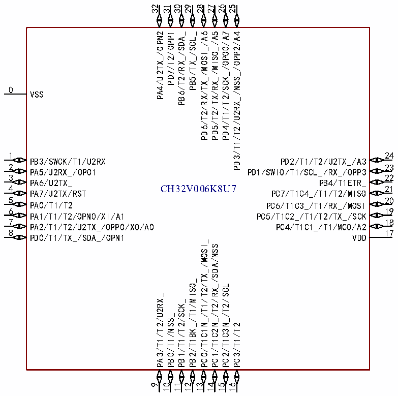

<!-- source-page: 10 -->

[← p.9](0009.md) · [index](../README.md) · [PDF p.10](https://ch32-riscv-ug.github.io/CH32V006/datasheet_zh/CH32V006DS0.PDF#page=10) · [p.11 →](0011.md)

<!-- header: CH32V006/V005数据手册 https://wch.cn -->

# 第 2 章 引脚信息

## 2.1 引脚排列

### 2.1.1 CH32V006引脚排列

 <!-- p10-cluster-01 uncaptioned graphics, rendered from the PDF; verify at https://ch32-riscv-ug.github.io/CH32V006/datasheet_zh/CH32V006DS0.PDF#page=10 -->

🖼 Text parsed from the figure above

32  
31  
30  
29  
28  
27  
26  
25  
PA4/U2TX_/OPN2 PD7/T2/OPP1 PB6/T2/RX_/SDA_ PB5/TX_/SCL_ PD6/T2/RX/TX_/MOSI_/A6 PD5/T2/TX/RX_/MISO_/A5 PD4/T1/T2/SCK_/OPO0/A7 PD3/T1/T2/U2RX_/NSS_/OPP2/A4  
0  
VSS  
1  
24  
PB3/SWCK/T1/U2RX  
PD2/T1/T2/U2TX_/A3  
2  
23  
PA5/U2RX_/OPO1  
PD1/SWIO/T1/SCL_/RX_/OPP3  
3  
22  
PA6/U2TX_  
PB4/T1ETR_  
4 CH32V006K8U7  
21  
PA7/U2TX/RST  
PC7/T1C4_/T1/T2/MISO  
5  
20  
PA0/T1/T2  
PC6/T1C3_/T1/RX_/MOSI  
6  
19  
PA1/T1/T2/OPN0/XI/A1  
PC5/T1C2_/T1/T2/TX_/SCK  
7  
18  
PA2/T1/T2/U2TX_/OPP0/XO/A0  
PC4/T1C1_/T1/MCO/A2  
8  
17  
PD0/T1/TX_/SDA_/OPN1  
VDD  
PC0/T1C1N_/T1/T2/TX_/MOSI_  
PC1/T1C2N_/T2/RX_/SDA/NSS  
PB2/T1BK_/T1/MISO_  
PC2/T1C3N_/T2/SCL  
PA3/T1/T2/U2RX_  
PB1/T1/T2/SCK_  
PB0/T1/NSS_  
PC3/T1/T2  
1  
9 10  
12 13 14 15 16  
1  

CH32V006E8R  
1 24  
PD1//SWIO/T1/SCL_/RX_/OPP3 PB3/SWCK/T1/U2RX  
2 23  
PC0/T1/T2/NSS_/TX_/MOSI_ PB1/T1/T2/SCK_  
3 22  
PC1/T1C2N_/T2/RX_/SDA/NSS PB0/T1/NSS_  
4 21  
PC2/T1C3N_/T2/SCL PA3/T1/T2/U2RX_  
5 20  
VSS PD0/T1/SDA_/TX_/OPN1  
6 19  
VDD PA2/T1/T2/U2TX_/OPP0/A0  
7 18  
PC5/T1C2_/T1/T2/TX_/SCK/RST PA0/T1/T2  
8 17  
PC4/T1C1_/T1/MCO/A2 PA1/OPN0/A1/PA6/U2TX_  
9 16  
PD2/T1/T2/U2TX_/A3 PA5/U2RX_/OPO1  
10 15  
PD3/T1/T2/U2RX_/NSS_/OPP2/A4 PA4/U2TX_/OPN2  
11 14  
PD4/T1/T2/SCK_/OPO0/A7 PD7/T2/OPP1  
12 13  
PD5/T2/TX/RX_/MISO_/A5 PD6/T2/RX/TX_/A6  
<!-- image: p10-draw-image-00001 bbox=[496.32, 779.28, 515.76, 789.6] -->
<!-- footer: V2.0 8 -->
