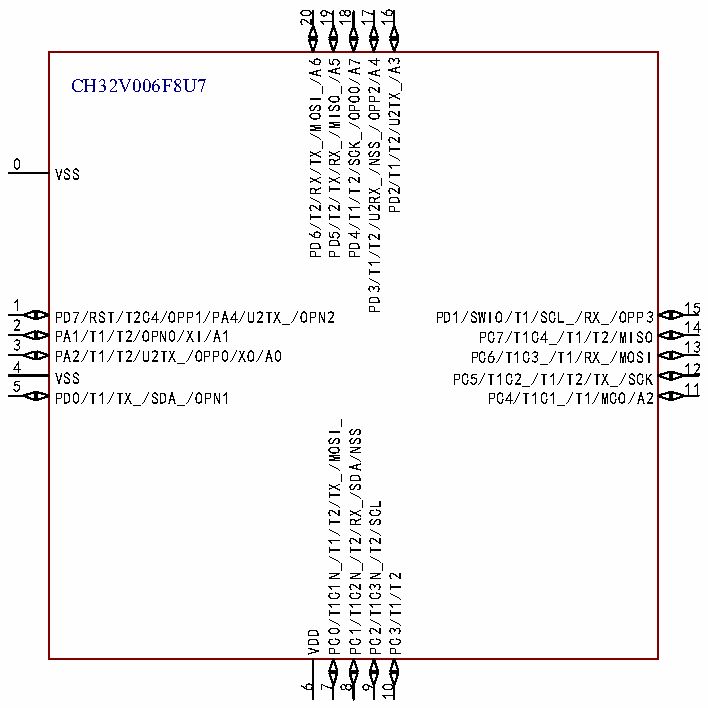
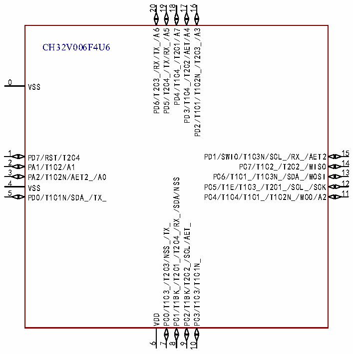

<!-- source-page: 11 -->

[← p.10](0010.md) · [index](../README.md) · [PDF p.11](https://ch32-riscv-ug.github.io/CH32V006/datasheet_zh/CH32V006DS0.PDF#page=11) · [p.12 →](0012.md)

<!-- header: CH32V006/V005数据手册 https://wch.cn -->

 <!-- p11-cluster-01 uncaptioned graphics, rendered from the PDF; verify at https://ch32-riscv-ug.github.io/CH32V006/datasheet_zh/CH32V006DS0.PDF#page=11 -->

 <!-- p11-cluster-02 uncaptioned graphics, rendered from the PDF; verify at https://ch32-riscv-ug.github.io/CH32V006/datasheet_zh/CH32V006DS0.PDF#page=11 -->

🖼 Text parsed from the figure above

20 19  
18 17 16  
PD2/T1/T2/U2TX_/A3  
PD6/T2/RX/TX_/MOSI_/A6 PD5/T2/TX/RX_/MISO_/A5  
PD4/T1/T2/SCK_/OPO0/A7 PD3/T1/T2/U2RX_/NSS_/OPP2/A4  
CH32V006F8U7  
0  
VSS  
1  
15  
PD7/RST/T2C4/OPP1/PA4/U2TX_/OPN2  
PD1/SWIO/T1/SCL_/RX_/OPP3  
2 14  
PA1/T1/T2/OPN0/XI/A1  
PC7/T1C4_/T1/T2/MISO  
3 13  
PA2/T1/T2/U2TX_/OPP0/XO/A0  
PC6/T1C3_/T1/RX_/MOSI  
4 12  
VSS  
PC5/T1C2_/T1/T2/TX_/SCK  
5  
11  
PD0/T1/TX_/SDA_/OPN1  
PC4/T1C1_/T1/MCO/A2  
PC0/T1C1N_/T1/T2/TX_/MOSI_  
PC1/T1C2N_/T2/RX_/SDA/NSS  
PC2/T1C3N_/T2/SCL  
PC3/T1/T2  
VDD  
6 7 8 9 10  
20 19  
18  
17 16  
PD6/T2C3_/RX/TX_/A6 PD5/T2C4_/TX/RX_/A5 PD4/T1C4_/T2C1/A7 PD3/T1C4_/T2C2/AET/A4 PD2/T1C1/T1C2N_/T2C3_/A3  
CH32V006F4U6  
0  
VSS  
1  
15  
PD1/SWIO/T1C3N/SCL_/RX_/AET2  
PD7/RST/T2C4  
2 14  
PC7/T1C2_/T2C2_/MISO  
PA1/T1C2/A1  
3 13  
PC6/T1C1_/T1C3N_/SDA_/MOSI  
PA2/T1C2N/AET2_/A0  
PC1/T1BK_/T2C1_/T2C4_/RX_/SDA/NSS  
4 12  
PC5/T1E/T1C3_/T2C1_/SCL_/SCK  
VSS  
5  
11  
PC4/T1C4/T1C1_/T1C2N_/MCO/A2  
PD0/T1C1N/SDA_/TX_  
PC0/T1C3_/T2C3/NSS_/TX_  
PC2/T1BK/T2C2_/SCL/AET_  
PC3/T1C3/T1C1N_  
VDD  
6  
7  
8  
9  
10  

<!-- image: p11-draw-image-00001 bbox=[496.32, 779.28, 515.76, 789.6] -->
<!-- footer: V2.0 9 -->
