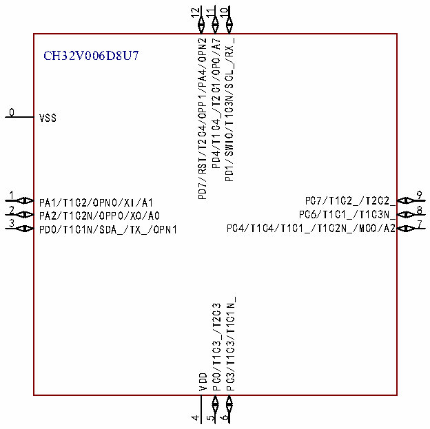

<!-- source-page: 12 -->

[← p.11](0011.md) · [index](../README.md) · [PDF p.12](https://ch32-riscv-ug.github.io/CH32V006/datasheet_zh/CH32V006DS0.PDF#page=12) · [p.13 →](0013.md)

<!-- header: CH32V006/V005数据手册 https://wch.cn -->
CH32V0 06F8P7  
1 20  
PD4/T1/T2/SCK_/OPO0/A7 PD3/T1/T2/U2RX_/NSS_/OPP2/A4  
2 19  
PD5/T2/TX/RX_/MISO_/A5 PD2/T1/T2/U2TX_/A3  
3 18  
PD6/T2/RX/TX_/MOSI_/A6 PD1/SWIO/T1/SCL_/RX_/OPP3  
4 17  
PD7/RST/T2C4/OPP1/PA4/OPN2 PC7/T1C4_/T1/T2/MISO  
5 16  
PA1/T1/T2/OPN0/XI/A1 PC6/T1C3_/T1/RX_/MOSI  
15  
6  
PA2/T1/T2/U2TX_/OPP0/XO/A0 PC5/T1C2_/T1/T2/TX_/SCK  
7 14  
VSS PC4/T1C1_/T1/MCO/A2  
8 13  
PD0/T1/SDA_/TX_/OPN1 PC3/T1/T2  
9 12  
VDD PC2/T1C3N_/T2/SCL  
10 11  
PC0/T1/T2/NSS_/TX_/MOSI_ PC1/T1C2N_/T2/RX_/SDA/NSS  

 <!-- p12-cluster-01 uncaptioned graphics, rendered from the PDF; verify at https://ch32-riscv-ug.github.io/CH32V006/datasheet_zh/CH32V006DS0.PDF#page=12 -->

🖼 Text parsed from the figure above

12  
11 10  
PD7/RST/T2C4/OPP1/PA4/OPN2 PD4/T1C4_/T2C1/OPO/A7 PD1/SWIO/T1C3N/SCL_/RX_  
CH32V006D8U7  
0  
VSS  
1  
9  
PC7/T1C2_/T2C2_  
PA1/T1C2/OPN0/XI/A1  
2  
8 PA2/T1C2N/OPP0/XO/A0  
PC6/T1C1_/T1C3N_  
3  
7  
PC4/T1C4/T1C1_/T1C2N_/MCO/A2  
PD0/T1C1N/SDA_/TX_/OPN1  
PC3/T1C3/T1C1N_  
PC0/T1C3_/T2C3  
VDD  
4 5 6  

<!-- image: p12-draw-image-00001 bbox=[500.88, 779.28, 520.32, 789.6] -->
<!-- footer: V2.0 10 -->
