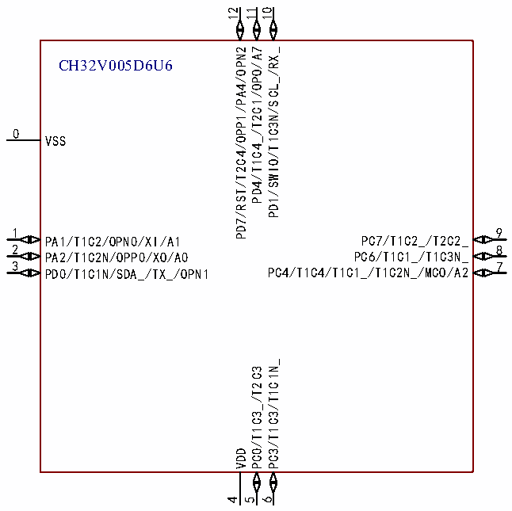

<!-- source-page: 14 -->

[← p.13](0013.md) · [index](../README.md) · [PDF p.14](https://ch32-riscv-ug.github.io/CH32V006/datasheet_zh/CH32V006DS0.PDF#page=14) · [p.15 →](0015.md)

<!-- header: CH32V006/V005数据手册 https://wch.cn -->

 <!-- p14-cluster-01 uncaptioned graphics, rendered from the PDF; verify at https://ch32-riscv-ug.github.io/CH32V006/datasheet_zh/CH32V006DS0.PDF#page=14 -->

🖼 Text parsed from the figure above

12 11 10  
PD7/RST/T2C4/OPP1/PA4/OPN2  
PD4/T1C4_/T2C1/OPO/A7  
PD1/SWIO/T1C3N/SCL_/RX_  
CH32V005D6U6  
0  
VSS  
1  
9  
PC7/T1C2_/T2C2_  
PA1/T1C2/OPN0/XI/A1  
2  
8  
PC6/T1C1_/T1C3N_  
PA2/T1C2N/OPP0/XO/A0  
3  
7  
PC4/T1C4/T1C1_/T1C2N_/MCO/A2  
PD0/T1C1N/SDA_/TX_/OPN1  
PC3/T1C3/T1C1N_  
PC0/T1C3_/T2C3  
VDD  
4  
5  
6  

注：引脚图中复用功能均为缩写。  
示例：A:ADC_ (A1:ADC_IN1、AET:ADC_RETR、AET2:ADC_IETR)  
T1:TIM1_ (T1C1:TIM1_CH1、T1C1N:TIM1_CH1N、T1BK:TIM1_BKIN、T1E:TIM1_ETR)  
T2:TIM2_ (T2C1:TIM2_CH1_ETR、T2C2:TIM2_CH2)  
USART1_ (RX:USART1_RX、TX:USART1_TX)  
U2:USART2_ (U2RX:USART2_RX、U2TX:USART2_TX)  
O:OPA_ (OPP0:OPA_P0、OPNO:OPA_NO、OPO1:OPA_OUT1、OPO:OPA_OUT0)  
I2C_ (SDA:I2C_SDA、SCL:I2C_SCL)  
SPI_ (SCK:SPI_SCK、NSS:SPI_NSS、MISO:SPI_MISO、MOSI:SPI_MOSI)  
SWIO:SWIO/SWDIO  
SWCK:SWCLK  
<!-- image: p14-draw-image-00001 bbox=[500.88, 779.28, 520.32, 789.6] -->
<!-- footer: V2.0 12 -->
