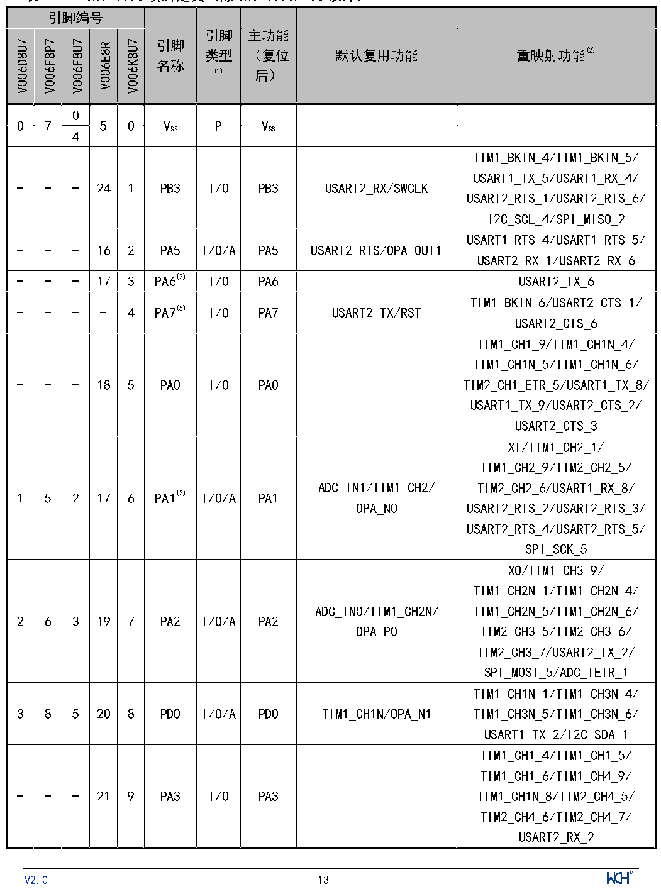

<!-- source-page: 15 -->

[← p.14](0014.md) · [index](../README.md) · [PDF p.15](https://ch32-riscv-ug.github.io/CH32V006/datasheet_zh/CH32V006DS0.PDF#page=15) · [p.16 →](0016.md)

<!-- header: CH32V006/V005数据手册 https://wch.cn -->

## 2.2 引脚描述

注意，下表中的引脚功能描述针对的是所有功能，不涉及具体型号产品。不同型号之间外设资源有差  
异，查看前请先根据产品型号资源表确认是否有此功能。  

 <!-- p15-cluster-01 uncaptioned graphics, rendered from the PDF; verify at https://ch32-riscv-ug.github.io/CH32V006/datasheet_zh/CH32V006DS0.PDF#page=15 -->

🖼 Text parsed from the figure above

<!-- p15-table-001 (table-2-1-1@1) pages 15-17 -->
<table><caption>表2-1-1 CH32V006引脚定义（除CH32V006F4U6以外）</caption><tr><th colspan="5">引脚编号</th><th rowspan="5" style="text-align:left">引脚名称</th><th rowspan="2">引脚</th><th rowspan="2">主功能</th><th rowspan="5">默认复用功能</th><th rowspan="5">重映射功能(2)</th></tr><tr><td rowspan="4">V006D8U7</td><td rowspan="4">V006F8P7</td><td rowspan="4">V006F8U7</td><td rowspan="4">V006E8R</td><td rowspan="4">V006K8U7</td></tr><tr><td>类型</td><td>（复位</td></tr><tr><td>(1)</td><td>后）</td></tr><tr><td></td><td></td></tr><tr><td rowspan="2">0</td><td rowspan="2">7</td><td>0</td><td rowspan="2">5</td><td rowspan="2">0</td><td rowspan="2" style="text-align:left">VSS</td><td rowspan="2">P</td><td rowspan="2" style="text-align:left">VSS</td><td rowspan="2"></td><td rowspan="2"></td></tr><tr><td>4</td></tr><tr><td>-</td><td>-</td><td>-</td><td>24</td><td>1</td><td>PB3</td><td>I/O</td><td>PB3</td><td>USART2_RX/SWCLK</td><td style="text-align:left">TIM1_BKIN_4/TIM1_BKIN_5/ USART1_TX_5/USART1_RX_4/ USART2_RTS_1/USART2_RTS_6/ I2C_SCL_4/SPI_MISO_2</td></tr><tr><td>-</td><td>-</td><td>-</td><td>16</td><td>2</td><td>PA5</td><td>I/O/A</td><td>PA5</td><td>USART2_RTS/OPA_OUT1</td><td style="text-align:left">USART1_RTS_4/USART1_RTS_5/ USART2_RX_1/USART2_RX_6</td></tr><tr><td>-</td><td>-</td><td>-</td><td>17</td><td>3</td><td>PA6(3)</td><td>I/O</td><td>PA6</td><td></td><td>USART2_TX_6</td></tr><tr><td>-</td><td>-</td><td>-</td><td>-</td><td>4</td><td>PA7(5)</td><td>I/O</td><td>PA7</td><td>USART2_TX/RST</td><td style="text-align:left">TIM1_BKIN_6/USART2_CTS_1/ USART2_CTS_6</td></tr><tr><td>-</td><td>-</td><td>-</td><td>18</td><td>5</td><td>PA0</td><td>I/O</td><td>PA0</td><td></td><td style="text-align:left">TIM1_CH1_9/TIM1_CH1N_4/ TIM1_CH1N_5/TIM1_CH1N_6/ TIM2_CH1_ETR_5/USART1_TX_8/ USART1_TX_9/USART2_CTS_2/ USART2_CTS_3</td></tr><tr><td>1</td><td>5</td><td>2</td><td>17</td><td>6</td><td>PA1(3)</td><td>I/O/A</td><td>PA1</td><td style="text-align:left">ADC_IN1/TIM1_CH2/ OPA_N0</td><td style="text-align:left">XI/TIM1_CH2_1/ TIM1_CH2_9/TIM2_CH2_5/ TIM2_CH2_6/USART1_RX_8/ USART2_RTS_2/USART2_RTS_3/ USART2_RTS_4/USART2_RTS_5/ SPI_SCK_5</td></tr><tr><td>2</td><td>6</td><td>3</td><td>19</td><td>7</td><td>PA2</td><td>I/O/A</td><td>PA2</td><td style="text-align:left">ADC_IN0/TIM1_CH2N/ OPA_P0</td><td style="text-align:left">XO/TIM1_CH3_9/ TIM1_CH2N_1/TIM1_CH2N_4/ TIM1_CH2N_5/TIM1_CH2N_6/ TIM2_CH3_5/TIM2_CH3_6/ TIM2_CH3_7/USART2_TX_2/ SPI_MOSI_5/ADC_IETR_1</td></tr><tr><td>3</td><td>8</td><td>5</td><td>20</td><td>8</td><td>PD0</td><td>I/O/A</td><td>PD0</td><td>TIM1_CH1N/OPA_N1</td><td style="text-align:left">TIM1_CH1N_1/TIM1_CH3N_4/ TIM1_CH3N_5/TIM1_CH3N_6/ USART1_TX_2/I2C_SDA_1</td></tr><tr><td>-</td><td>-</td><td>-</td><td>21</td><td>9</td><td>PA3</td><td>I/O</td><td>PA3</td><td></td><td style="text-align:left">TIM1_CH1_4/TIM1_CH1_5/ TIM1_CH1_6/TIM1_CH4_9/ TIM1_CH1N_8/TIM2_CH4_5/ TIM2_CH4_6/TIM2_CH4_7/ USART2_RX_2</td></tr><tr><td colspan="5">引脚编号</td><td rowspan="5" style="text-align:left">引脚名称</td><td rowspan="2">引脚</td><td rowspan="2">主功能</td><td rowspan="5">默认复用功能</td><td rowspan="5">重映射功能(2)</td></tr><tr><td rowspan="4">V006D8U7</td><td rowspan="4">V006F8P7</td><td rowspan="4">V006F8U7</td><td rowspan="4">V006E8R</td><td rowspan="4">V006K8U7</td></tr><tr><td>类型</td><td>（复位</td></tr><tr><td>(1)</td><td>后）</td></tr><tr><td></td><td></td></tr><tr><td>-</td><td>-</td><td>-</td><td>22</td><td>10</td><td>PB0</td><td>I/O</td><td>PB0</td><td></td><td style="text-align:left">TIM1_CH2_4/TIM1_CH2_5/ TIM1_CH2_6/TIM1_CH2N_8/ USART2_TX_4/SPI_NSS_3/</td></tr><tr><td>-</td><td>-</td><td>-</td><td>23</td><td>11</td><td>PB1</td><td>I/O</td><td>PB1</td><td></td><td style="text-align:left">TIM1_CH3_4/TIM1_CH3_6/ TIM1_CH3N_8/TIM2_CH1_ETR_6/ USART2_RX_4/SPI_SCK_3</td></tr><tr><td>-</td><td>-</td><td>-</td><td>-</td><td>12</td><td>PB2</td><td>I/O</td><td>PB2</td><td></td><td style="text-align:left">TIM1_CH4_6/TIM1_BKIN_7/ TIM1_BKIN_8/TIM1_BKIN_9/ SPI_MISO_3</td></tr><tr><td>5</td><td>10</td><td>7</td><td>2</td><td>13</td><td>PC0</td><td>I/O</td><td>PC0</td><td>TIM2_CH3</td><td style="text-align:left">TIM1_CH3_2/TIM1_CH1N_7/ TIM1_CH1N_9/TIM2_CH1_ETR_4/ TIM2_CH3_1/USART1_TX_3/ SPI_NSS_1/SPI_MOSI_3</td></tr><tr><td>-</td><td>11</td><td>8</td><td>3</td><td>14</td><td>PC1</td><td>I/O</td><td>PC1</td><td>I2C_SDA/SPI_NSS</td><td style="text-align:left">TIM1_CH2N_7/TIM1_CH2N_9/ TIM1_BKIN_2/TIM1_BKIN_3/ TIM2_CH1_ETR_1/ TIM2_CH1_ETR_3/TIM2_CH2_4/ TIM2_CH4_2/USART1_RX_3/ SPI_NSS_5</td></tr><tr><td>-</td><td>12</td><td>9</td><td>4</td><td>15</td><td>PC2</td><td>I/O/A</td><td>PC2</td><td style="text-align:left">TIM1_BKIN/USART1_RTS/ I2C_SCL</td><td style="text-align:left">TIM1_CH3N_7/TIM1_CH3N_9/ TIM2_CH2_2/USART1_RTS_2/ TIM1_BKIN_1/TIM1_ETR_3/ ADC_RETR_1</td></tr><tr><td>6</td><td>13</td><td>10</td><td>-</td><td>16</td><td>PC3</td><td>I/O</td><td>PC3</td><td>TIM1_CH3</td><td style="text-align:left">TIM1_CH3_1/TIM1_CH3_5/ TIM1_CH1N_2/TIM1_CH1N_3/ TIM2_CH3_4/USART1_CTS_2</td></tr><tr><td>4</td><td>9</td><td>6</td><td>6</td><td>17</td><td style="text-align:left">VDD</td><td>P</td><td style="text-align:left">VDD</td><td></td><td></td></tr><tr><td>7</td><td>14</td><td>11</td><td>8</td><td>18</td><td>PC4</td><td>I/O/A</td><td>PC4</td><td>ADC_IN2/TIM1_CH4/MCO</td><td style="text-align:left">TIM1_CH1_3/TIM1_CH1_7/ TIM1_CH1_8/TIM1_CH4_1/ TIM1_CH2N_2/USART1_RX_9/ USART2_TX_5/SPI_NSS_2/ SPI_NSS_6</td></tr><tr><td>-</td><td>15</td><td>12</td><td>7</td><td>19</td><td>PC5(5)</td><td>I/O</td><td>PC5</td><td>TIM1_ETR/SPI_SCK/RST</td><td style="text-align:left">TIM1_CH2_7/TIM1_CH2_8/ TIM1_CH3_3/TIM1_ETR_2/ TIM2_CH1_ETR_2/USART1_TX_6/ I2C_SCL_2/SPI_SCK_1</td></tr><tr><td>8</td><td>16</td><td>13</td><td>-</td><td>20</td><td>PC6</td><td>I/O</td><td>PC6</td><td>SPI_MOSI</td><td style="text-align:left">TIM1_CH1_2/TIM1_CH3_7/ TIM1_CH3_8/TIM1_CH3N_3/ USART1_RX_6/USART1_CTS_1/ USART1_CTS_3/SPI_MOSI_1/</td></tr><tr><td colspan="5">引脚编号</td><td rowspan="5" style="text-align:left">引脚名称</td><td rowspan="2">引脚</td><td rowspan="2">主功能</td><td rowspan="5">默认复用功能</td><td rowspan="5">重映射功能(2)</td></tr><tr><td rowspan="4">V006D8U7</td><td rowspan="4">V006F8P7</td><td rowspan="4">V006F8U7</td><td rowspan="4">V006E8R</td><td rowspan="4">V006K8U7</td></tr><tr><td>类型</td><td>（复位</td></tr><tr><td>(1)</td><td>后）</td></tr><tr><td></td><td></td></tr><tr><td></td><td></td><td></td><td></td><td></td><td></td><td></td><td></td><td></td><td>I2C_SDA_2</td></tr><tr><td>9</td><td>17</td><td>14</td><td>-</td><td>21</td><td>PC7</td><td>I/O</td><td>PC7</td><td>SPI_MISO</td><td style="text-align:left">TIM1_CH2_2/TIM1_CH2_3/ TIM1_CH4_7/TIM1_CH4_8/ TIM2_CH2_3/USART1_CTS_6/ USART1_CTS_7/USART1_RTS_1/ USART1_RTS_3/SPI_MISO_1/ SPI_MISO_6</td></tr><tr><td>-</td><td>-</td><td>-</td><td>-</td><td>22</td><td>PB4</td><td>I/O</td><td>PB4</td><td></td><td style="text-align:left">TIM1_ETR_7/TIM1_ETR_8/ TIM1_ETR_9/USART1_RTS_6/ USART1_RTS_7/SPI_MOSI_6</td></tr><tr><td>10</td><td>18</td><td>15</td><td>1</td><td>23</td><td>PD1</td><td>I/O/A</td><td>PD1</td><td style="text-align:left">TIM1_CH3N/SWIO/SWDIO/ OPA_P3/ADC_IETR</td><td style="text-align:left">TIM1_CH4_4/TIM1_CH4_5/ TIM1_CH3N_1/TIM1_CH3N_2/ USART1_TX_4/USART1_RX_2/ USART1_RX_5/USART2_RX_5/ I2C_SCL_1/I2C_SDA_4</td></tr><tr><td>-</td><td>19</td><td>16</td><td>9</td><td>24</td><td>PD2</td><td>I/O/A</td><td>PD2</td><td>ADC_IN3/TIM1_CH1</td><td style="text-align:left">TIM1_CH1_1/TIM1_CH2N_3/ TIM2_CH3_2/USART1_CTS_8/ USART2_TX_3/SPI_SCK_2</td></tr><tr><td>-</td><td>20</td><td>17</td><td>10</td><td>25</td><td>PD3</td><td>I/O/A</td><td>PD3</td><td style="text-align:left">ADC_IN4/TIM2_CH2/ USART1_CTS/OPA_P2/ ADC_RETR</td><td style="text-align:left">TIM1_CH4_2/TIM2_CH1_ETR_7/ TIM2_CH2_1/USART1_RTS_8/ USART2_RX_3/SPI_NSS_4/ SPI_MOSI_2</td></tr><tr><td>11</td><td>1</td><td>18</td><td>11</td><td>26</td><td>PD4</td><td>I/O/A</td><td>PD4</td><td style="text-align:left">ADC_IN7/TIM2_CH1_ETR/ OPA_OUT0</td><td style="text-align:left">TIM1_CH4_3/TIM1_ETR_1/ TIM1_ETR_4/TIM1_ETR_5/ TIM1_ETR_6/TIM2_CH2_7/ USART1_RTS_9/SPI_SCK_4</td></tr><tr><td>-</td><td>2</td><td>19</td><td>12</td><td>27</td><td>PD5</td><td>I/O/A</td><td>PD5</td><td>ADC_IN5/USART1_TX</td><td style="text-align:left">TIM2_CH4_3/USART1_RX_1/ USART1_CTS_9/SPI_MISO_4</td></tr><tr><td>-</td><td>3</td><td>20</td><td>13</td><td>28</td><td>PD6</td><td>I/O/A</td><td>PD6</td><td>ADC_IN6/USART1_RX</td><td style="text-align:left">TIM2_CH3_3/USART1_TX_1/ SPI_MOSI_4</td></tr><tr><td>-</td><td>-</td><td>-</td><td>-</td><td>29</td><td>PB5</td><td>I/O</td><td>PB5</td><td></td><td style="text-align:left">USART1_TX_7/I2C_SCL_3/ SPI_SCK_6/SPI_MISO_5</td></tr><tr><td>-</td><td>-</td><td>-</td><td>-</td><td>30</td><td>PB6</td><td>I/O</td><td>PB6</td><td></td><td style="text-align:left">TIM2_CH4_4/USART1_RX_7/ USART2_CTS_4/I2C_SDA_3</td></tr><tr><td rowspan="2">12</td><td rowspan="2">4</td><td rowspan="2">1</td><td>14</td><td>31</td><td>PD7(4)(5)</td><td>I/O/A</td><td>PD7</td><td>TIM2_CH4/RST/OPA_P1</td><td style="text-align:left">TIM2_CH4_1/USART1_CTS_4/ USART1_CTS_5</td></tr><tr><td>15</td><td>32</td><td>PA4(4)</td><td>I/O/A</td><td>PA4</td><td>USART2_CTS/OPA_N2</td><td>USART2_TX_1/USART2_CTS_5</td></tr></table>

0 7 5 0 VSS P VSS  
<!-- image: p15-draw-image-00001 inside the figure -->
<!-- footer: V2.0 13 -->

