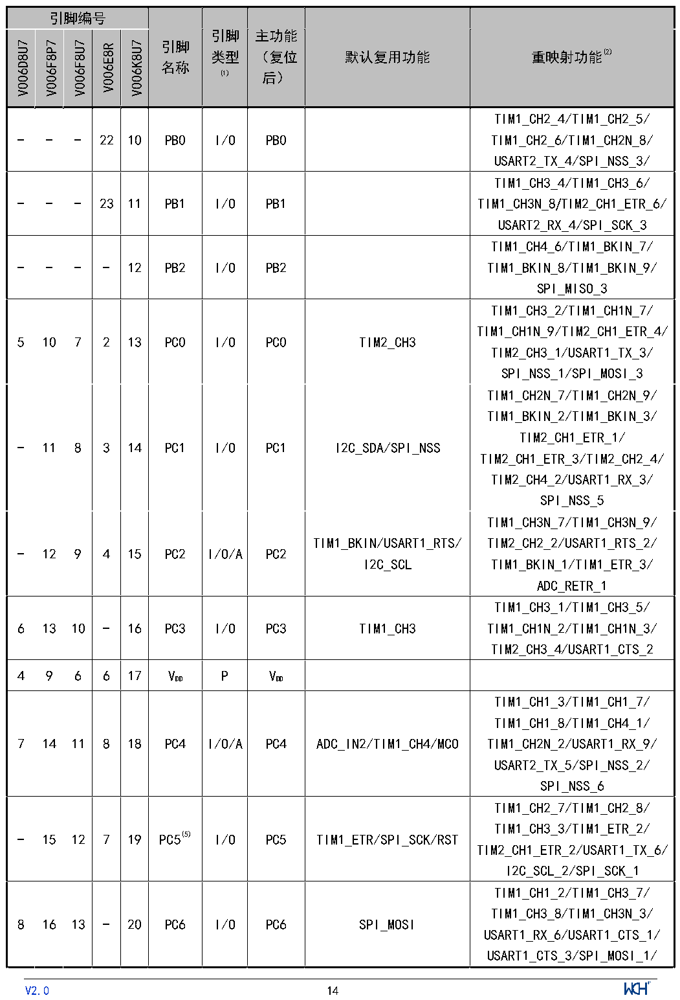

<!-- source-page: 16 -->

[← p.15](0015.md) · [index](../README.md) · [PDF p.16](https://ch32-riscv-ug.github.io/CH32V006/datasheet_zh/CH32V006DS0.PDF#page=16) · [p.17 →](0017.md)

<!-- header: CH32V006/V005数据手册 https://wch.cn -->

 <!-- p16-cluster-01 uncaptioned graphics, rendered from the PDF; verify at https://ch32-riscv-ug.github.io/CH32V006/datasheet_zh/CH32V006DS0.PDF#page=16 -->

🖼 Text parsed from the figure above

> ⬆ **Table continued** — rendered in full at [page 15](0015.md). <!-- p16-table-001 -->

<!-- image: p16-draw-image-00001 inside the figure -->
<!-- footer: V2.0 14 -->

