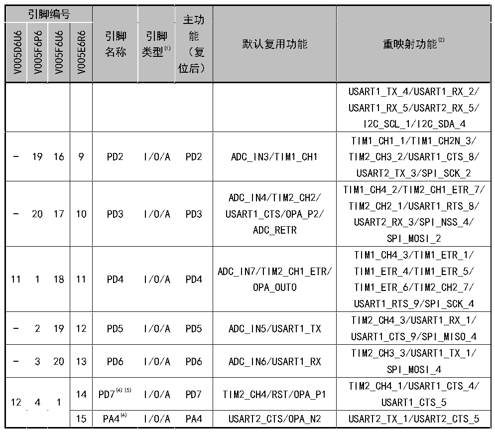

<!-- source-page: 22 -->

[← p.21](0021.md) · [index](../README.md) · [PDF p.22](https://ch32-riscv-ug.github.io/CH32V006/datasheet_zh/CH32V006DS0.PDF#page=22) · [p.23 →](0023.md)

<!-- header: CH32V006/V005数据手册 https://wch.cn -->

 <!-- p22-cluster-01 uncaptioned graphics, rendered from the PDF; verify at https://ch32-riscv-ug.github.io/CH32V006/datasheet_zh/CH32V006DS0.PDF#page=22 -->

🖼 Text parsed from the figure above

> ⬆ **Table continued** — rendered in full at [page 20](0020.md). <!-- p22-table-001 -->

注1：表格缩写解释：  
I = TTL/CMOS 电平斯密特输入；O = CMOS 电平三态输出；  
A = 模拟信号输入或输出；P = 电源。  
注2：重映射功能下划线后的数值表示AFIO寄存器中相对应位的配置值。例如：TIM1_BKIN_4表示AFIO  
寄存器相应位配置为100b。  
注3：对于CH32V006E8R和CH32V005E6R6芯片，PA1与PA6引脚在芯片内部短接合封，禁止两个I/O均配置  
为输出功能。  
注4：对于CH32V006F8U7、CH32V006F8P7、CH32V006D8U7、CH32V005F6U6、CH32V005F6P6和CH32V005D6U6  
芯片，PA4与PD7引脚在芯片内部短接合封，禁止两个I/O均配置为输出功能。  
注5：对于CH32V006K8U7芯片，PA7为复位引脚；对于CH32V006E8R和CH32V005E6R6芯片，PC5为复位引脚；  
对于其余CH32V006和CH32V005芯片，PD7为复位引脚。  
<!-- image: p22-draw-image-00001 bbox=[500.88, 779.28, 520.32, 789.6] -->
<!-- footer: V2.0 20 -->
