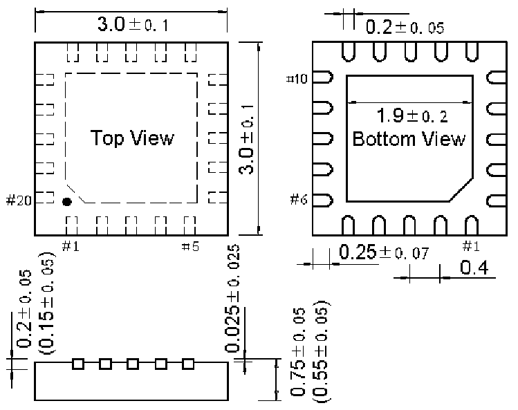
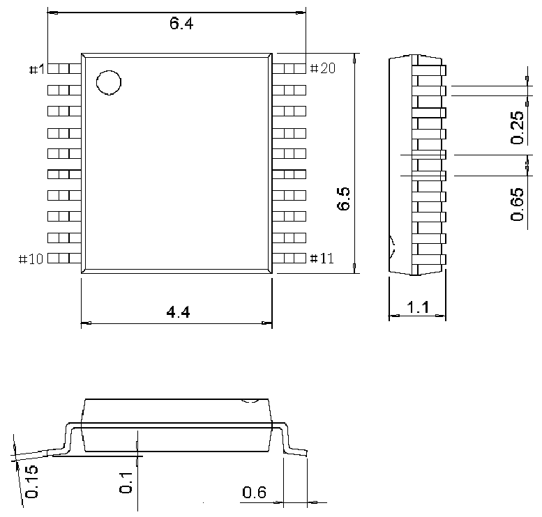

<!-- source-page: 42 -->

[← p.41](0041.md) · [index](../README.md) · [PDF p.42](https://ch32-riscv-ug.github.io/CH32V006/datasheet_zh/CH32V006DS0.PDF#page=42) · [p.43 →](0043.md)

<!-- header: CH32V006/V005数据手册 https://wch.cn -->

## 4.3 QFN20封装

 <!-- p42-draw-image-00002 rendered from the PDF -->

## 4.4 TSSOP20封装

 <!-- p42-draw-image-00003 rendered from the PDF -->

<!-- image: p42-draw-image-00001 bbox=[502.8, 779.28, 522.24, 789.6] -->
<!-- footer: V2.0 40 -->
