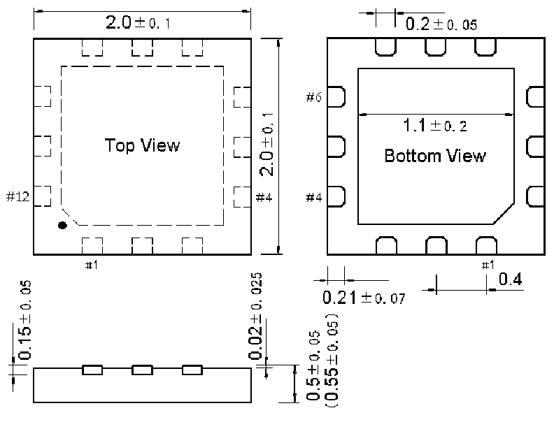

<!-- source-page: 43 -->

[← p.42](0042.md) · [index](../README.md) · [PDF p.43](https://ch32-riscv-ug.github.io/CH32V006/datasheet_zh/CH32V006DS0.PDF#page=43) · [p.44 →](0044.md)

<!-- header: CH32V006/V005数据手册 https://wch.cn -->

## 4.5 QFN12封装

 <!-- p43-draw-image-00002 rendered from the PDF -->

<!-- image: p43-draw-image-00001 bbox=[502.8, 779.28, 522.24, 789.6] -->
<!-- footer: V2.0 41 -->
