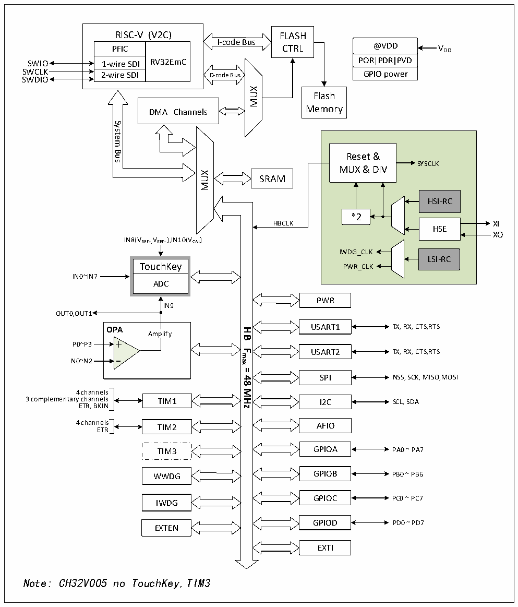

<!-- source-page: 3 -->

[← p.2](0002.md) · [index](../README.md) · [PDF p.3](https://ch32-riscv-ug.github.io/CH32V006/datasheet_zh/CH32V006DS2.PDF#page=3) · [p.4 →](0004.md)

<!-- header: CH32M006数据手册 https://wch.cn -->

# 第 1 章 规格信息

## 1.1 系统架构

微控制器基于 RISC-V 指令集设计，其架构中将青稞微处理器内核、仲裁单元、DMA 模块、SRAM  
存储等部件通过多组总线实现交互。集成通用DMA控制器以减轻CPU负担、提高访问效率，应用多级  
时钟管理机制降低了外设的运行功耗，同时兼有数据保护机制，时钟自动切换保护等措施增加了系统  
稳定性。下图是系列芯片内部总体架构框图。  

图1-1-1 CH32V006系统框图  
 <!-- rendered from the PDF; verify at https://ch32-riscv-ug.github.io/CH32V006/datasheet_zh/CH32V006DS2.PDF#page=3 -->

🖼 Text parsed from the figure above

RISC-V (V2C) PFIC 1-wire SDI RV32EmC 2-wire SDI  RISC-V (V2C)  PFIC  1-wire SDI  21--wwiirree SSDDII  
RISC-V (V2C) FLASH  
@VDD  POR PDR PVD  GPIO power  
I-code Bus  
PFIC CTRL  
SWIO POR PDR PVD  
SWCLK GPIO power  
SWDIO  
MUX  
Flash  
Memory  
DMA Channels  
System  
Bus  
Reset &amp;  
SYSCLK  
MUX &amp; DIV  
MUX  
SRAM  
HSI-RC  HSE  
*2  
HBCLK XI  
XO  
IN8(VREF+,VREF- ),IN10(VCAL)  
IWDG_CLK  
LSI-RC  
TouchKey PWR_CLK  
IN0~IN7  
ADC  
PWR  
IN9  
OUT0,OUT1  
OPA USART1 TX, RX, CTS,RTS  
<strong>HB</strong>  
Amplify  
P0~P3  
<strong>Fmax</strong>  
USART2 TX, RX, CTS,RTS  
N0~N2  
<strong>=</strong>  
SPI NSS, SCK, MISO,MOSI  
<strong>48</strong>  
<strong>MHz</strong>  
4 channels  
3 complementary channels TIM1 I2C  
SCL, SDA  
ETR, BKIN  
4 channels TIM2 AFIO  
ETR  
TIM3 GPIOA PA0 ~ PA7  
WWDG GPIOB PB0 ~ PB6  
GPIOC PC0 ~ PC7  
IWDG  
GPIOD PD0 ~ PD7  
EXTEN  
EXTI  
Note: CH32V005 no TouchKey,TIM3  

<!-- image: p3-draw-image-00001 bbox=[507.72, 779.28, 527.16, 789.6] -->
<!-- footer: V1.1 1 -->
