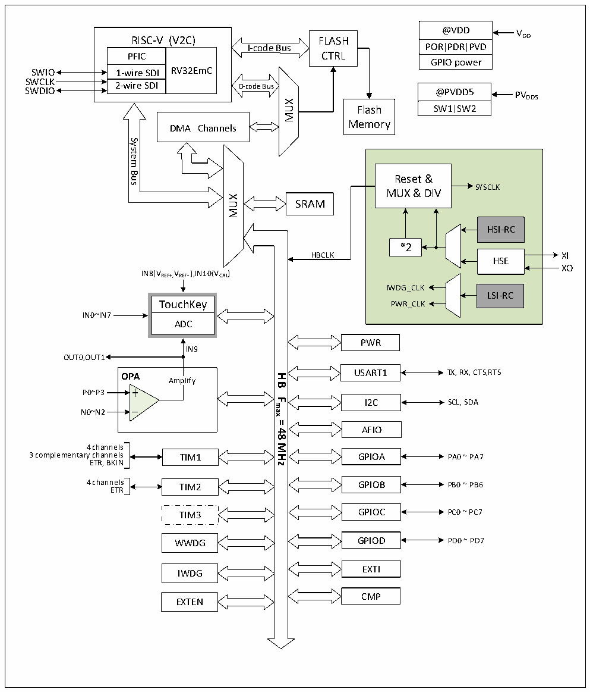

<!-- source-page: 4 -->

[← p.3](0003.md) · [index](../README.md) · [PDF p.4](https://ch32-riscv-ug.github.io/CH32V006/datasheet_zh/CH32V006DS2.PDF#page=4) · [p.5 →](0005.md)

<!-- header: CH32M006数据手册 https://wch.cn -->

图1-1-2 CH32M006系统框图  
 <!-- rendered from the PDF; verify at https://ch32-riscv-ug.github.io/CH32V006/datasheet_zh/CH32V006DS2.PDF#page=4 -->

🖼 Text parsed from the figure above

@VDD  POR  PDR  PVD  GPIO power  
RISC-V (V2C) PFIC 1-wire SDI RV32EmC 2-wire SDI  RISC-V (V2C)  PFIC  1-wire SDI 2-wire SDI  2-wire SDI  
DD  
RISC-V (V2C) FLASH  
I-code Bus  
PFIC CTRL  
SWIO  
SWCLK  
@PVDD5  SW1 SW2  
SWDIO @PVDD5 PV  
DD5  
MUX  
Flash  
Memory  
DMA Channels  
System  
Bus  
Reset &amp;  
SYSCLK  
MUX &amp; DIV  
MUX  
SRAM  
HSI-RC  HSE  
*2  
HBCLK XI  
XO  
IN8(VREF+,VREF- ),IN10(VCAL)  
IWDG_CLK  
LSI-RC  
TouchKey PWR_CLK  
IN0~IN7  
ADC  
PWR  
IN9  
OUT0,OUT1  
OPA USART1 TX, RX, CTS,RTS  
<strong>HB</strong>  
Amplify  
P0~P3  
<strong>Fmax</strong>  
I2C  
SCL, SDA  
N0~N2  
<strong>=</strong>  
AFIO  
<strong>48</strong>  
<strong>MHz</strong>  
4 channels  
3 complementary channels TIM1 GPIOA PA0 ~ PA7  
ETR, BKIN  
4 channels TIM2 GPIOB PB0 ~ PB6  
ETR  
TIM3 GPIOC PC0 ~ PC7  
WWDG GPIOD PD0 ~ PD7  
EXTI  
IWDG  
CMP  
EXTEN  

<!-- image: p4-draw-image-00001 bbox=[507.72, 779.28, 527.16, 789.6] -->
<!-- footer: V1.1 2 -->
