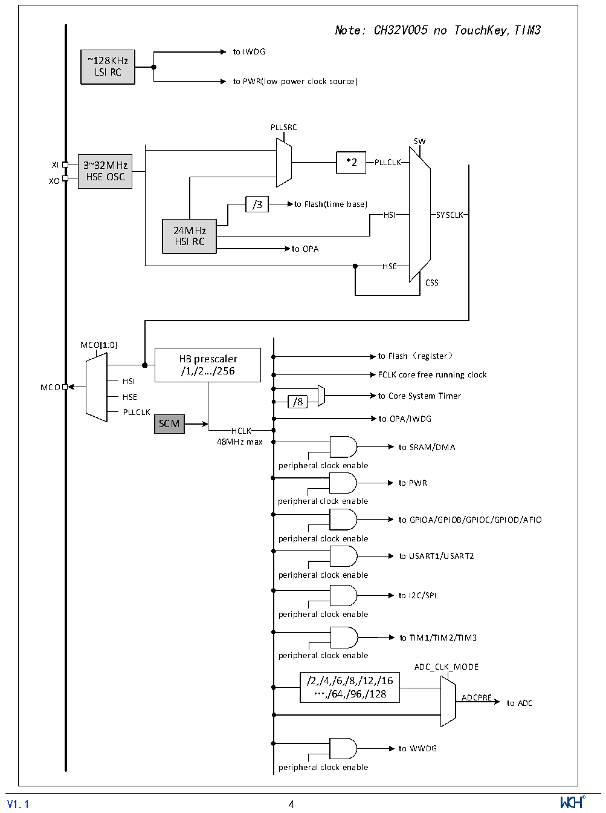

<!-- source-page: 6 -->

[← p.5](0005.md) · [index](../README.md) · [PDF p.6](https://ch32-riscv-ug.github.io/CH32V006/datasheet_zh/CH32V006DS2.PDF#page=6) · [p.7 →](0007.md)

<!-- header: CH32M006数据手册 https://wch.cn -->

## 1.3 时钟树

系统中引入3组时钟源：内部高频RC振荡器（HSI）、内部低频RC振荡器(LSI)、外接高频振荡器  
(HSE)。其中，低频时钟源为独立看门狗提供了时钟基准。高频时钟源直接或者间接通过2倍频后输出  
为系统总线时钟（SYSCLK），系统时钟再由各预分频器提供了HB域外设控制时钟及采样或接口输出时  
钟，部分模块工作需要由PLL时钟直接提供。  

图1-3 时钟树框图  
 <!-- rendered from the PDF; verify at https://ch32-riscv-ug.github.io/CH32V006/datasheet_zh/CH32V006DS2.PDF#page=6 -->

🖼 Text parsed from the figure above

Note: CH32V005 no TouchKey,TIM3  
to IWDG  
~128KHz  
LSI RC  
to PWR(low power clock source)  
PLLSRC  
SW  
XI 3~32MHz *2 PLLCLK  
HSE OSC  
XO  
/3 to Flash(time base)  
HSI SYSCLK  
24MHz  
HSI RC  
to OPA  
HSE  HSE  
CSS  
MCO[1:0]  
HB prescaler to Flash（register）  
/1,/2.../256  
FCLK core free running clock  
HSI  
MCO  
HSE to Core System Timer  
/8  
PLLCLK  
to OPA/IWDG  
SCM  
HCLK  
48MHz max  
to SRAM/DMA  
peripheral clock enable  
to PWR  
peripheral clock enable  
to GPIOA/GPIOB/GPIOC/GPIOD/AFIO  
peripheral clock enable  
to USART1/USART2  
peripheral clock enable  
to I2C/SPI  
peripheral clock enable  
to TIM1/TIM2/TIM3  
peripheral clock enable  
ADC_CLK_MODE  
/2,/4,/6,/8,/12,/16  
…,/64,/96,/128  
ADCPRE  
to ADC  
to WWDG  
peripheral clock enable  
<!-- image: p6-draw-image-00001 inside the figure -->
<!-- footer: V1.1 4 -->

