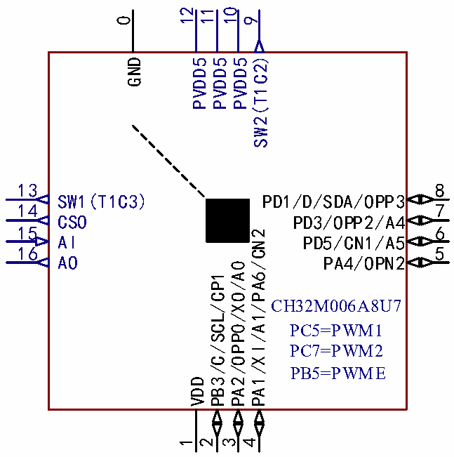

<!-- source-page: 12 -->

[← p.11](0011.md) · [index](../README.md) · [PDF p.12](https://ch32-riscv-ug.github.io/CH32V006/datasheet_zh/CH32V006DS2.PDF#page=12) · [p.13 →](0013.md)

<!-- header: CH32M006数据手册 https://wch.cn -->

# 第 2 章 引脚信息

## 2.1 CH32M006引脚排列

 <!-- p12-cluster-01 uncaptioned graphics, rendered from the PDF; verify at https://ch32-riscv-ug.github.io/CH32V006/datasheet_zh/CH32V006DS2.PDF#page=12 -->

🖼 Text parsed from the figure above

12  
11  
10  
0  
9  
SW2(T1C2)  
GND PVDD5  
PVDD5  
PVDD5  
13  
8  
SW1(T1C3)  
PD1/D/SDA/OPP3  
14 7  
CSO PD3/OPP2/A4  
15 6  
PA1/XI/A1/PA6/CN2  
AI  
PD5/CN1/A5  
16  
5  
AO  
PA4/OPN2  
PA2/OPP0/XO/A0  
PB3/C/SCL/CP1  
CH32M006A8U7  
PC5=PWM1  
PC7=PWM2  
PB5=PWME  
VDD  
1  
2  
3  
4  

注：0#引脚为QFN封装的底板。  
引脚图中复用功能均为缩写。  
示例：A:ADC_ (A1:ADC_IN1)  
O:OPA_ (OPP0:OPA_P0、OPNO:OPA_NO、OPO1:OPA_OUT1、OPO:OPA_OUT0)  
I2C_ (SDA:I2C_SDA、SCL:I2C_SCL)  
D:SWIO/SWDIO  
C:SWCLK  
C:CMP1_ (CP1:CMP1_P1、CN2:CMP1_N2)  
<!-- image: p12-draw-image-00001 bbox=[500.88, 779.28, 520.32, 789.6] -->
<!-- footer: V1.1 10 -->
