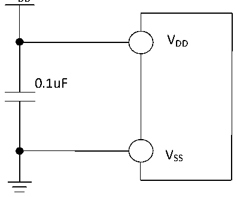
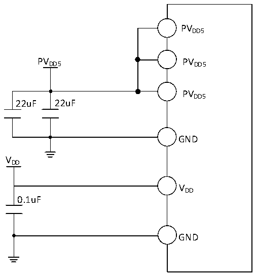

<!-- source-page: 18 -->

[← p.17](0017.md) · [index](../README.md) · [PDF p.18](https://ch32-riscv-ug.github.io/CH32V006/datasheet_zh/CH32V006DS2.PDF#page=18) · [p.19 →](0019.md)

<!-- header: CH32M006数据手册 https://wch.cn -->

# 第 3 章 电气特性

## 3.1 测试条件

除非特殊说明和标注，所有电压都以VSS 为基准。  
所有最小值和最大值将在最坏的环境温度、供电电压和时钟频率条件下得到保证。  
CH32V006典型数值是基于常温25℃和VDD= 3.3V或5V的环境下用于设计指导。  
CH32M006典型数值是基于常温25℃和VDD= 5V、PVDD5= 5V的环境下用于设计指导。  
对于通过综合评估、设计模拟或工艺特性得到的数据，不会在生产线进行测试。在综合评估的基  
础上，最小和最大值是通过样本测试后统计得到。除非特殊说明为实测值，否则特性参数以综合评估  
或设计保证。  
供电方案：  

图3-1-1 CH32V006常规供电典型电路  
 <!-- rendered from the PDF; verify at https://ch32-riscv-ug.github.io/CH32V006/datasheet_zh/CH32V006DS2.PDF#page=18 -->

VDD  

🖼 Text parsed from the figure above

VDD  
0.1uF  
VSS  

图3-1-2 CH32M006A8U7常规供电典型电路  
 <!-- rendered from the PDF; verify at https://ch32-riscv-ug.github.io/CH32V006/datasheet_zh/CH32V006DS2.PDF#page=18 -->

🖼 Text parsed from the figure above

PVDD5  
PVDD5 PVDD5  
PVDD5  
22uF 22uF  
GND  
VDD  
VDD  
0.1uF  
GND  

<!-- image: p18-draw-image-00001 bbox=[502.8, 786.36, 522.24, 796.68] -->
<!-- footer: V1.1 16 -->
