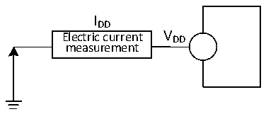

<!-- source-page: 21 -->

[← p.20](0020.md) · [index](../README.md) · [PDF p.21](https://ch32-riscv-ug.github.io/CH32V006/datasheet_zh/CH32V006DS2.PDF#page=21) · [p.22 →](0022.md)

<!-- header: CH32M006数据手册 https://wch.cn -->

> ⬆ **Table continued** — rendered in full at [page 20](0020.md). <!-- p21-table-001 -->

注：1.常温测试值。  

### 3.3.3 内置的参考电压

<!-- p21-table-002 (table-3-5@1) -->
<table><caption>表3-5 内置参考电压</caption><tr><th>符号</th><th>参数</th><th>条件</th><th>最小值</th><th>典型值</th><th>最大值</th><th>单位</th></tr><tr><td style="text-align:left">VREFINT</td><td>内置参考电压</td><td style="text-align:left">T = -40℃～105℃ A</td><td>1.18</td><td>1.2</td><td>1.22</td><td>V</td></tr><tr><td style="text-align:left">TS_vrefint</td><td style="text-align:left">当读出内部参考电压时， ADC的采样时间</td><td>建议慢速采样</td><td>3</td><td></td><td>240</td><td style="text-align:left">1/f ADC</td></tr></table>

### 3.3.4 供电电流特性

电流消耗是多种参数和因素的综合指标，这些参数和因素包括工作电压、环境温度、I/O 引脚的  
负载、产品的软件配置、工作频率、I/O 脚的翻转速率、程序在存储器中的位置以及执行的代码等。  
电流消耗测量方法如下图：  

图3-2 电流消耗测量  
 <!-- rendered from the PDF; verify at https://ch32-riscv-ug.github.io/CH32V006/datasheet_zh/CH32V006DS2.PDF#page=21 -->

🖼 Text parsed from the figure above

IDD  
Electric current V DD  
measurement  

微控制器处于下列条件：  
常温 VDD= 3.3V 或 5V 情况下，测试时：所有 I/O 端口配置下拉输入；HSI = 24MHz（已校准），  
寄存器PWR_CTLR的位LDO_MODE = 10，使能或关闭所有外设时钟的功耗。  

<!-- p21-table-003 (table-3-6@1) -->
<table><caption>表3-6 运行模式下典型的电流消耗，数据处理代码从内部闪存中运行</caption><tr><th rowspan="2">符号</th><th rowspan="2">参数</th><th colspan="3">条件</th><th colspan="2">典型值</th><th rowspan="2">单位</th></tr><tr><td>HSI/HSE</td><td>HSI_LP</td><td style="text-align:left">FHCLK</td><td>使能所有外设</td><td>关闭所有外设</td></tr><tr><td rowspan="11" style="text-align:left">I (1) DD</td><td rowspan="11" style="text-align:left">运行模式下的供应电流</td><td rowspan="5" style="text-align:left">运行于高速外部 时 钟 （ HSE ） (HSE_SI = 00, HSE_LP = 1）</td><td rowspan="5">X</td><td style="text-align:left">F = 48MHz HCLK</td><td>4.4</td><td>3.5</td><td rowspan="11">mA</td></tr><tr><td style="text-align:left">F = 24MHz HCLK</td><td>3.3</td><td>2.8</td></tr><tr><td style="text-align:left">F = 16MHz HCLK</td><td>2.8</td><td>2.5</td></tr><tr><td style="text-align:left">F = 8MHz HCLK</td><td>2.5</td><td>2.4</td></tr><tr><td style="text-align:left">F = 750KHz HCLK</td><td>1.7</td><td>1.7</td></tr><tr><td rowspan="6" style="text-align:left">运行于高速内部RC振荡器（HSI）</td><td rowspan="5">0</td><td style="text-align:left">F = 48MHz HCLK</td><td>3.7</td><td>2.8</td></tr><tr><td style="text-align:left">F = 24MHz HCLK</td><td>2.5</td><td>2.0</td></tr><tr><td style="text-align:left">F = 16MHz HCLK</td><td>2.1</td><td>1.7</td></tr><tr><td style="text-align:left">F = 8MHz HCLK</td><td>1.8</td><td>1.6</td></tr><tr><td style="text-align:left">F = 750KHz HCLK</td><td>0.9</td><td>0.9</td></tr><tr><td>1</td><td style="text-align:left">F = 40KHz HCLK</td><td>0.6</td><td>0.6</td></tr></table>

注：以上为实测参数，不含PVDD5 电流。  
<!-- image: p21-draw-image-00001 bbox=[502.8, 786.36, 522.24, 796.68] -->
<!-- footer: V1.1 19 -->
