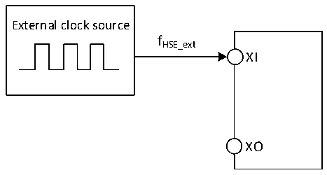
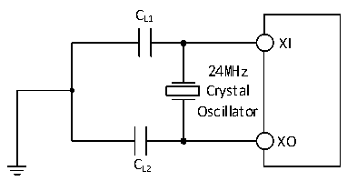

<!-- source-page: 23 -->

[← p.22](0022.md) · [index](../README.md) · [PDF p.23](https://ch32-riscv-ug.github.io/CH32V006/datasheet_zh/CH32V006DS2.PDF#page=23) · [p.24 →](0024.md)

<!-- header: CH32M006数据手册 https://wch.cn -->

图3-3 外部提供高频时钟源电路  
 <!-- rendered from the PDF; verify at https://ch32-riscv-ug.github.io/CH32V006/datasheet_zh/CH32V006DS2.PDF#page=23 -->

🖼 Text parsed from the figure above

External clock source  
fHSE_ext  
XI  
XO  

<!-- p23-table-001 (table-3-10@1) -->
<table><caption>表3-10 使用一个晶体/陶瓷谐振器产生的高速外部时钟</caption><tr><th>符号</th><th>参数</th><th>条件</th><th>最小值</th><th>典型值</th><th>最大值</th><th>单位</th></tr><tr><td style="text-align:left">FXI</td><td>谐振器频率</td><td></td><td>3</td><td>24</td><td>32</td><td>MHz</td></tr><tr><td style="text-align:left">RF</td><td>反馈电阻（无需外置）</td><td></td><td></td><td>250</td><td></td><td>kΩ</td></tr><tr><td style="text-align:left">CLOAD</td><td style="text-align:left">建议的负载电容与对应晶体串行阻抗RS</td><td style="text-align:left">R = 60Ω(1) S</td><td></td><td>20</td><td></td><td>pF</td></tr><tr><td rowspan="2" style="text-align:left">IHSE</td><td rowspan="2">HSE驱动电流</td><td>HSE_LP = 0，20p负载</td><td></td><td>1.6</td><td></td><td rowspan="2">mA</td></tr><tr><td>HSE_LP = 1，20p负载</td><td></td><td>0.8</td><td></td></tr><tr><td style="text-align:left">g m</td><td>振荡器的跨导</td><td>启动</td><td></td><td>21</td><td></td><td>mA/V</td></tr><tr><td style="text-align:left">t SU(HSE)</td><td>启动时间</td><td style="text-align:left">V 是稳定DD</td><td></td><td>1.5（2）</td><td></td><td>ms</td></tr></table>

注：1.25M晶体ESR建议不超过80欧，低于25M可适当放宽。  
2.启动时间指从HSEON开启到HSERDY被置位的时间差。  
电路参考设计及要求：  
晶体的负载电容以晶体厂商建议为准，通常情况CL1= CL2。  

图3-4 外接24M晶体典型电路  
 <!-- rendered from the PDF; verify at https://ch32-riscv-ug.github.io/CH32V006/datasheet_zh/CH32V006DS2.PDF#page=23 -->

🖼 Text parsed from the figure above

CL1  
XI  
24MHz  
Crystal  
Oscillator  
XO  
CL2  

### 3.3.6 内部时钟源特性

<!-- p23-table-002 (table-3-11@1) pages 23-24 -->
<table><caption>表3-11 内部高速(HSI)RC振荡器特性</caption><tr><th>符号</th><th>参数</th><th>条件</th><th>最小值</th><th>典型值</th><th>最大值</th><th>单位</th></tr><tr><td rowspan="2" style="text-align:left">FHSI</td><td rowspan="2">频率(校准后)</td><td>HSI_LP = 0</td><td></td><td>24</td><td></td><td>MHz</td></tr><tr><td>HSI_LP = 1</td><td>30</td><td>42</td><td>58</td><td>KHz</td></tr><tr><td style="text-align:left">DuCy HSI</td><td>占空比(Duty cycle)</td><td></td><td>45</td><td>50</td><td>55</td><td>%</td></tr><tr><td rowspan="2" style="text-align:left">ACCHSI</td><td rowspan="2">HSI振荡器的精度（校准后）</td><td style="text-align:left">HSI_LP = 0， T = -10℃～70℃ A</td><td>-2.0</td><td></td><td>2.0</td><td>%</td></tr><tr><td style="text-align:left">HSI_LP = 0， T = -40℃～105℃ A</td><td>-3.0</td><td></td><td>3.0</td><td>%</td></tr><tr><td style="text-align:left">t (1) SU(HSI)</td><td>HSI振荡器启动稳定时间</td><td></td><td></td><td>3</td><td>8</td><td>us</td></tr><tr><td rowspan="2" style="text-align:left">IDD(HSI)</td><td rowspan="2">HSI振荡器功耗</td><td>HSI_LP = 0</td><td></td><td>200</td><td></td><td rowspan="2">uA</td></tr><tr><td>HSI_LP = 1</td><td></td><td>8.5</td><td></td></tr></table>

<!-- image: p23-draw-image-00001 bbox=[502.8, 786.36, 522.24, 796.68] -->
<!-- footer: V1.1 21 -->
