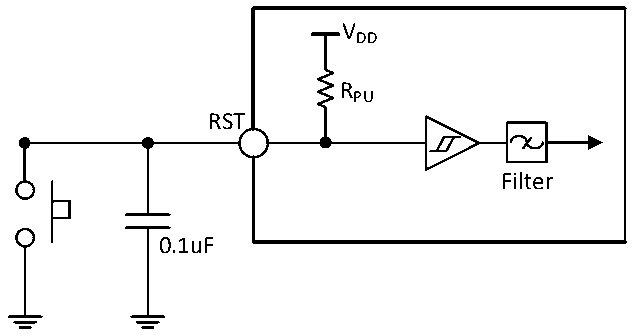
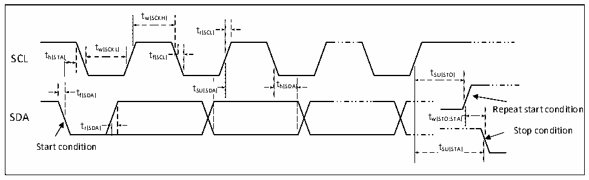

<!-- source-page: 26 -->

[← p.25](0025.md) · [index](../README.md) · [PDF p.26](https://ch32-riscv-ug.github.io/CH32V006/datasheet_zh/CH32V006DS2.PDF#page=26) · [p.27 →](0027.md)

<!-- header: CH32M006数据手册 https://wch.cn -->

图3-5 外部复位引脚典型电路  
 <!-- rendered from the PDF; verify at https://ch32-riscv-ug.github.io/CH32V006/datasheet_zh/CH32V006DS2.PDF#page=26 -->

🖼 Text parsed from the figure above

VDD  
RPU  
RST  
Filter  
0.1uF  

注：图中的电容是可选的，可以用于滤除按键抖动。  

### 3.3.11 TIM定时器特性

<!-- p26-table-002 (table-3-20@1) -->
<table><caption>表3-20 TIMx特性</caption><tr><th>符号</th><th>参数</th><th>条件</th><th>最小值</th><th>最大值</th><th>单位</th></tr><tr><td rowspan="2" style="text-align:left">t res(TIM)</td><td rowspan="2">定时器基准时钟</td><td></td><td>1</td><td></td><td style="text-align:left">t TIMxCLK</td></tr><tr><td style="text-align:left">f = 48MHz TIMxCLK</td><td>20.8</td><td></td><td>ns</td></tr><tr><td rowspan="2" style="text-align:left">FEXT</td><td rowspan="2">CH1至CH4的定时器外部时钟频率</td><td></td><td>0</td><td style="text-align:left">f /2TIMxCLK</td><td>MHz</td></tr><tr><td style="text-align:left">f = 48MHz TIMxCLK</td><td>0</td><td>24</td><td>MHz</td></tr><tr><td style="text-align:left">R esTIM</td><td>定时器分辨率</td><td></td><td></td><td>16</td><td>位</td></tr><tr><td rowspan="2" style="text-align:left">t COUNTER</td><td rowspan="2" style="text-align:left">当选择了内部时钟时，16 位计数器时钟周期</td><td></td><td>1</td><td>65536</td><td style="text-align:left">t TIMxCLK</td></tr><tr><td style="text-align:left">f = 48MHz TIMxCLK</td><td>0.0208</td><td>1363</td><td>us</td></tr><tr><td rowspan="2" style="text-align:left">t MAX_COUNT</td><td rowspan="2">最大可能的计数</td><td></td><td></td><td>65535</td><td style="text-align:left">t TIMxCLK</td></tr><tr><td style="text-align:left">f = 48MHz TIMxCLK</td><td></td><td>1363</td><td>us</td></tr></table>

### 3.3.12 I2C接口特性

图3-6 I2C总线时序图  
 <!-- rendered from the PDF; verify at https://ch32-riscv-ug.github.io/CH32V006/datasheet_zh/CH32V006DS2.PDF#page=26 -->

🖼 Text parsed from the figure above

tw(SCKH)  
tr(SCL)  
t  
SCL t h(STA) w(SCKL) t f(SCL)  
tSU(STO)  
t t SU(SDA) t h(SDA)  
th(SDA)  
f(SDA)  
Repeat start condition  
t  
r(SDA) Stop condition  
Start condition tSU(STA)  

<!-- p26-table-004 (table-3-21@1) pages 26-27 -->
<table><caption>表3-21 I2C接口特性</caption><tr><th rowspan="2">符号</th><th rowspan="2">参数</th><th colspan="2">标准I2C</th><th colspan="2">快速I2C</th><th rowspan="2">单位</th></tr><tr><td>最小值</td><td>最大值</td><td>最小值</td><td>最大值</td></tr><tr><td style="text-align:left">t w(SCKL)</td><td>SCL时钟低电平时间</td><td>4.7</td><td></td><td>1.2</td><td></td><td>us</td></tr><tr><td style="text-align:left">t w(SCKH)</td><td>SCL时钟高电平时间</td><td>4.0</td><td></td><td>0.6</td><td></td><td>us</td></tr><tr><td style="text-align:left">t SU(SDA)</td><td>SDA数据建立时间</td><td>250</td><td></td><td>100</td><td></td><td>ns</td></tr><tr><td style="text-align:left">t h(SDA)</td><td>SDA数据保持时间</td><td>0</td><td></td><td>0</td><td>900</td><td>ns</td></tr><tr><td style="text-align:left">t /t r(SDA) r(SCL)</td><td>SDA和SCL上升时间</td><td></td><td>1000</td><td>20</td><td></td><td>ns</td></tr><tr><td style="text-align:left">t /t f(SDA) f(SCL)</td><td>SDA和SCL下降时间</td><td></td><td>300</td><td></td><td></td><td>ns</td></tr><tr><td style="text-align:left">t h(STA)</td><td>开始条件保持时间</td><td>4.0</td><td></td><td>0.6</td><td></td><td>us</td></tr><tr><td style="text-align:left">t SU(STA)</td><td>重复的开始条件建立时间</td><td>4.7</td><td></td><td>0.6</td><td></td><td>us</td></tr><tr><td style="text-align:left">t SU(STO)</td><td>停止条件建立时间</td><td>4.0</td><td></td><td>0.6</td><td></td><td>us</td></tr><tr><td style="text-align:left">t w(STO:STA)</td><td>停止条件至开始条件的时间（总线空闲）</td><td>4.7</td><td></td><td>1.2</td><td></td><td>us</td></tr><tr><td style="text-align:left">C b</td><td>每条总线的容性负载</td><td></td><td>400</td><td></td><td>400</td><td>pF</td></tr></table>

<!-- image: p26-draw-image-00001 bbox=[502.8, 786.36, 522.24, 796.68] -->
<!-- footer: V1.1 24 -->
