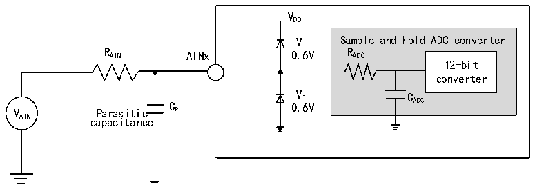
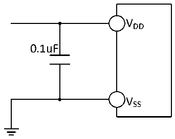

<!-- source-page: 31 -->

[← p.30](0030.md) · [index](../README.md) · [PDF p.31](https://ch32-riscv-ug.github.io/CH32V006/datasheet_zh/CH32V006DS2.PDF#page=31) · [p.32 →](0032.md)

<!-- header: CH32M006数据手册 https://wch.cn -->

<!-- p31-table-001 (table-3-25@1) -->
<table><caption>表3-25 ADC误差（fADC= 16MHz，ADC_LP = 1，RAIN&lt; 10kΩ，VDD= 5V）</caption><tr><th>符号</th><th>参数</th><th>条件</th><th>典型值</th><th>最大值</th><th>单位</th></tr><tr><td rowspan="2">ET</td><td rowspan="2">整体误差</td><td style="text-align:left">0 ≤ V ＜ V /2 AIN DD</td><td>±3.5</td><td></td><td rowspan="6">LSB</td></tr><tr><td style="text-align:left">0 ≤ V ＜ V AIN DD</td><td>±6</td><td></td></tr><tr><td rowspan="2">ED</td><td rowspan="2">微分非线性误差</td><td style="text-align:left">0 ≤ V ＜ V /2 AIN DD</td><td>±3.5</td><td></td></tr><tr><td style="text-align:left">0 ≤ V ＜ V AIN DD</td><td>±6</td><td></td></tr><tr><td rowspan="2">EL</td><td rowspan="2">积分非线性误差</td><td style="text-align:left">0 ≤ V ＜ V /2 AIN DD</td><td>±2.5</td><td></td></tr><tr><td style="text-align:left">0 ≤ V ＜ V AIN DD</td><td>±5</td><td></td></tr></table>

注：以上均为设计参数保证。  
Cp 表示PCB与焊盘上的寄生电容（大约5pF），可能与焊盘和PCB布局质量有关。较大的Cp 数值将  
降低转换精度，解决办法是降低fADC 值。  

图3-10 ADC典型连接图  
 <!-- rendered from the PDF; verify at https://ch32-riscv-ug.github.io/CH32V006/datasheet_zh/CH32V006DS2.PDF#page=31 -->

🖼 Text parsed from the figure above

VDD  
VT Sample and hold ADC converter  
R AIN AINx 0.6V R ADC  
12-bit  
converter  
V Parasitic C P 0 V . T 6V C ADC  
AIN capacitance  

图3-11 模拟电源及退耦电路参考  
 <!-- rendered from the PDF; verify at https://ch32-riscv-ug.github.io/CH32V006/datasheet_zh/CH32V006DS2.PDF#page=31 -->

🖼 Text parsed from the figure above

VDD  
0.1uF  
VSS  

### 3.3.15 OPA特性

<!-- p31-table-002 (table-3-26-1@1) pages 31-32 -->
<table><caption>表3-26-1 OPA运放特性</caption><tr><th>符号</th><th>参数</th><th>条件</th><th>最小值</th><th>典型值</th><th>最大值</th><th>单位</th></tr><tr><td style="text-align:left">VDD</td><td>供电电压</td><td>建议不低于2.5V</td><td>2.0</td><td>5</td><td>5.5</td><td>V</td></tr><tr><td style="text-align:left">VCMIR</td><td>共模输入电压</td><td></td><td>0</td><td></td><td style="text-align:left">VDD</td><td>V</td></tr><tr><td style="text-align:left">VIOFFSET</td><td>输入失调电压</td><td></td><td></td><td>±3</td><td>±12</td><td>mV</td></tr><tr><td style="text-align:left">ILOAD</td><td>驱动电流</td><td style="text-align:left">R = 4kΩLOAD</td><td></td><td></td><td>1.4</td><td>mA</td></tr><tr><td style="text-align:left">ILOAD_PGA</td><td>PGA模式驱动电流</td><td></td><td></td><td></td><td>500</td><td>uA</td></tr><tr><td style="text-align:left">IDDOPAMP</td><td>消耗电流</td><td>无负载，静态模式</td><td></td><td>420</td><td></td><td>uA</td></tr><tr><td>CMRR(1)</td><td>共模抑制比</td><td>@1kHz</td><td></td><td>96</td><td></td><td>dB</td></tr><tr><td>PSRR(1)</td><td>电源抑制比</td><td>@1kHz</td><td></td><td>82</td><td></td><td>dB</td></tr><tr><td>Av(1)</td><td>开环增益</td><td style="text-align:left">C = 5pFLOAD</td><td></td><td>110</td><td></td><td>dB</td></tr><tr><td style="text-align:left">G (1) BW</td><td>单位增益带宽</td><td style="text-align:left">C = 5pFLOAD</td><td></td><td>12</td><td></td><td>MHz</td></tr><tr><td style="text-align:left">P(1) M</td><td>相位裕度</td><td style="text-align:left">C = 5pFLOAD</td><td></td><td>75</td><td></td><td>°</td></tr><tr><td style="text-align:left">S(1) R</td><td>压摆率</td><td style="text-align:left">C = 5pFLOAD</td><td></td><td>10</td><td></td><td>V/us</td></tr><tr><td style="text-align:left">t (1) WAKUP</td><td>关闭到唤醒时间0.1%</td><td style="text-align:left">输入V /2, DD C = 50pF,R = 4kΩ LOAD LOAD</td><td></td><td></td><td>1</td><td>us</td></tr><tr><td style="text-align:left">RLOAD</td><td>阻性负载</td><td></td><td>4</td><td></td><td></td><td>kΩ</td></tr><tr><td style="text-align:left">CLOAD</td><td>容性负载</td><td></td><td></td><td></td><td>50</td><td>pF</td></tr><tr><td rowspan="2" style="text-align:left">V (2) OHSAT</td><td rowspan="2">高饱和输出电压</td><td style="text-align:left">R = 4kΩLOAD</td><td style="text-align:left">V -160DD</td><td></td><td></td><td rowspan="2">mV</td></tr><tr><td style="text-align:left">R = 20kΩLOAD</td><td style="text-align:left">V -35DD</td><td></td><td></td></tr><tr><td rowspan="2" style="text-align:left">V (2) OLSAT</td><td rowspan="2">低饱和输出电压</td><td style="text-align:left">R = 4kΩLOAD</td><td></td><td></td><td>25</td><td rowspan="2">mV</td></tr><tr><td style="text-align:left">R = 20kΩLOAD</td><td></td><td></td><td>5</td></tr><tr><td rowspan="5" style="text-align:left">PGAGain(1)</td><td>PGADIF = 1模式同相</td><td>Gain = 4/8/16</td><td>-3</td><td></td><td>3</td><td>%</td></tr><tr><td rowspan="4">内部同相PGA</td><td style="text-align:left">Gain = 4,V &lt; (V /3) INP DD</td><td>-1</td><td></td><td>1</td><td>%</td></tr><tr><td style="text-align:left">Gain = 8,V &lt; (V /7) INP DD</td><td>-1</td><td></td><td>1</td><td>%</td></tr><tr><td style="text-align:left">Gain = 16,V &lt; (V /15) INP DD</td><td>-1</td><td></td><td>1</td><td>%</td></tr><tr><td style="text-align:left">Gain = 32,V &lt; (V /31) INP DD</td><td>-1</td><td></td><td>1</td><td>%</td></tr><tr><td rowspan="2" style="text-align:left">VB</td><td rowspan="2" style="text-align:left">PGA 模式输出直流偏置电压</td><td>VBEN = 1,VBSEL = 0</td><td></td><td style="text-align:left">V /2DD</td><td></td><td>V</td></tr><tr><td>VBEN = 1,VBSEL = 1</td><td></td><td style="text-align:left">V /4DD</td><td></td><td>V</td></tr><tr><td>Delta R</td><td>电阻绝对值变化</td><td></td><td>-15</td><td></td><td>15</td><td>%</td></tr><tr><td rowspan="2">eN(1)</td><td rowspan="2">等效输入噪声</td><td style="text-align:left">R = 4kΩ@1kHz LOAD</td><td></td><td>100</td><td></td><td rowspan="2" style="text-align:left">nV/ sqrt(Hz)</td></tr><tr><td style="text-align:left">R = 20kΩ@1KHz LOAD</td><td></td><td>60</td><td></td></tr></table>

<!-- image: p31-draw-image-00001 bbox=[502.8, 786.36, 522.24, 796.68] -->
<!-- footer: V1.1 29 -->
