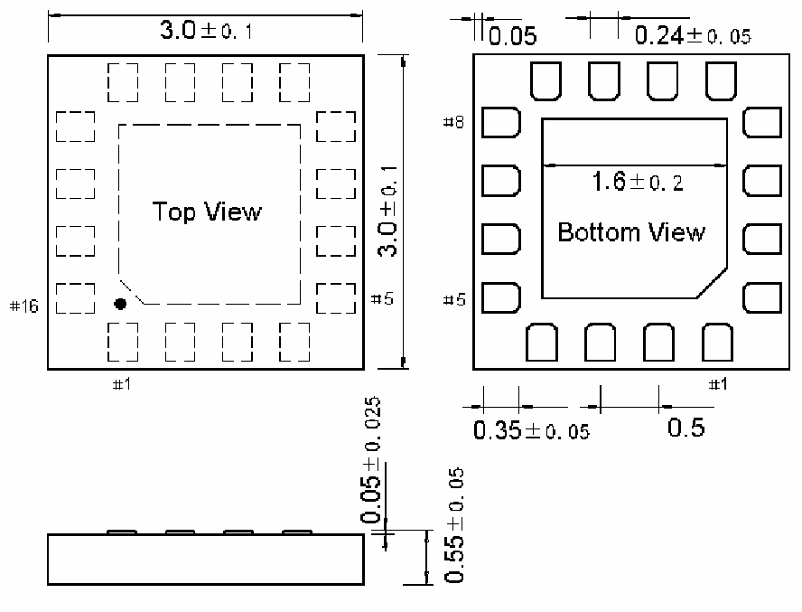

<!-- source-page: 34 -->

[← p.33](0033.md) · [index](../README.md) · [PDF p.34](https://ch32-riscv-ug.github.io/CH32V006/datasheet_zh/CH32V006DS2.PDF#page=34) · [p.35 →](0035.md)

<!-- header: CH32M006数据手册 https://wch.cn -->

# 第 4 章 封装及订货信息

芯片封装  

<!-- p34-table-001 (table-3-27-2@1) -->
<table><tr><th>封装形式</th><th>塑体尺寸</th><th colspan="2">引脚节距</th><th>封装说明</th><th>订货型号</th></tr><tr><td>QFN16</td><td>3*3mm</td><td>0.5mm</td><td>19.7mil</td><td>四边无引线16脚</td><td>CH32M006A8U7</td></tr></table>

说明：尺寸标注的单位是 mm（毫米），引脚中心间距总是标称值，没有误差，除此之外的尺寸误差不  
大于±0.1mm或者±10%两者中的较大值。  

## 4.1 QFN16封装（全底面、无侧边引脚）

 <!-- p34-draw-image-00002 rendered from the PDF -->

<!-- image: p34-draw-image-00001 bbox=[502.8, 779.28, 522.24, 789.6] -->
<!-- footer: V1.1 32 -->
