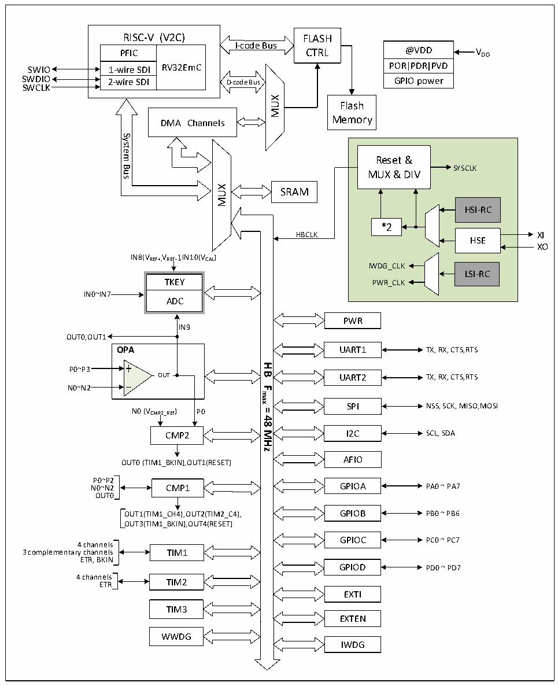

<!-- source-page: 4 -->

[← p.3](0003.md) · [index](../README.md) · [PDF p.4](https://ch32-riscv-ug.github.io/CH32V006/datasheet_en/CH32V007DS0.PDF#page=4) · [p.5 →](0005.md)

<!-- header: CH32V007/M007 Datasheet https://wch-ic.com -->

Figure 1-1-1 CH32V007 system block diagram  
 <!-- rendered from the PDF; verify at https://ch32-riscv-ug.github.io/CH32V006/datasheet_en/CH32V007DS0.PDF#page=4 -->

🖼 Text parsed from the figure above

RISC-V (V2C)  PFIC  RV32EmC  1-wire SDI  21--wwiirree SSDDII  
RISC-V (V2C) FLASH  
@VDD  POR PDR PVD  GPIO power  
I-code Bus  
PFIC CTRL  
POR PDR PVD SWIO  
SWDIO GPIO power  
SWCLK  
MUX  
Flash  
Memory  
DMA Channels  
System  
Reset &amp;  
Bus  
SYSCLK  
MUX &amp; DIV  
MUX  
SRAM  
HSI-RC  
*2  
HBCLK XI  
HSE  
XO  
IN8(VREF+,VREF- ),IN10(VCAL)  
IWDG_CLK  
LSI-RC  
TKEY PWR_CLK  
IN0~IN7  
ADC  
PWR  
IN9  
OUT0,OUT1  
OPA UART1 TX, RX, CTS,RTS  
<strong>HB</strong>  
P0~P3  
OUT UART2 TX, RX, CTS,RTS  
N0~N2  
<strong>Fmax</strong>  
SPI NSS, SCK, MISO,MOSI  
<strong>=</strong>  
N0 (VCMP2_REF) P0  
<strong>48</strong>  
CMP2 I2C  
SCL, SDA  
<strong>MHz</strong>  
OUT0 (TIM1_BKIN),OUT1(RESET) AFIO  
P0~P2  
N0~N2 CMP1 GPIOA PA0 ~ PA7  
OUT0  
OUT1(TIM1_CH4),OUT2(TIM2_C4), GPIOB PB0 ~ PB6  
OUT3(TIM1_BKIN),OUT4(RESET)  
GPIOC PC0 ~ PC7  
4 channels  
3 complementary channels TIM1  
ETR, BKIN  
GPIOD PD0 ~ PD7  
4 channels  
ETR TIM2  
EXTI  
TIM3  
EXTEN  
WWDG  
IWDG  

<!-- image: p4-draw-image-00001 bbox=[514.32, 784.08, 533.76, 794.28] -->
<!-- footer: V1.8 2 -->
