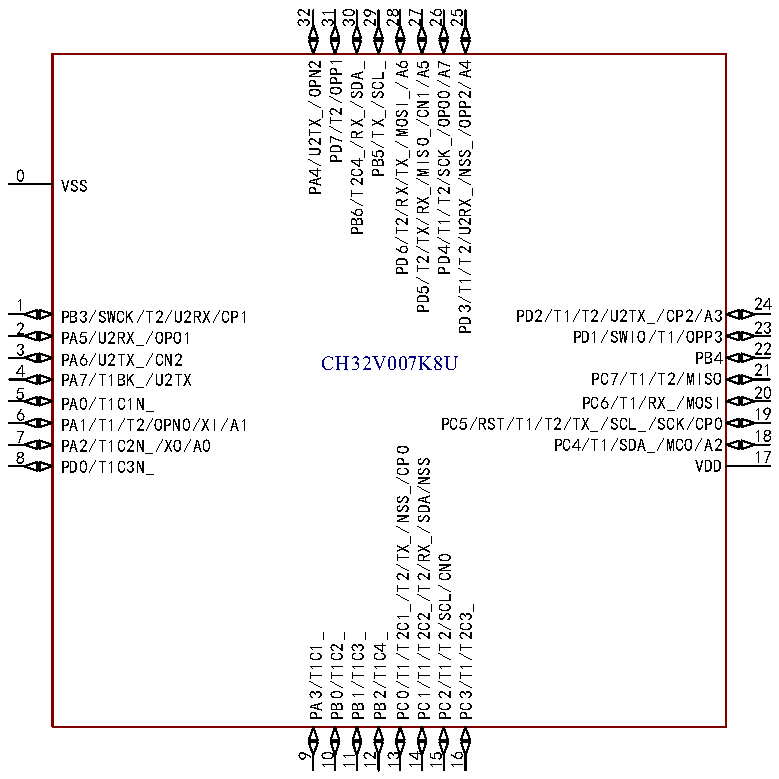

<!-- source-page: 18 -->

[← p.17](0017.md) · [index](../README.md) · [PDF p.18](https://ch32-riscv-ug.github.io/CH32V006/datasheet_en/CH32V007DS0.PDF#page=18) · [p.19 →](0019.md)

<!-- header: CH32V007/M007 Datasheet https://wch-ic.com -->

# Chapter 2 Pinouts and Pin Definition

## 2.1 Pinouts

### 2.1.1 CH32V007 Pinouts

 <!-- p18-cluster-01 uncaptioned graphics, rendered from the PDF; verify at https://ch32-riscv-ug.github.io/CH32V006/datasheet_en/CH32V007DS0.PDF#page=18 -->

🖼 Text parsed from the figure above

32  
31  
30  
29  
28  
27  
26  
25  
PD7/T2/OPP1  
PA4/U2TX_/OPN2  
PB6/T2C4_/RX_/SDA_  
PB5/TX_/SCL_  
PD6/T2/RX/TX_/MOSI_/A6  
PD5/T2/TX/RX_/MISO_/CN1/A5  
PD4/T1/T2/SCK_/OPO0/A7  
PD3/T1/T2/U2RX_/NSS_/OPP2/A4  
0  
VSS  
1 24  
PB3/SWCK/T2/U2RX/CP1 PD2/T1/T2/U2TX_/CP2/A3  
2 23  
PA5/U2RX_/OPO1 PD1/SWIO/T1/OPP3  
3 22  
PA6/U2TX_/CN2 CH32V007K8U PB4  
4 21  
PA7/T1BK_/U2TX PC7/T1/T2/MISO  
5 20  
PA0/T1C1N_ PC6/T1/RX_/MOSI  
6 19  
PA1/T1/T2/OPN0/XI/A1 PC5/RST/T1/T2/TX_/SCL_/SCK/CP0  
7 18  
PA2/T1C2N_/XO/A0 PC4/T1/SDA_/MCO/A2  
PC0/T1/T2C1_/T2/TX_/NSS_/CPO  
8 17  
PD0/T1C3N_ VDD  
PC1/T1/T2C2_/T2/RX_/SDA/NSS  
PC2/T1/T2/SCL/CN0  
PC3/T1/T2C3_  
PA3/T1C1_  
PB0/T1C2_  
PB1/T1C3_  
PB2/T1C4_  
9  
10  
11  
12  
13  
14  
15  
16  

CH32V007E8R  
1 24  
PD1/SWIO/T1C4_/OP3 PB3/SWCK/T2C2_/CP1  
2 23  
PC0/TX_/CPO PB1/T1C3_  
3 22  
PC1/T2C4_/RX_/SDA PB0/T1C2_  
4 21  
PC2/CN0/SCL PA3/T1C1_  
5 20  
VSS PD0/T1C3N_  
6 19  
VDD PA2/T1C2N_/A0  
7 18  
PC5/RST/T2C1_/SCL_/CP0 PA0/T1C1N_  
8 17  
PC4/SDA_/A2 PA1/ON0/A1/PA6/CN2  
9 16  
PD2/T2C3_/CP2/A3 PA5/OO1  
10 15  
PD3/OP2/A4 PA4/ON2  
11 14  
PD4/A7 PD7/OP1  
12 13  
PD5/CN1/A5 PD6/A6  
<!-- image: p18-draw-image-00001 bbox=[518.88, 784.08, 538.32, 794.28] -->
<!-- footer: V1.8 16 -->
