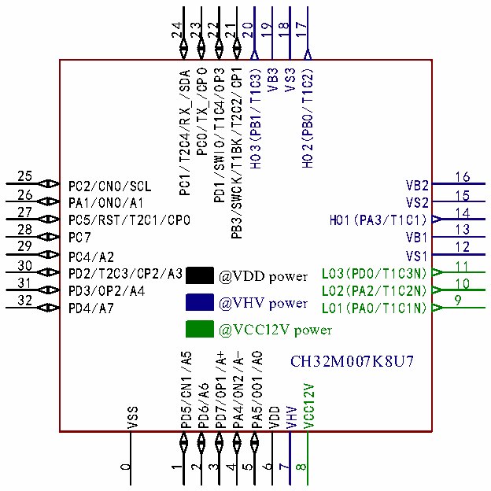

<!-- source-page: 19 -->

[← p.18](0018.md) · [index](../README.md) · [PDF p.19](https://ch32-riscv-ug.github.io/CH32V006/datasheet_en/CH32V007DS0.PDF#page=19) · [p.20 →](0020.md)

<!-- header: CH32V007/M007 Datasheet https://wch-ic.com -->

### 2.1.2 CH32M007 Pinouts

 <!-- p19-cluster-01 uncaptioned graphics, rendered from the PDF; verify at https://ch32-riscv-ug.github.io/CH32V006/datasheet_en/CH32V007DS0.PDF#page=19 -->

🖼 Text parsed from the figure above

24 23 22 21  
20  
19 18  
17  
PB3/SWCK/T1BK/T2C2/CP1  
HO3(PB1/T1C3)  
HO2(PB0/T1C2)  
PC0/TX_/CPO  
PD1/SWIO/T1C4/OP3  
VB3  
VS3  
PC1/T2C4/RX_/SDA  
25  
16  
PC2/CN0/SCL VB2  
26  
15  
PA1/ON0/A1 VS2  
27  
14  
PC5/RST/T2C1/CP0 HO1(PA3/T1C1)  
28  
13  
PC7 VB1  
29  
12  
PC4/A2 VS1  
30  
11  
PD2/T2C3/CP2/A3 LO3(PD0/T1C3N)  
@VDD power  
31  
10  
PD3/OP2/A4 LO2(PA2/T1C2N)  
32 PD4/A7 LO1(PA0/T1C1N)  
9  
@VHV power  
@VCC12V power  
PD5/CN1/A5  
PD7/OP1/A+  
PA4/ON2/A-  
PA5/OO1/AO  
CH32M007K8U7  
PD6/A6  
VCC12V  
VSS  
VDD  
VHV  
0  
1  
2  
3  
4  
5  
6  
7  
8  

CH32M007G8R6  
1 28  
PD7/OP1/A+ PA4/ON2/A-  
2 27  
PD2/T2C3/CP2/A3 PC5/RST/T2C1/SCL/CP0  
3 26  
PD3/OP2/A4 PC4/SDA/A2  
4 25  
PD4/OO0/A7/AO VSS  
5 24  
PD5/CN1/A5 PA1/ON0/A1  
6 23  
PD6/A6 PC2/CN0/PD1/SWIO/T1C4/OP3  
7 22  
VDD PB3/SWCK/T1BK/T2C2/CP1  
8 21  
VHV HO3(PB1/T1C3)  
9 20  
VCC12V VB3  
10 @VDD power 19  
LO1(PA0/T1C1N) VS3  
11 18  
LO2(PA2/T1C2N) HO2(PB0/T1C2)  
12 17  
LO3(PD0/T1C3N) VB2  
13 @VHV power 16  
VS1 VS2  
14 15  
VB1 HO1(PA3/T1C1)  
@VCC12V power  
<!-- image: p19-draw-image-00001 bbox=[518.88, 784.08, 538.32, 794.28] -->
<!-- footer: V1.8 17 -->
