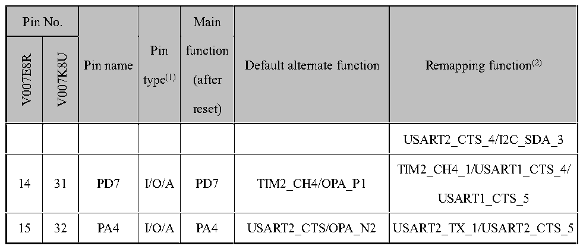
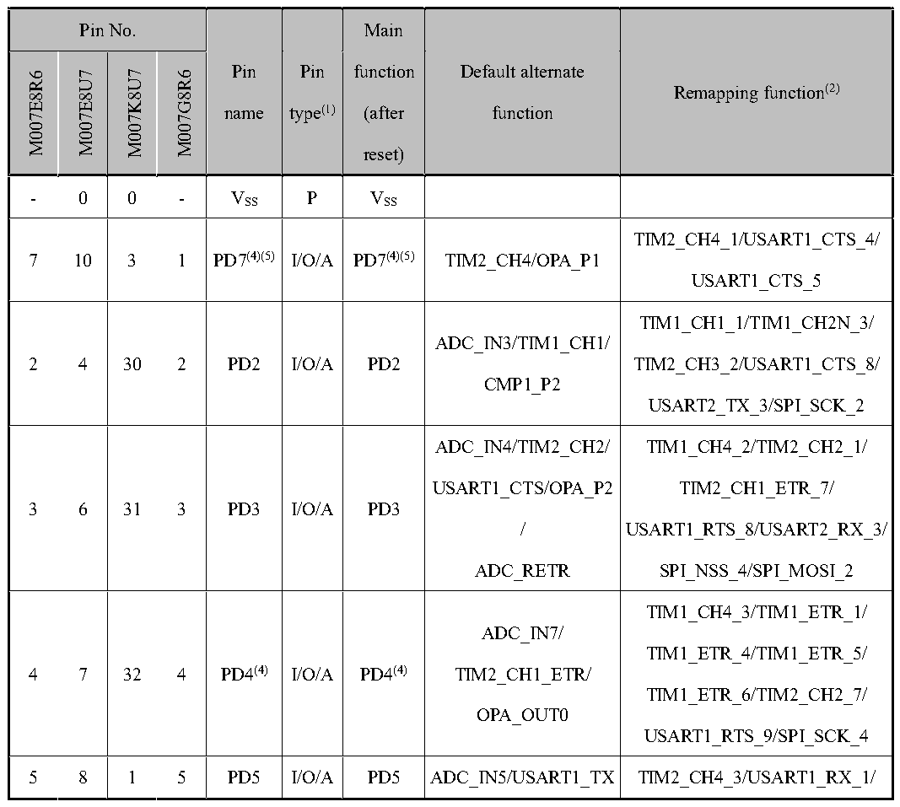

<!-- source-page: 27 -->

[← p.26](0026.md) · [index](../README.md) · [PDF p.27](https://ch32-riscv-ug.github.io/CH32V006/datasheet_en/CH32V007DS0.PDF#page=27) · [p.28 →](0028.md)

<!-- header: CH32V007/M007 Datasheet https://wch-ic.com -->

 <!-- p27-cluster-01 uncaptioned graphics, rendered from the PDF; verify at https://ch32-riscv-ug.github.io/CH32V006/datasheet_en/CH32V007DS0.PDF#page=27 -->

🖼 Text parsed from the figure above

> ⬆ **Table continued** — rendered in full at [page 22](0022.md). <!-- p27-table-001 -->

 <!-- p27-cluster-02 uncaptioned graphics, rendered from the PDF; verify at https://ch32-riscv-ug.github.io/CH32V006/datasheet_en/CH32V007DS0.PDF#page=27 -->

🖼 Text parsed from the figure above

<!-- p27-table-002 (table-2-2@1) pages 27-31 -->
<table><caption>Table 2-2 CH32M007 Pin definitions</caption><tr><th colspan="4">Pin No.</th><th rowspan="4" style="text-align:left">Pin name</th><th rowspan="2">Pin</th><th>Main</th><th rowspan="4" style="text-align:left">Default alternate function</th><th rowspan="4">Remapping function(2)</th></tr><tr><td rowspan="3">M007E8R6</td><td rowspan="3">M007E8U7</td><td rowspan="3">M007K8U7</td><td rowspan="3">M007G8R6</td><td>function</td></tr><tr><td>type(1)</td><td>(after</td></tr><tr><td></td><td>reset)</td></tr><tr><td>-</td><td>0</td><td>0</td><td>-</td><td style="text-align:left">VSS</td><td>P</td><td style="text-align:left">VSS</td><td></td><td></td></tr><tr><td>7</td><td>10</td><td>3</td><td>1</td><td>PD7(4)(5)</td><td>I/O/A</td><td>PD7(4)(5)</td><td>TIM2_CH4/OPA_P1</td><td style="text-align:left">TIM2_CH4_1/USART1_CTS_4/ USART1_CTS_5</td></tr><tr><td>2</td><td>4</td><td>30</td><td>2</td><td>PD2</td><td>I/O/A</td><td>PD2</td><td style="text-align:left">ADC_IN3/TIM1_CH1/ CMP1_P2</td><td style="text-align:left">TIM1_CH1_1/TIM1_CH2N_3/ TIM2_CH3_2/USART1_CTS_8/ USART2_TX_3/SPI_SCK_2</td></tr><tr><td>3</td><td>6</td><td>31</td><td>3</td><td>PD3</td><td>I/O/A</td><td>PD3</td><td style="text-align:left">ADC_IN4/TIM2_CH2/ USART1_CTS/OPA_P2 / ADC_RETR</td><td style="text-align:left">TIM1_CH4_2/TIM2_CH2_1/ TIM2_CH1_ETR_7/ USART1_RTS_8/USART2_RX_3/ SPI_NSS_4/SPI_MOSI_2</td></tr><tr><td>4</td><td>7</td><td>32</td><td>4</td><td>PD4(4)</td><td>I/O/A</td><td>PD4(4)</td><td style="text-align:left">ADC_IN7/ TIM2_CH1_ETR/ OPA_OUT0</td><td style="text-align:left">TIM1_CH4_3/TIM1_ETR_1/ TIM1_ETR_4/TIM1_ETR_5/ TIM1_ETR_6/TIM2_CH2_7/ USART1_RTS_9/SPI_SCK_4</td></tr><tr><td>5</td><td>8</td><td>1</td><td>5</td><td>PD5</td><td>I/O/A</td><td>PD5</td><td>ADC_IN5/USART1_TX</td><td>TIM2_CH4_3/USART1_RX_1/</td></tr><tr><td colspan="4">Pin No.</td><td rowspan="2">Pin</td><td rowspan="2">Pin</td><td>Main</td><td rowspan="4" style="text-align:left">Default alternate function</td><td rowspan="4">Remapping function(2)</td></tr><tr><td rowspan="3">M007E8R6</td><td rowspan="3">M007E8U7</td><td rowspan="3">M007K8U7</td><td rowspan="3">M007G8R6</td><td>function</td></tr><tr><td>name</td><td>type(1)</td><td>(after</td></tr><tr><td></td><td></td><td>reset)</td></tr><tr><td></td><td></td><td></td><td></td><td></td><td></td><td></td><td style="text-align:left">/ CMP1_N1</td><td>USART1_CTS_9/SPI_MISO_4</td></tr><tr><td>6</td><td>9</td><td>2</td><td>6</td><td>PD6</td><td>I/O/A</td><td>PD6</td><td style="text-align:left">ADC_IN6/USART1_RX</td><td style="text-align:left">TIM2_CH3_3/USART1_TX_1/ SPI_MOSI_4</td></tr><tr><td>10</td><td>13</td><td>6</td><td>7</td><td style="text-align:left">VDD</td><td>P</td><td style="text-align:left">VDD</td><td></td><td></td></tr><tr><td>-</td><td>14</td><td>-</td><td>-</td><td style="text-align:left">VHREG</td><td>P</td><td style="text-align:left">VHREG</td><td></td><td></td></tr><tr><td>12</td><td>15</td><td>7</td><td>8</td><td style="text-align:left">VHV</td><td>P</td><td style="text-align:left">VHV</td><td></td><td></td></tr><tr><td>-</td><td>-</td><td>8</td><td>9</td><td style="text-align:left">VCC12V</td><td>P</td><td style="text-align:left">VCC12V</td><td></td><td></td></tr><tr><td>14</td><td>17</td><td>9</td><td>10</td><td style="text-align:left">LO1 (PA0)</td><td>O</td><td>LO1</td><td></td><td></td></tr><tr><td>16</td><td>19</td><td>10</td><td>11</td><td style="text-align:left">LO2 (PA2)</td><td>O</td><td>LO2</td><td></td><td></td></tr><tr><td>18</td><td>21</td><td>11</td><td>12</td><td style="text-align:left">LO3 (PD0)</td><td>O</td><td>LO3</td><td></td><td></td></tr><tr><td>-</td><td>-</td><td>12</td><td>13</td><td style="text-align:left">VS1</td><td>P</td><td style="text-align:left">VS1</td><td></td><td></td></tr><tr><td>-</td><td>-</td><td>13</td><td>14</td><td style="text-align:left">VB1</td><td>P</td><td style="text-align:left">VB1</td><td></td><td></td></tr><tr><td>13</td><td>16</td><td>14</td><td>15</td><td style="text-align:left">HO1 (PA3)</td><td>O</td><td>HO1</td><td></td><td></td></tr><tr><td>-</td><td>-</td><td>15</td><td>16</td><td style="text-align:left">VS2</td><td>P</td><td style="text-align:left">VS2</td><td></td><td></td></tr><tr><td>-</td><td>-</td><td>16</td><td>17</td><td style="text-align:left">VB2</td><td>P</td><td style="text-align:left">VB2</td><td></td><td></td></tr><tr><td>15</td><td>18</td><td>17</td><td>18</td><td style="text-align:left">HO2 (PB0)</td><td>O</td><td>HO2</td><td></td><td></td></tr><tr><td>-</td><td>-</td><td>18</td><td>19</td><td style="text-align:left">VS3</td><td>P</td><td style="text-align:left">VS3</td><td></td><td></td></tr><tr><td>-</td><td>-</td><td>19</td><td>20</td><td style="text-align:left">VB3</td><td>P</td><td style="text-align:left">VB3</td><td></td><td></td></tr><tr><td>17</td><td>20</td><td>20</td><td>21</td><td>HO3</td><td>O</td><td>HO3</td><td></td><td></td></tr><tr><td colspan="4">Pin No.</td><td rowspan="2">Pin</td><td rowspan="2">Pin</td><td>Main</td><td rowspan="4" style="text-align:left">Default alternate function</td><td rowspan="4">Remapping function(2)</td></tr><tr><td rowspan="3">M007E8R6</td><td rowspan="3">M007E8U7</td><td rowspan="3">M007K8U7</td><td rowspan="3">M007G8R6</td><td>function</td></tr><tr><td>name</td><td>type(1)</td><td>(after</td></tr><tr><td></td><td></td><td>reset)</td></tr><tr><td></td><td></td><td></td><td></td><td>(PB1)</td><td></td><td></td><td></td><td></td></tr><tr><td>19</td><td>22</td><td>21</td><td>22</td><td>PB3</td><td>I/O/A</td><td>PB3</td><td style="text-align:left">USART2_RX/SWCLK/ CMP1_P1</td><td style="text-align:left">TIM1_BKIN_4/TIM1_BKIN_5/ TIM2_CH2_2/USART1_TX_5/ USART1_RX_4/USART2_RTS_1/ USART2_RTS_6/I2C_SCL_4/ SPI_MISO_2</td></tr><tr><td>21</td><td>25</td><td>25</td><td rowspan="2">23</td><td>PC2(6)</td><td>I/O/A</td><td>PC2(6)</td><td style="text-align:left">TIM1_BKIN/ USART1_RTS/ I2C_SCL/CMP1_N0</td><td style="text-align:left">TIM1_CH3N_7/TIM1_CH3N_9/ USART1_RTS_2/TIM1_BKIN_1/ TIM1_ETR_3/ADC_RETR_1</td></tr><tr><td>1</td><td>5</td><td>22</td><td>PD1(6)</td><td>I/O/A</td><td>PD1(6)</td><td style="text-align:left">TIM1_CH3N/SWIO/ SWDIO/OPA_P3/ ADC_IETR</td><td style="text-align:left">TIM1_CH4_4/TIM1_CH4_5/ TIM1_CH3N_1/TIM1_CH3N_2/ USART1_TX_4/USART1_RX_2/ USART1_RX_5/USART2_RX_5/ I2C_SCL_1/I2C_SDA_4</td></tr><tr><td>24</td><td>26</td><td>26</td><td>24</td><td>PA1</td><td>I/O/A</td><td>PA1</td><td style="text-align:left">ADC_IN1/TIM1_CH2/ OPA_N0</td><td style="text-align:left">XI/TIM1_CH2_1/TIM1_CH2_9/ TIM2_CH2_5/TIM2_CH2_6/ USART1_RX_8/USART2_RTS_2/ USART2_RTS_3/USART2_RTS_ 4/ USART2_RTS_5/SPI_SCK_5</td></tr><tr><td>11</td><td>3</td><td></td><td>25</td><td style="text-align:left">VSS</td><td>P</td><td style="text-align:left">VSS</td><td></td><td></td></tr><tr><td>22</td><td>1</td><td>29</td><td>26</td><td>PC4</td><td>I/O/A</td><td>PC4</td><td style="text-align:left">MCO/ADC_IN2/TIM1_ CH4</td><td style="text-align:left">TIM1_CH1_3/TIM1_CH1_7/ TIM1_CH1_8/TIM1_CH4_1/ TIM1_CH2N_2/USART1_RX_9/ USART2_TX_5/I2C_SDA_2/</td></tr><tr><td colspan="4">Pin No.</td><td rowspan="2">Pin</td><td rowspan="2">Pin</td><td>Main</td><td rowspan="4" style="text-align:left">Default alternate function</td><td rowspan="4">Remapping function(2)</td></tr><tr><td rowspan="3">M007E8R6</td><td rowspan="3">M007E8U7</td><td rowspan="3">M007K8U7</td><td rowspan="3">M007G8R6</td><td>function</td></tr><tr><td>name</td><td>type(1)</td><td>(after</td></tr><tr><td></td><td></td><td>reset)</td></tr><tr><td></td><td></td><td></td><td></td><td></td><td></td><td></td><td></td><td>SPI_NSS_2/SPI_NSS_6/</td></tr><tr><td>23</td><td>2</td><td>27</td><td>27</td><td>PC5</td><td>I/O/A</td><td>PC5</td><td style="text-align:left">TIM1_ETR/SPI_SCK/ CMP1_P0/RST</td><td style="text-align:left">TIM1_CH2_7/TIM1_CH2_8/ TIM1_CH3_3/TIM1_ETR_2/ TIM2_CH1_ETR_2/USART1_TX _6/ I2C_SCL_2/SPI_SCK_1</td></tr><tr><td>-</td><td>-</td><td>28</td><td>-</td><td>PC7</td><td>I/O</td><td>PC7</td><td>SPI_MISO</td><td style="text-align:left">TIM1_CH2_2/TIM1_CH2_3/ TIM1_CH4_7/TIM1_CH4_8/ TIM2_CH2_3/USART1_CTS_6/ USART1_CTS_7/USART1_RTS_ 1/ USART1_RTS_3/SPI_MISO_1/ SPI_MISO_6</td></tr><tr><td>8</td><td>11</td><td>4</td><td>28</td><td>PA4(4)(5)</td><td>I/O/A</td><td>PA4(4)(5)</td><td>USART2_CTS/OPA_N2</td><td>USART2_TX_1/USART2_CTS_5</td></tr><tr><td>9</td><td>12</td><td>5</td><td>-</td><td>PA5(5)</td><td>I/O/A</td><td>PA5(5)</td><td style="text-align:left">USART2_RTS/OPA_OUT1</td><td style="text-align:left">USART1_RTS_4/USART1_RTS_ 5/ USART2_RX_1/USART2_RX_6</td></tr><tr><td>-</td><td>23</td><td>23</td><td>-</td><td>PC0</td><td>I/O/A</td><td>PC0</td><td style="text-align:left">TIM2_CH3/CMP1_OUT0</td><td style="text-align:left">TIM1_CH3_2/TIM1_CH1N_7/ TIM1_CH1N_9/ TIM2_CH1_ETR_4/ TIM2_CH3_1/USART1_TX_3/ SPI_NSS_1/SPI_MOSI_3</td></tr><tr><td>20</td><td>24</td><td>24</td><td>-</td><td>PC1</td><td>I/O</td><td>PC1</td><td>I2C_SDA/SPI_NSS</td><td style="text-align:left">TIM1_CH2N_7/TIM1_CH2N_9/ TIM1_BKIN_2/TIM1_BKIN_3/ TIM2_CH1_ETR_1/</td></tr><tr><td colspan="4">Pin No.</td><td rowspan="2">Pin</td><td rowspan="4" style="text-align:left">Pin type(1)</td><td>Main</td><td rowspan="4" style="text-align:left">Default alternate function</td><td rowspan="4">Remapping function(2)</td></tr><tr><td rowspan="3">M007E8R6</td><td rowspan="3">M007E8U7</td><td rowspan="3">M007K8U7</td><td rowspan="3">M007G8R6</td><td>function</td></tr><tr><td>name</td><td>(after</td></tr><tr><td></td><td>reset)</td></tr><tr><td></td><td></td><td></td><td></td><td></td><td></td><td></td><td></td><td style="text-align:left">TIM2_CH1_ETR_3/TIM2_CH2_4 / TIM2_CH4_2/USART1_RX_3/ SPI_NSS_5</td></tr></table>

0 0 - VSS P VSS  

<!-- image: p27-draw-image-00001 bbox=[518.88, 784.08, 538.32, 794.28] -->
<!-- footer: V1.8 25 -->
