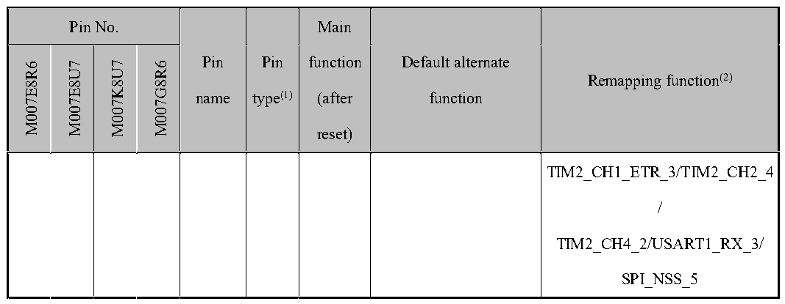

<!-- source-page: 31 -->

[← p.30](0030.md) · [index](../README.md) · [PDF p.31](https://ch32-riscv-ug.github.io/CH32V006/datasheet_en/CH32V007DS0.PDF#page=31) · [p.32 →](0032.md)

<!-- header: CH32V007/M007 Datasheet https://wch-ic.com -->

 <!-- p31-cluster-01 uncaptioned graphics, rendered from the PDF; verify at https://ch32-riscv-ug.github.io/CH32V006/datasheet_en/CH32V007DS0.PDF#page=31 -->

🖼 Text parsed from the figure above

> ⬆ **Table continued** — rendered in full at [page 27](0027.md). <!-- p31-table-001 -->

<em>Note 1: Explanation of table abbreviations:</em>  
<em>I = TTL/CMOS level Schmitt input; O = CMOS level tri-state output.</em>  
<em>A = Analog signal input or output; P = Power supply.</em>  
<em>Note 2: The underlined value of the remapping function indicates the configuration value of the corresponding bit</em>  
<em>in the AFIO register. For example: TIM1_BKIN_4 indicates that the corresponding bit configuration of the</em>  
<em>AFIO register is 100b.</em>  
<em>Note 4: For the CH32M007K8U7 and CH32M007G8R6 chip, pin PD7 is usually selected as the positive input to</em>  
<em>the OPA, pin PA4 is selected as the negative input to the OPA, and pin PD4 is selected as the output of the OPA.</em>  
<em>Note 5: For CH32M007E8 chip, usually select PD7 pin as the positive input of the OPA, PA4 pin as the negative</em>  
<em>input of the OPA, and PA5 pin as the output of the OPA.</em>  
<em>Note 6: For the CH32M007G8R6 chip, the PC2 and PD1 pins are shorted inside the chip to prevent both IOs</em>  
<em>from being configured as output functions.</em>  

<!-- p31-table-002 (table-2-3@1) pages 31-32 -->
<table><caption>Table 2-3 CH32M007K8U7 and CH32M007G8R6 proprietary pin description</caption><tr><th>Pin name</th><th>Pin description</th></tr><tr><td style="text-align:left">VCC12V</td><td style="text-align:left">The power input of the internal low-side driver and the output of the high-voltage regulator need to be externally connected with an MLCC capacitor with a capacity of at least 4.7uF, and 10uF is recommended.</td></tr><tr><td style="text-align:left">VHV</td><td style="text-align:left">Power input of internal high voltage regulator.</td></tr><tr><td style="text-align:left">VDD</td><td style="text-align:left">The output of the internal low-voltage regulator needs an external MLCC capacitor with a capacity of at least 4.7uF, and 10uF is recommended.</td></tr><tr><td>LO1,LO2,LO3</td><td style="text-align:left">The output of the internal low-side gate driver is used to drive the gate of N-type MOSFET.</td></tr><tr><td>HO1,HO2,HO3</td><td style="text-align:left">The output of the internal high-side gate driver is used to drive the gate of N-type MOSFET.</td></tr><tr><td style="text-align:left">V ,V ,V S1 S2 S3</td><td style="text-align:left">Floating ground of internal high-side gate driver.</td></tr><tr><td style="text-align:left">V ,V ,V B1 B2 B3</td><td style="text-align:left">For the bootstrap power supply of the internal high-side gate driver, it is suggested to externally connect the capacitance of 1uF～4.7uF to their respective floating ground VS.</td></tr></table>

<!-- image: p31-draw-image-00001 bbox=[518.88, 784.08, 538.32, 794.28] -->
<!-- footer: V1.8 29 -->
