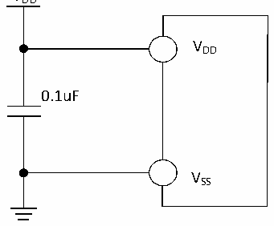

<!-- source-page: 36 -->

[← p.35](0035.md) · [index](../README.md) · [PDF p.36](https://ch32-riscv-ug.github.io/CH32V006/datasheet_en/CH32V007DS0.PDF#page=36) · [p.37 →](0037.md)

<!-- header: CH32V007/M007 Datasheet https://wch-ic.com -->

# Chapter 3 Electrical Characteristics

## 3.1 Test Condition

Unless otherwise specified and marked, all voltages are based on VSS.  
All minimum and maximum values will be guaranteed under the worst environmental temperature, power supply  
voltage and clock frequency conditions.  
The typical value of CH32V007 is based on the ambient temperature of 25℃ and VDD= 3.3V or 5V.  
The typical value of CH32M007K8U7 and CH32M007G8R6 is based on the ambient temperature of 25℃, power  
supply VHV= 24V, generate VCC12V= 12V and VDD= 5V.  
The typical value of CH32M007E8U7 is based on the ambient temperature of 25℃, power supply VHV= 15V and  
VHREG= 7V, generate VDD= 5V.  
The typical value of CH32M007E8R6 is based on the ambient temperature of 25℃, power supply VHV= 15V,  
generate VDD= 5V.  
The data obtained through comprehensive evaluation, design simulation or process characteristics will not be  
tested in the production line. On the basis of comprehensive evaluation, the minimum and maximum values are  
obtained by statistics after sample testing. Unless otherwise specified as measured values, the characteristic  
parameters shall be guaranteed by comprehensive evaluation or design.  
Power supply scheme (Resistors are optional in the figure, which are used to share the voltage drop and reduce the  
chip heating):  

Figure 3-1-1 CH32V007 typical circuit for conventional power supply  
 <!-- rendered from the PDF; verify at https://ch32-riscv-ug.github.io/CH32V006/datasheet_en/CH32V007DS0.PDF#page=36 -->

VDD  

🖼 Text parsed from the figure above

VDD  
0.1uF  
VSS  

<!-- image: p36-draw-image-00001 bbox=[518.88, 784.08, 538.32, 794.28] -->
<!-- footer: V1.8 34 -->
