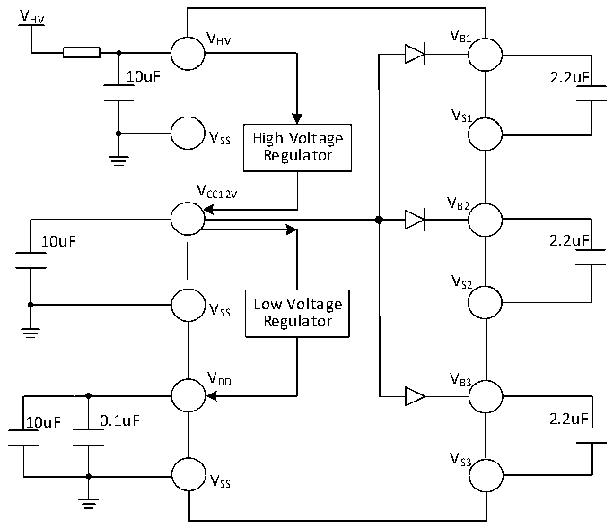
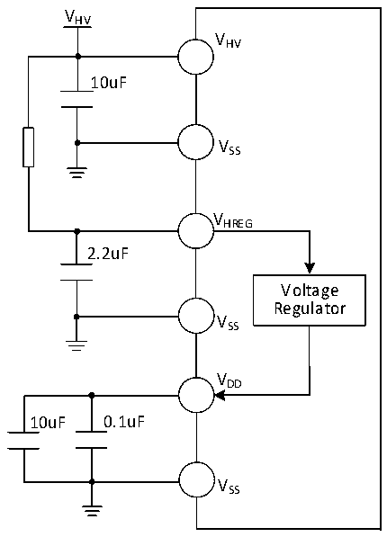

<!-- source-page: 37 -->

[← p.36](0036.md) · [index](../README.md) · [PDF p.37](https://ch32-riscv-ug.github.io/CH32V006/datasheet_en/CH32V007DS0.PDF#page=37) · [p.38 →](0038.md)

<!-- header: CH32V007/M007 Datasheet https://wch-ic.com -->

Figure 3-1-2 CH32M007K8U7 and CH32M007G8R6 typical circuit for conventional power supply  
 <!-- rendered from the PDF; verify at https://ch32-riscv-ug.github.io/CH32V006/datasheet_en/CH32V007DS0.PDF#page=37 -->

🖼 Text parsed from the figure above

VHV  
V HV V B1  
10uF 2.2uF  
VS1  
V SS High Voltage  
Regulator  
V  
CC12V V  
B2  
10uF 2.2uF  
VS2  
V Low Voltage  
SS Regulator  
VDD VB3  
10uF 0.1uF 2.2uF  
VS3  
VSS  

Figure 3-1-3 CH32M007E8U7 typical circuit for conventional power supply  
 <!-- rendered from the PDF; verify at https://ch32-riscv-ug.github.io/CH32V006/datasheet_en/CH32V007DS0.PDF#page=37 -->

🖼 Text parsed from the figure above

VHV  
VHV  
10uF  
VSS  
VHREG  
2.2uF  
Voltage  
Regulator  
VSS  
VDD  
10uF 0.1uF  
VSS  

<!-- image: p37-draw-image-00001 bbox=[518.88, 784.08, 538.32, 794.28] -->
<!-- footer: V1.8 35 -->
