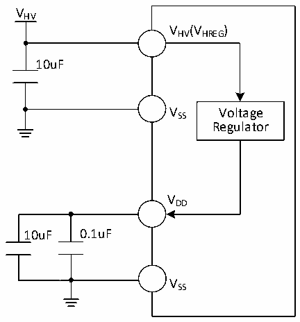

<!-- source-page: 38 -->

[← p.37](0037.md) · [index](../README.md) · [PDF p.38](https://ch32-riscv-ug.github.io/CH32V006/datasheet_en/CH32V007DS0.PDF#page=38) · [p.39 →](0039.md)

<!-- header: CH32V007/M007 Datasheet https://wch-ic.com -->

Figure 3-1-4 CH32M007E8R6 typical circuit for conventional power supply  
 <!-- rendered from the PDF; verify at https://ch32-riscv-ug.github.io/CH32V006/datasheet_en/CH32V007DS0.PDF#page=38 -->

🖼 Text parsed from the figure above

VHV  
VHV(VHREG)  
10uF  
V SS Voltage  
Regulator  
VDD  
10uF 0.1uF  
VSS  

## 3.2 Absolute Maximum Ratings

Stresses at or above the absolute maximum ratings listed in the table below may cause permanent damage to the  
device.  

<!-- p38-table-001 (table-3-1@1) pages 38-40 -->
<table><caption>Table 3-1 Absolute maximum ratings</caption><tr><th>Symbol</th><th colspan="2">Description</th><th>Min.</th><th>Max.</th><th>Unit</th></tr><tr><td rowspan="2" style="text-align:left">TA</td><td rowspan="2">Ambient temperature during operation</td><td style="text-align:left">Chips with a model number ending in 6</td><td>-40</td><td>85</td><td>℃</td></tr><tr><td style="text-align:left">Chips with a model number ending in 7</td><td>-40</td><td>105</td><td>℃</td></tr><tr><td style="text-align:left">TS</td><td colspan="2">Ambient temperature during storage</td><td>-40</td><td>125</td><td>℃</td></tr><tr><td rowspan="3" style="text-align:left">VDD</td><td style="text-align:left">External main supply voltage (V ) DD</td><td>CH32V007</td><td>-0.3</td><td>5.5</td><td>V</td></tr><tr><td style="text-align:left">Output voltage of internal low-voltage regulator</td><td style="text-align:left">CH32M007K8U7CH32M007G8R6</td><td>-0.3</td><td>5.5</td><td>V</td></tr><tr><td style="text-align:left">Output voltage of internal voltage regulator</td><td>CH32M007E8</td><td>-0.3</td><td>5.5</td><td>V</td></tr><tr><td rowspan="2" style="text-align:left">VHV</td><td style="text-align:left">Input power supply voltage of internal high voltage regulator</td><td style="text-align:left">CH32M007K8U7CH32M007G8R6</td><td>-0.4</td><td>56</td><td>V</td></tr><tr><td style="text-align:left">Power supply voltage of high voltage power supply and gate driver</td><td>CH32M007E8</td><td>-0.4</td><td>28</td><td>V</td></tr><tr><td style="text-align:left">VCC12V</td><td style="text-align:left">Power supply voltage of low-side driver and low-voltage regulator</td><td style="text-align:left">CH32M007K8U7CH32M007G8R6</td><td>-0.4</td><td>18</td><td>V</td></tr><tr><td style="text-align:left">VHREG</td><td style="text-align:left">Input power supply voltage of internal voltage regulator</td><td>CH32M007E8U7</td><td>-0.4</td><td>28</td><td>V</td></tr><tr><td style="text-align:left">VIN</td><td colspan="2">Input voltage on the I/O pin</td><td style="text-align:left">V -0.3SS</td><td style="text-align:left">V +0.3DD</td><td>V</td></tr><tr><td style="text-align:left">VB</td><td>High-side bootstrap supply voltage</td><td rowspan="5" style="text-align:left">CH32M007K8U7CH32M007G8R6</td><td>-0.4</td><td>63</td><td>V</td></tr><tr><td style="text-align:left">VBPEAK</td><td style="text-align:left">High-side bootstrap 1% duty cycle pulse voltage</td><td>-0.4</td><td>67</td><td>V</td></tr><tr><td style="text-align:left">VS</td><td>High-side floating ground voltage</td><td>-1.5</td><td>52</td><td>V</td></tr><tr><td style="text-align:left">VSPEAK</td><td style="text-align:left">High-side suspended 1% duty cycle pulse voltage</td><td>-4.0</td><td>56</td><td>V</td></tr><tr><td style="text-align:left">VB_S</td><td style="text-align:left">Voltage difference between high-side bootstrap power supply and floating ground</td><td>-0.4</td><td>17</td><td>V</td></tr><tr><td rowspan="2" style="text-align:left">VHO</td><td rowspan="2">Output voltage of high-side driver</td><td style="text-align:left">CH32M007K8U7CH32M007G8R6</td><td style="text-align:left">V -0.4S</td><td style="text-align:left">V +0.4B</td><td>V</td></tr><tr><td>CH32M007E8</td><td>-0.4</td><td style="text-align:left">V +0.4HV</td><td>V</td></tr><tr><td rowspan="2" style="text-align:left">VLO</td><td rowspan="2">Output voltage of low-side driver</td><td style="text-align:left">CH32M007K8U7CH32M007G8R6</td><td>-0.4</td><td style="text-align:left">V + CC12V0.4</td><td>V</td></tr><tr><td>CH32M007E8</td><td>-0.4</td><td style="text-align:left">V +0.4HV</td><td>V</td></tr><tr><td style="text-align:left">dV /dt S</td><td>Slew rate of floating ground voltage VS</td><td style="text-align:left">CH32M007K8U7CH32M007G8R6</td><td></td><td>20</td><td>V/nS</td></tr><tr><td style="text-align:left">| V | DD_x</td><td style="text-align:left">Variations between different main power supply pins</td><td>CH32V007</td><td></td><td>50</td><td>mV</td></tr><tr><td style="text-align:left">| V | SS_x</td><td colspan="2">Variations between different ground pins</td><td></td><td>50</td><td>mV</td></tr><tr><td style="text-align:left">V△ ESDIO(HBM)</td><td colspan="2" style="text-align:left">Electrostatic discharge voltage (HBM) of ordinary I/O pin</td><td colspan="2">4K</td><td>V</td></tr><tr><td style="text-align:left">VESD(HBM)</td><td style="text-align:left">Electrostatic discharge voltage (HBM) of dedicated pin.</td><td>CH32M007</td><td colspan="2">2K</td><td>V</td></tr><tr><td style="text-align:left">IAVVHV</td><td style="text-align:left">V pin continuous input current HV</td><td></td><td>50</td><td>mA</td></tr><tr><td style="text-align:left">IAVVCC12V</td><td style="text-align:left">V V pin continuous input current CC12</td><td rowspan="3" style="text-align:left">CH32M007K8U7CH32M007G8R6</td><td></td><td>50</td><td>mA</td></tr><tr><td style="text-align:left">IPEAKVB</td><td style="text-align:left">V built-in diode 1% duty cycle pulse B output current</td><td></td><td>100</td><td>mA</td></tr><tr><td style="text-align:left">IAVVB</td><td style="text-align:left">V built-in diode continuous output B current</td><td></td><td>10</td><td>mA</td></tr><tr><td style="text-align:left">IVDD</td><td style="text-align:left">Total current of all V main power pins DD</td><td>CH32V007</td><td></td><td>100</td><td>mA</td></tr><tr><td style="text-align:left">IVSS</td><td colspan="2" style="text-align:left">Total current of all V common ground pins SS</td><td></td><td>200</td><td>mA</td></tr><tr><td rowspan="2" style="text-align:left">IIO</td><td colspan="2">Sink current on any I/O and control pin</td><td></td><td>30</td><td rowspan="5">mA</td></tr><tr><td colspan="2" style="text-align:left">Output current on any I/O and control pin</td><td></td><td>-30</td></tr><tr><td rowspan="2" style="text-align:left">IINJ(PIN)</td><td colspan="2">XI pin of HSE</td><td></td><td>+/-4</td></tr><tr><td colspan="2">Injected current on other pins</td><td></td><td>+/-4</td></tr><tr><td style="text-align:left">∑IINJ(PIN)</td><td colspan="2" style="text-align:left">Total injected current on all I/Os and control pins</td><td></td><td>+/-20</td></tr></table>

<!-- image: p38-draw-image-00001 bbox=[518.88, 784.08, 538.32, 794.28] -->
<!-- footer: V1.8 36 -->
