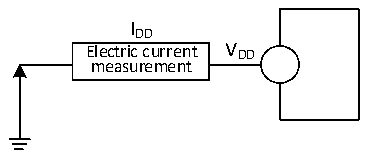
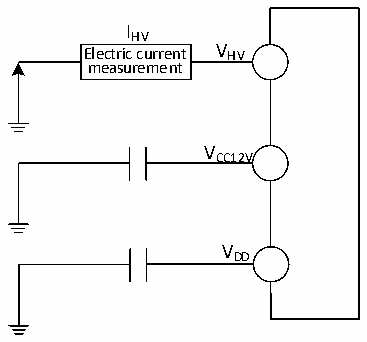
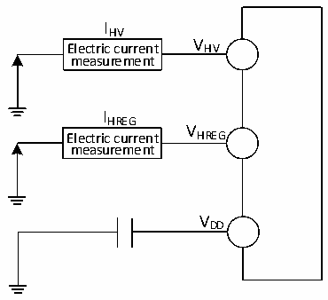
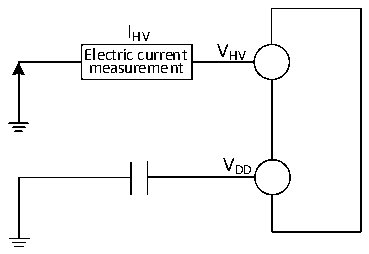

<!-- source-page: 44 -->

[← p.43](0043.md) · [index](../README.md) · [PDF p.44](https://ch32-riscv-ug.github.io/CH32V006/datasheet_en/CH32V007DS0.PDF#page=44) · [p.45 →](0045.md)

<!-- header: CH32V007/M007 Datasheet https://wch-ic.com -->

Figure 3-2-1 CH32V007 current consumption measurement  
 <!-- rendered from the PDF; verify at https://ch32-riscv-ug.github.io/CH32V006/datasheet_en/CH32V007DS0.PDF#page=44 -->

🖼 Text parsed from the figure above

IDD  
Electric current V DD  
measurement  

Figure 3-2-2 CH32M007K8U7 and CH32M007G8R6 current consumption measurement  
 <!-- rendered from the PDF; verify at https://ch32-riscv-ug.github.io/CH32V006/datasheet_en/CH32V007DS0.PDF#page=44 -->

🖼 Text parsed from the figure above

IHV  
Electric current V HV  
measurement  
VCC12V  
VDD  

Figure 3-2-3 CH32M007E8U7 current consumption measurement  
 <!-- rendered from the PDF; verify at https://ch32-riscv-ug.github.io/CH32V006/datasheet_en/CH32V007DS0.PDF#page=44 -->

🖼 Text parsed from the figure above

IHV  
Electric current V HV  
measurement  
IHREG  
V  
Electric current HREG  
measurement  
VDD  

Figure 3-2-4 CH32M007E8R6 current consumption measurement  
 <!-- rendered from the PDF; verify at https://ch32-riscv-ug.github.io/CH32V006/datasheet_en/CH32V007DS0.PDF#page=44 -->

🖼 Text parsed from the figure above

IHV  
Electric current V HV  
measurement  
VDD  

<!-- image: p44-draw-image-00001 bbox=[518.88, 784.08, 538.32, 794.28] -->
<!-- footer: V1.8 42 -->
