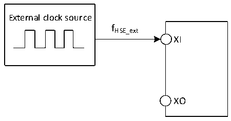

<!-- source-page: 49 -->

[← p.48](0048.md) · [index](../README.md) · [PDF p.49](https://ch32-riscv-ug.github.io/CH32V006/datasheet_en/CH32V007DS0.PDF#page=49) · [p.50 →](0050.md)

<!-- header: CH32V007/M007 Datasheet https://wch-ic.com -->

### 3.3.5 External Clock Source Characteristics

<!-- p49-table-001 (table-3-10@1) -->
<table><caption>Table 3-10 From external high-speed clock</caption><tr><th>Symbol</th><th>Parameter</th><th>Condition</th><th>Min.</th><th>Typ.</th><th>Max.</th><th>Unit</th></tr><tr><td style="text-align:left">FHSE_ext</td><td>External clock frequency</td><td></td><td>3</td><td>24</td><td>32</td><td>MHz</td></tr><tr><td style="text-align:left">V (1) HSEH</td><td>XI input pin high-level voltage</td><td></td><td style="text-align:left">0.8VDD</td><td></td><td style="text-align:left">VDD</td><td>V</td></tr><tr><td style="text-align:left">V (1) HSEL</td><td>XI input pin low-level voltage</td><td></td><td>0</td><td></td><td style="text-align:left">0.2VDD</td><td>V</td></tr><tr><td style="text-align:left">C in(HSE)</td><td>XI input capacitance</td><td></td><td></td><td>5</td><td></td><td>pF</td></tr><tr><td style="text-align:left">DuCy (HSE)</td><td>Duty cycle</td><td></td><td>40</td><td>50</td><td>60</td><td>%</td></tr><tr><td style="text-align:left">IL</td><td>XI input leakage current</td><td></td><td></td><td></td><td>±1</td><td>uA</td></tr></table>

<em>Note: 1. Failure to meet this condition may cause level recognition error.</em>  

Figure 3-3 External high-frequency clock source circuit  
 <!-- rendered from the PDF; verify at https://ch32-riscv-ug.github.io/CH32V006/datasheet_en/CH32V007DS0.PDF#page=49 -->

🖼 Text parsed from the figure above

External clock source  
fHSE_ext  
XI  
XO  

<!-- p49-table-002 (table-3-11@1) -->
<table><caption>Table 3-11 High-speed external clock generated from a crystal/ceramic resonator</caption><tr><th>Symbol</th><th>Parameter</th><th>Condition</th><th>Min.</th><th>Typ.</th><th>Max.</th><th>Unit</th></tr><tr><td style="text-align:left">FXI</td><td>Resonator frequency</td><td></td><td>3</td><td>24</td><td>32</td><td>MHz</td></tr><tr><td style="text-align:left">RF</td><td>Feedback resistor (no external)</td><td></td><td></td><td>250</td><td></td><td>kΩ</td></tr><tr><td style="text-align:left">CLOAD</td><td style="text-align:left">Recommended load capacitance and corresponding crystal series impedance RS</td><td style="text-align:left">R = 60Ω(1) S</td><td></td><td>20</td><td></td><td>pF</td></tr><tr><td rowspan="2" style="text-align:left">IHSE</td><td rowspan="2">HSE drive current</td><td>HSE_LP = 0, 20p load</td><td></td><td>1.6</td><td></td><td rowspan="2">mA</td></tr><tr><td>HSE_LP = 1, 20p load</td><td></td><td>0.8</td><td></td></tr><tr><td style="text-align:left">g m</td><td>Oscillator transconductance</td><td>Startup</td><td></td><td>21</td><td></td><td>mA/V</td></tr><tr><td style="text-align:left">t SU(HSE)</td><td>Startup time</td><td style="text-align:left">V is stable DD</td><td></td><td>1.5(2)</td><td></td><td>ms</td></tr></table>

<em>Note: 1. 25M crystal ESR is recommended not more than 80Ω, less than 25m can be appropriately relaxed.</em>  
<em>2. Startup time refers to the time difference between when HSEON is turned on and when HSERDY is set.</em>  
<!-- image: p49-draw-image-00001 bbox=[518.88, 784.08, 538.32, 794.28] -->
<!-- footer: V1.8 47 -->
