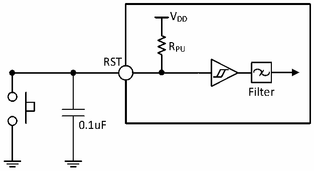

<!-- source-page: 53 -->

[← p.52](0052.md) · [index](../README.md) · [PDF p.53](https://ch32-riscv-ug.github.io/CH32V006/datasheet_en/CH32V007DS0.PDF#page=53) · [p.54 →](0054.md)

<!-- header: CH32V007/M007 Datasheet https://wch-ic.com -->

> ⬆ **Table continued** — rendered in full at [page 52](0052.md). <!-- p53-table-001 -->

<em>Note: Above parameters are guaranteed by design.</em>  

### 3.3.10 NRST Pin Characteristics

Circuit reference design and requirements:  

Figure 3-5 Typical circuit of external reset pin  
 <!-- rendered from the PDF; verify at https://ch32-riscv-ug.github.io/CH32V006/datasheet_en/CH32V007DS0.PDF#page=53 -->

🖼 Text parsed from the figure above

VDD  
RPU  
RST  
Filter  
0.1uF  

<em>Note: The capacitor in the figure is optional and can be used to filter out key jitter.</em>  

<!-- p53-table-003 (table-3-20@1) -->
<table><caption>Table 3-20 External reset pin characteristics</caption><tr><th>Symbol</th><th>Parameter</th><th>Condition</th><th>Min.</th><th>Typ.</th><th>Max.</th><th>Unit</th></tr><tr><td style="text-align:left">VIH(RST)</td><td>RST input high-level voltage</td><td></td><td style="text-align:left">0.3*V +0.7DD</td><td></td><td style="text-align:left">VDD</td><td>V</td></tr><tr><td style="text-align:left">VIL(RST)</td><td>RST input low-level voltage</td><td></td><td>0</td><td></td><td style="text-align:left">0.15*V +0.3DD</td><td>V</td></tr><tr><td style="text-align:left">V hys(RST)</td><td style="text-align:left">NRST Schmitt Trigger voltage hysteresis</td><td></td><td>150</td><td></td><td></td><td>mV</td></tr><tr><td style="text-align:left">RPU</td><td>Pull-up equivalent resistance</td><td></td><td>35</td><td>45</td><td>55</td><td>kΩ</td></tr><tr><td style="text-align:left">VF(RST)</td><td style="text-align:left">RST input can be filtered pulse width</td><td></td><td></td><td></td><td>100</td><td>ns</td></tr><tr><td style="text-align:left">VNF(RST)</td><td style="text-align:left">RST input cannot be filtered pulse width</td><td></td><td>300</td><td></td><td></td><td>ns</td></tr></table>

Circuit reference design and requirements:  
<!-- image: p53-draw-image-00001 bbox=[518.88, 784.08, 538.32, 794.28] -->
<!-- footer: V1.8 51 -->
