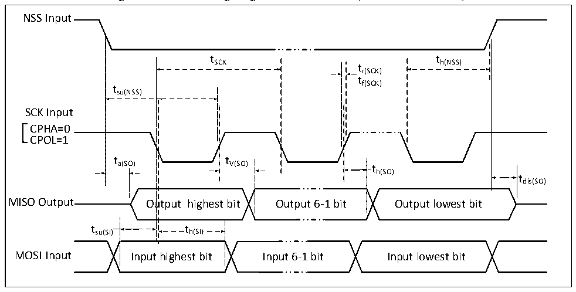
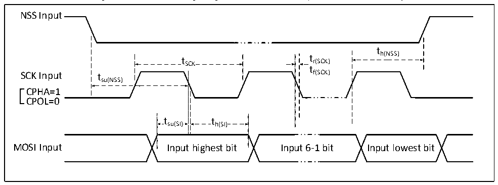

<!-- source-page: 57 -->

[← p.56](0056.md) · [index](../README.md) · [PDF p.57](https://ch32-riscv-ug.github.io/CH32V006/datasheet_en/CH32V007DS0.PDF#page=57) · [p.58 →](0058.md)

<!-- header: CH32V007/M007 Datasheet https://wch-ic.com -->

Figure 3-8-2 SPI timing diagram in Slave mode (CPHA=0, CPOL=1)  
 <!-- rendered from the PDF; verify at https://ch32-riscv-ug.github.io/CH32V006/datasheet_en/CH32V007DS0.PDF#page=57 -->

🖼 Text parsed from the figure above

NSS Input  
tSCKt th(NSS)  
r(SCK)  
tf(SCK)  
tsu(NSS)  
SCK Input  
CPHA=0  
CPOL=1  
t t  
a(SO) V(SO) t  
h(SO)  
tdis(SO)  
utput highest bit  t h(SI)  t h(SI)  )  th(SI)  
MISO Output Output highest bit Output 6-1 bit Output lowest bit  
tsu(SI) th(SI)  
MOSI Input Input highest bit Input 6-1 bit Input lowest bit  

Figure 3-9-1 SPI timing diagram in Slave mode (CPHA = 1, CPOL=0)  
 <!-- rendered from the PDF; verify at https://ch32-riscv-ug.github.io/CH32V006/datasheet_en/CH32V007DS0.PDF#page=57 -->

🖼 Text parsed from the figure above

NSS Input  
th(NSS)  
t SCK t r(SCK)  
t  
SCK Input tsu(NSS) f(SCK)  
CPHA=1  
CPOL=0  
t h(SI)  th(SI)  
tsu(SI) th(SI)  
MOSI Input Input highest bit Input 6-1 bit Input lowest bit  

<!-- image: p57-draw-image-00001 bbox=[518.88, 784.08, 538.32, 794.28] -->
<!-- footer: V1.8 55 -->
