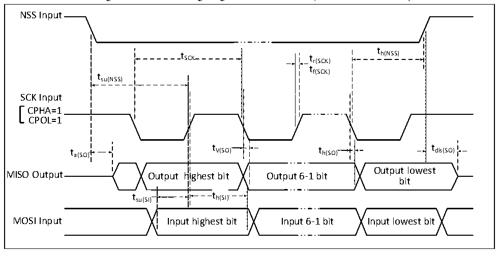

<!-- source-page: 58 -->

[← p.57](0057.md) · [index](../README.md) · [PDF p.58](https://ch32-riscv-ug.github.io/CH32V006/datasheet_en/CH32V007DS0.PDF#page=58) · [p.59 →](0059.md)

<!-- header: CH32V007/M007 Datasheet https://wch-ic.com -->

Figure 3-9-2 SPI timing diagram in Slave mode (CPHA = 1, CPOL=1)  
 <!-- rendered from the PDF; verify at https://ch32-riscv-ug.github.io/CH32V006/datasheet_en/CH32V007DS0.PDF#page=58 -->

🖼 Text parsed from the figure above

NSS Input  
t  
t SCK t r(SCK) h(NSS)  
tf(SCK)  
tsu(NSS)  
SCK Input  
CPHA=1  
CPOL=1  
t a(SO) t V(SO) t h(SO) t dis(SO)  
Output lowest  
MISO Output Output highest bit Output 6-1 bit  
bit  
t su(SI)  
t h(SI)  th(SI)  
MOSI Input Input highest bit Input 6-1 bit Input lowest bit  

<!-- p58-table-003 (table-3-23@1) pages 58-59 -->
<table><caption>Table 3-23 SPI interface characteristics</caption><tr><th>Symbol</th><th>Parameter</th><th colspan="2">Condition</th><th>Min.</th><th>Max.</th><th>Unit</th></tr><tr><td rowspan="2" style="text-align:left">f /t SCK SCK</td><td rowspan="2">SPI clock frequency</td><td colspan="2">Master mode</td><td></td><td>24</td><td>MHz</td></tr><tr><td colspan="2">Slave mode</td><td></td><td>24</td><td>MHz</td></tr><tr><td style="text-align:left">t /t r(SCK) f(SCK)</td><td>SPI clock rise and fall time</td><td colspan="2">Load capacitance: C = 30pF</td><td></td><td>10</td><td>ns</td></tr><tr><td style="text-align:left">t SU(NSS)</td><td>NSS setup time</td><td colspan="2">Slave mode</td><td style="text-align:left">2t HCLK</td><td></td><td>ns</td></tr><tr><td style="text-align:left">t h(NSS)</td><td>NSS hold time</td><td colspan="2">Slave mode</td><td style="text-align:left">2t HCLK</td><td></td><td>ns</td></tr><tr><td style="text-align:left">t /t w(SCKH) w(SCKL)</td><td>SCK high and low time</td><td colspan="2" style="text-align:left">Master mode, f = HCLK 24MHz，Prescaler factor = 4</td><td>70</td><td>97</td><td>ns</td></tr><tr><td rowspan="2" style="text-align:left">t SU(MI)</td><td rowspan="3">Data input setup time</td><td rowspan="2" style="text-align:left">Master mode</td><td>HSRXEN = 0</td><td>15</td><td></td><td rowspan="2">ns</td></tr><tr><td>HSRXEN =</td><td style="text-align:left">15-0.5t SCK</td><td></td></tr><tr><td style="text-align:left">t SU(SI)</td><td colspan="2">Slave mode</td><td></td><td></td><td>ns</td></tr><tr><td rowspan="2" style="text-align:left">t h(MI)</td><td rowspan="3">Data input hold time</td><td rowspan="2" style="text-align:left">Master mode</td><td>HSRXEN = 0</td><td>-4</td><td></td><td rowspan="2">ns</td></tr><tr><td>HSRXEN = 1</td><td style="text-align:left">0.5t -4SCK</td><td></td></tr><tr><td style="text-align:left">t h(SI)</td><td colspan="2">Slave mode</td><td></td><td></td><td>ns</td></tr><tr><td style="text-align:left">t a(SO)</td><td>Data output access time</td><td colspan="2" style="text-align:left">Slave mode, f = 20MHz HCLK</td><td>0</td><td style="text-align:left">1t HCLK</td><td>ns</td></tr><tr><td style="text-align:left">t dis(SO)</td><td>Data output disable time</td><td colspan="2">Slave mode</td><td>0</td><td>10</td><td>ns</td></tr><tr><td style="text-align:left">t V(SO)</td><td>Data output valid time</td><td colspan="2">Slave mode (After enable edge)</td><td></td><td>15</td><td>ns</td></tr><tr><td style="text-align:left">t V(MO)</td><td></td><td colspan="2">Master mode (After enable edge)</td><td></td><td>5</td><td>ns</td></tr><tr><td style="text-align:left">t h(SO)</td><td rowspan="2">Data output hold time</td><td colspan="2">Slave mode (After enable edge)</td><td>6</td><td></td><td>ns</td></tr><tr><td style="text-align:left">t h(MO)</td><td colspan="2">Master mode (After enable edge)</td><td>0</td><td></td><td>ns</td></tr></table>

<!-- image: p58-draw-image-00001 bbox=[518.88, 784.08, 538.32, 794.28] -->
<!-- footer: V1.8 56 -->
